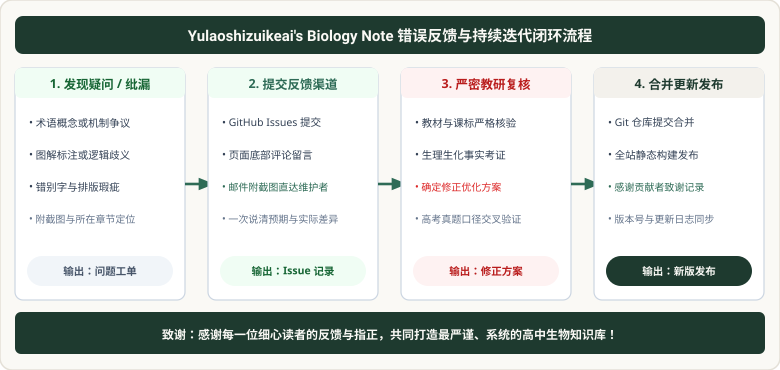

# 错误反馈

  

生物是一门严谨的实验科学，任何概念、符号或实验步骤的微小纰漏都可能给读者带来困扰。如果您在阅读本高中生物知识库时发现了任何问题，欢迎向我们反馈！

## 反馈渠道

1. **GitHub Issues**：访问本项目的 GitHub 仓库提交 Issue，详细描述错误页面、具体内容及纠正建议（推荐，响应最快）。
2. **电子邮件反馈**：发送邮件至 [imharlanyu@gmail.com](mailto:imharlanyu@gmail.com)，欢迎附带相关章节截图与修改见解。

感谢您的每一份细心与指正！
