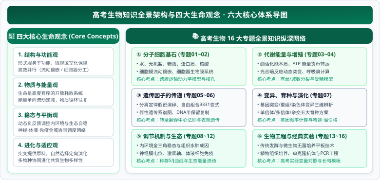

# 高考生物全景图与生命观念

  

高中生物是一门以实验为基石、以系统论为思维框架、由微观分子机理层层涌现至宏观生态网络的现代生命科学。学好高中生物的关键不仅在于精准识记教材的核心事实与生理名词，更在于建立贯通微观与宏观的**生命世界全景图**，并掌握贯穿高考命题全流程的**四大生命观念**与**科学思维探究方法**。

---

## 一、 高考生物六大核心知识板块全景图

整个高中生物（人教版新课标必修 2 册 + 选择性必修 3 册）在知识架构上严密贯通为六大板块、16 个专题：

| 知识板块 | 对应本知识库专题 | 核心主线与生命规律 |
| :--- | :--- | :--- |
| **分子与细胞微观基石** | 01~02 专题 | **物质基础与细胞结构**： 1. 水与无机盐的生理功能、糖类/脂质、蛋白质空间结构与核酸遗传载体 2. 细胞膜流动镶嵌模型、跨膜运输动力学（被动与主动运输）、生物膜系统微区室化与细胞核控制中心 |
| **细胞代谢与能量流动** | 03~04 专题 | **酶、能量货币与细胞生命历程**： 1. 降低活化能的酶机理、ATP 循环转运 2. 有氧/无氧呼吸三阶段与呼吸熵定量模型、光合作用光暗反应与瞬时突变分析 3. 细胞增殖（有丝分裂与减数分裂）、分化、全能性、衰老与凋亡 |
| **遗传信息的传递与表达** | 05~06 专题 | **孟德尔定律与中心法则**： 1. 分离定律（假说-演绎法）、自由组合定律（$9:3:3:1$ 变式矩阵分析）、伴性遗传系谱图分析 2. DNA 双螺旋反向平行结构、半保留复制定量守恒模型、转录/翻译过程、中心法则与表观遗传修饰 |
| **生物变异、育种与演化** | 07 专题 | **基因库变迁与物种进化**： 1. 基因突变、基因重组与染色体变异三维对比 2. 杂交育种、单倍体育种、多倍体育种与现代生物育种技术决策 3. 现代生物进化理论（种群为单位、突变与重组提供原料、自然选择决定方向、隔离导致物种形成） |
| **个体稳态调节与生态网络** | 08~12 专题 | **内环境自稳态与宏观生态平衡**： 1. 内环境理化性质、血浆-组织液-淋巴液动态水力学网络与组织水肿成因 2. 神经调节（膜电位动力学与突触单向传递）、体液调节（激素分级反馈轴与血糖体温水盐调节）、免疫调节（体液与细胞免疫协同） 3. 植物激素协同调控网络、种群数量波动模型（$J/S$ 曲线）、群落演替动力学、生态系统能量流动与物质循环 |
| **现代生物工程与经典实验** | 13~16 专题 | **生物工程应用与科学探究规范**： 1. 传统发酵技术（果酒、果醋、泡菜）、微生物无菌纯化培养与计数统计 2. 植物细胞工程（组织培养与体细胞杂交）、动物细胞工程（细胞培养、核移植与单克隆抗体）、胚胎工程 3. 基因工程工具酶、PCR 反应模型与表达载体构建 4. 教材必做实验全景显色矩阵与高考实验变量对照满分答题模板 |

---

## 二、 贯穿始终的四大生命观念

在人教版教材与新高考评价体系中，四大核心素养生命观念不仅是高考命题的情境立足点，更是解答长句简答题的第一性逻辑链：

### 1. 结构与功能观（Structure and Function）
生命的一切功能都建立在特定的物质结构基础之上，“形式服务于功能”：
- **蛋白质结构多样性**：氨基酸种类、数目、排列顺序及肽链折叠方式决定了催化、运输、免疫与信息传递等不同功能。
- **生物膜微区室化**：内质网、高尔基体、线粒体等双层与单层膜结构将细胞内部分隔为互不干扰的独立微区室，使拮抗反应能高效有序并行。
- **细胞特化结构**：红细胞双凹圆盘状增加比表面积，小肠绒毛上皮细胞微绒毛扩大吸收面积，神经元树突与轴突便于远距离传导神经冲动。

### 2. 物质与能量观（Matter and Energy）
生命系统是远离平衡态的开放耗散系统，必须持续与外界进行物质和能量交换：
- **物质守恒与循环往复**：碳、氮、磷等元素在生物群落与无机环境之间循环往复流动，生物圈在物质上是自给自足的封闭系统。
- **能量单向流动与逐级递减**：太阳能经由光合作用固定为化学能，在食物链中逐级传递并最终以热能散失，无法被生物再利用。
- **ATP 能量货币**：吸能反应伴随 ATP 的水解，放能反应伴随 ATP 的合成，ATP 是驱动细胞一切生命活动的通用能量载体。

### 3. 稳态与平衡观（Homeostasis and Balance）
无论是微观的细胞微环境，还是宏观的生态系统，生命均通过负反馈调节维持动态平衡：
- **内环境稳态**：神经-体液-免疫（NEI）调节网络通过交感/副交感神经、激素靶向调度与免疫监视，将体温、渗透压、血糖维持在狭窄的适宜生理区间。
- **基因表达调控平衡**：原癌基因与抑癌基因的相互制约防止细胞异常增生；DNA 甲基化与组蛋白乙酰化实现基因时空特异性表达。
- **生态系统自我调节能力**：捕食者与被捕食者数量的交替波动、群落演替的顶级平衡，均依赖于群落内部复杂的物种多样性与负反馈网络。

### 4. 进化与适应观（Evolution and Adaptation）
现代地球上绚丽多姿的生命均源于共同祖先，性状的适应性是亿万年自然选择的烙印：
- **形态生理与环境统一**：仙人掌叶片退化为刺以减少水分蒸腾，鸟类骨骼中空以适应飞行，动物体色拟态以躲避天敌。
- **协同进化驱动多样性**：捕食者奔跑速度与猎物逃逸速度相互促进共同提高，虫媒花与传粉昆虫口器结构的特异性共生演进。
- **分子进化的保守性**：几乎所有生物共用一套通用的遗传密码，ATP 作为生命通用货币，共同有力证明了地球生命的共同起源。
