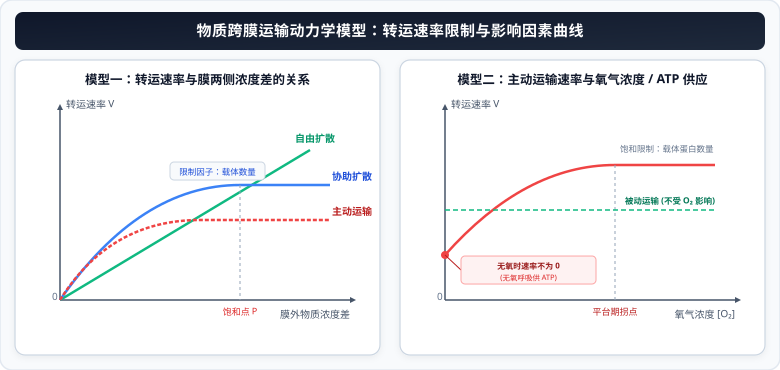

# 04 物质跨膜运输的实例与方式（被动与主动运输）

> **【导读与第一性原理】**
>
> - **教材坐标**：必修1 第4章 第1节《被动运输》与 第2节《主动运输与胞吞、胞吐》
> - **核心生命观念**：物质与能量观、稳态与平衡观
> - **认知引导**：热力学第二定律告诉我们，物质总是自发地从高浓度向低浓度扩散以增加熵。然而，活细胞内部的钾离子浓度却比外界高出数十倍，小肠上皮细胞甚至能将微量的葡萄糖逆着数倍浓度差强行抽入体内！细胞是如何做到既允许水分子顺熵自由流动，又能违背热力学自发趋势逆流富集物质的？本节将从分子转运的动力学与能量偶联出发，揭秘跨膜运输的全景图谱。

---

## 一、 教材基础与微观机理透析

### 1. 渗透作用与质壁分离及复原实验

<ClientOnly>
  <MembraneTransportSimulator />
</ClientOnly>

#### (1) 渗透作用（Osmosis）发生的物理必备条件

1. **具有一层半透膜（Semipermeable membrane）**：水分子等小分子可以通过，而蔗糖等大分子溶质无法通过；
2. **半透膜两侧溶液具有浓度差（渗透压差）**：水分子整体表现为**从水的相对含量高处（低浓度溶液）向水的相对含量低处（高浓度溶液）顺相对含量梯度渗透**。

#### (2) 植物细胞的质壁分离与复原机理

- **原生质层（Protoplast layer）**：由**细胞膜、液泡膜以及两层膜之间的细胞质**共同组成。由于细胞膜和液泡膜都具有选择透过性，因此**原生质层相当于一层半透膜**。
- **细胞壁与原生质层的物理伸缩性差异**：
  - **原生质层的伸缩性很大**；
  - **细胞壁的伸缩性很小**，且为全透性。
- **动态过程因果链**：
  - **质壁分离**：外界溶液浓度 $>$ 细胞液浓度 $\implies$ 细胞渗透失水 $\implies$ 原生质层收缩程度大于细胞壁 $\implies$ 原生质层与细胞壁逐渐分离；细胞液颜色变深、液泡体积缩小。
  - **质壁分离复原**：将发生质壁分离的细胞置于清水中 $\implies$ 外界溶液浓度 $<$ 细胞液浓度 $\implies$ 细胞渗透吸水 $\implies$ 原生质层膨胀紧贴细胞壁。
  - **质壁分离自动复原**：若将细胞置于一定浓度的 **$\text{KNO}_3$、尿素、甘油或乙二醇溶液** 中，细胞先渗透失水发生质壁分离；随后这些微观分子或离子被细胞**主动运输或自由扩散吸收**进入液泡，导致细胞液浓度反超外界溶液浓度，细胞重新吸水，从而**自发发生质壁分离复原**！

---

### 2. 物质跨膜运输方式的微观对比

$$
\text{物质进出细胞} \begin{cases}
\text{小分子与离子} \begin{cases}
\text{被动运输（顺浓度，不耗 ATP）} \begin{cases} \textbf{自由扩散}（不需转运蛋白） \\ \textbf{协助扩散}（需通道蛋白或载体蛋白） \end{cases} \\
\textbf{主动运输}（逆浓度，需载体蛋白，消耗能量）
\end{cases} \\
\text{大分子与颗粒物} \begin{cases} \textbf{胞吞}（消耗 ATP，需受体识别，依赖流动性） \\ \textbf{胞吐}（消耗 ATP，依赖膜融合流动性） \end{cases}
\end{cases}
$$

#### (1) 跨膜运输四大基本方式微观参数矩阵

| 运输方式                             | 运输方向                                      | 转运蛋白需求                            | 能量消耗                                    | 典型物质实例                                                                                                                                                                                     |
| :----------------------------------- | :-------------------------------------------- | :-------------------------------------- | :------------------------------------------ | :----------------------------------------------------------------------------------------------------------------------------------------------------------------------------------------------- |
| **自由扩散 (Simple diffusion)**      | **顺浓度梯度** （高浓度 $\to$ 低浓度）     | **不需要**                              | **不消耗** ATP                              | 水、气体分子（$\text{O}_2, \text{CO}_2$）、脂溶性小分子（甘油、乙醇、苯、性激素）                                                                                                                |
| **协助扩散 (Facilitated diffusion)** | **顺浓度梯度** （高浓度 $\to$ 低浓度）     | **需要** （通道蛋白或载体蛋白）      | **不消耗** ATP                              | ① 葡萄糖进入哺乳动物成熟红细胞 ② 水通道蛋白转运水分子 ③ 神经纤维产生动作电位时 **$\text{Na}^+$ 内流** ④ 恢复静息电位时 **$\text{K}^+$ 外流**                                            |
| **主动运输 (Active transport)**      | **通常逆浓度梯度** （低浓度 $\to$ 高浓度） | **需要** （必须为**载体蛋白**）      | **必须消耗** 能量 （ATP 水解或电化学势） | ① 植物根系吸收无机盐离子（$\text{K}^+, \text{NO}_3^-$ 等） ② 小肠上皮细胞吸收葡萄糖、氨基酸 ③ 钠钾泵（$\text{Na}^+/\text{K}^+\text{-ATPase}$）逆浓度泵出 $3\text{Na}^+$ 泵入 $2\text{K}^+$ |
| **胞吞 / 胞吐 (Endo/Exocytosis)**    | 大分子及颗粒物穿膜                            | **不需要** 载体蛋白 （需膜受体识别） | **必须消耗** 能量 （ATP 驱动骨架形变）   | ① 白细胞吞噬病菌、变形虫摄食（胞吞） ② 胰岛素、消化酶、抗体等分泌蛋白分泌（胞吐） ③ 神经元突触小泡释放神经递质（胞吐）                                                                     |

#### (2) 载体蛋白 vs 通道蛋白的微观机制辨析（教材新增高频点）

- **通道蛋白（Channel proteins）**：只容许与自身通道的**直径和形状相适配、大小和电荷相适宜**的分子或离子通过。分子在通过通道蛋白时，**不与通道蛋白结合**，通道蛋白构象**不发生剧烈翻转**（如水通道蛋白、电压门控 $\text{Na}^+$ 通道）。
- **载体蛋白（Carrier proteins）**：只容许与自身结合部位相适应的分子或离子结合，而且**每次转运都会发生自身构象的改变**。构象改变时结合位点向膜另一侧暴露，释放溶质后恢复原状。

---

## 二、 跨膜运输动力学模型与影响因素曲线

  

$$
\begin{cases}
\text{协助扩散极限限制因子} \implies \text{膜上转运蛋白（通道/载体）的数量与分布密度} \\
\text{主动运输极限限制因子} \implies \text{膜上特异性载体蛋白的数量} + \text{细胞呼吸 ATP 能量供应速率}
\end{cases}
$$

---

### 2. 可汗学院式苏格拉底深究问答（认知阶梯）

- **深度追问 1**：水分子是极小分子，本身能够通过自由扩散穿过磷脂双分子层，为什么细胞膜上还要大费周章地装备“水通道蛋白”？
  - _第一性机理（物理化学本质）_：磷脂双分子层的核心是高密度的疏水脂肪酸尾部，具有极强的疏水屏障效应，极性的水分子直接跨膜扩散的阻力极大、速率极其缓慢。在对水通量有极端需求的生理器官（如肾小管和集合管上皮细胞的重吸收、植物成熟区根毛细胞快速吸水），单纯依靠自由扩散远远不能维持机体渗透压稳态；水通道蛋白内部具有特异性的亲水氨基酸通道，能让水分子以单列形式“光速”穿流，且不带电荷、不漏离子，既高效又安全。
- **深度追问 2**：为什么主动运输必须依赖“载体蛋白”，而绝不能通过“通道蛋白”实现？
  - _第一性机理（机械做功逻辑）_：通道蛋白内部是一条贯通的连续孔道，物质只能顺着浓度梯度自发扩散，一旦通道开启，高浓度侧溶质必然冲向低浓度侧，无法逆向泵送。而主动运输必须实现“逆浓度梯度做功”，这就如同船闸：载体蛋白必须先在低浓度侧特异性结合溶质，随后在 ATP 水解供能下发生**空间构象翻转**，封闭进门、打开出门，强行将溶质“顶”到高浓度侧，这种“抓取-变构-释放”的机械泵功能只有构象可变的载体蛋白才能胜任。

---

## 三、 核心矢量图解 (SVG)

<svg xmlns="http://www.w3.org/2000/svg" viewBox="0 0 780 370" width="100%">
  <!-- 背景板 -->
  <rect x="0" y="0" width="780" height="370" rx="12" fill="#F8FAFC" stroke="#E2E8F0" stroke-width="1.5"/>
  <!-- 顶部标题条 -->
  <g transform="translate(20, 16)">
    <rect x="0" y="0" width="740" height="42" rx="8" fill="#1E293B"/>
    <text x="370" y="26" fill="#FFFFFF" font-size="16" font-weight="bold" text-anchor="middle" letter-spacing="1">物质跨膜运输方式微观机理与动力学限制模型</text>
  </g>
  <!-- 左侧卡片：四大跨膜运输方式微观对比 (局部坐标系) -->
  <g transform="translate(20, 72)">
    <rect x="0" y="0" width="360" height="280" rx="8" fill="#FFFFFF" stroke="#CBD5E1" stroke-width="1.5"/>
    <rect x="0" y="0" width="360" height="36" rx="8" fill="#EFF6FF" stroke="#BFDBFE" stroke-width="1"/>
    <text x="180" y="23" fill="#1D4ED8" font-size="14" font-weight="bold" text-anchor="middle">小分子跨膜与大分子囊泡转运对比</text>
    <!-- 方式列表 -->
    <g transform="translate(15, 48)">
      <!-- 自由扩散 -->
      <rect x="0" y="0" width="330" height="36" rx="6" fill="#F0F9FF" stroke="#BAE6FD" stroke-width="1"/>
      <text x="12" y="17" fill="#0369A1" font-size="11" font-weight="bold">自由扩散：顺梯度、不需蛋白、不耗 ATP</text>
      <text x="12" y="30" fill="#475569" font-size="10">代表物：H₂O、O₂、CO₂、甘油、乙醇、性激素(脂溶)</text>
      <!-- 协助扩散 -->
      <g transform="translate(0, 42)">
        <rect x="0" y="0" width="330" height="42" rx="6" fill="#F8FAFC" stroke="#E2E8F0" stroke-width="1"/>
        <text x="12" y="17" fill="#1E293B" font-size="11" font-weight="bold">协助扩散：顺梯度、需通道/载体蛋白、不耗 ATP</text>
        <text x="12" y="32" fill="#2563EB" font-size="10">代表物：葡萄糖入红细胞、动作电位 Na⁺内流、K⁺外流</text>
      </g>
      <!-- 主动运输 -->
      <g transform="translate(0, 90)">
        <rect x="0" y="0" width="330" height="42" rx="6" fill="#FFFBEB" stroke="#FDE68A" stroke-width="1"/>
        <text x="12" y="17" fill="#B45309" font-size="11" font-weight="bold">主动运输：通常逆梯度、需载体蛋白、【必耗 ATP】</text>
        <text x="12" y="32" fill="#92400E" font-size="10">代表物：植物吸矿质离子、小肠吸葡萄糖、钠钾泵</text>
      </g>
      <!-- 胞吞胞吐 -->
      <g transform="translate(0, 138)">
        <rect x="0" y="0" width="330" height="44" rx="6" fill="#FEF2F2" stroke="#FECACA" stroke-width="1"/>
        <text x="12" y="17" fill="#991B1B" font-size="11" font-weight="bold">胞吞/胞吐：大分子囊泡介导转运、【必耗 ATP】</text>
        <text x="12" y="32" fill="#DC2626" font-size="10">代表物：胰岛素/抗体分泌、突触小泡释放神经递质</text>
      </g>
    </g>
  </g>
  <!-- 右侧卡片：动力学限制曲线与高频考点 (局部坐标系) -->
  <g transform="translate(400, 72)">
    <rect x="0" y="0" width="360" height="280" rx="8" fill="#FFFFFF" stroke="#CBD5E1" stroke-width="1.5"/>
    <rect x="0" y="0" width="360" height="36" rx="8" fill="#F0FDF4" stroke="#86EFAC" stroke-width="1"/>
    <text x="180" y="23" fill="#15803D" font-size="14" font-weight="bold" text-anchor="middle">运输速率曲线限制法则与易错排雷</text>
    <!-- 限制法则 -->
    <g transform="translate(15, 48)">
      <!-- 浓度限制模型 -->
      <rect x="0" y="0" width="330" height="60" rx="6" fill="#F0FDF4" stroke="#BBF7D0" stroke-width="1"/>
      <text x="12" y="18" fill="#166534" font-size="11.5" font-weight="bold">速率对【浓度差】响应曲线判定：</text>
      <text x="12" y="34" fill="#334155" font-size="10.5">● 自由扩散：无限直线正比例，无饱和点</text>
      <text x="12" y="50" fill="#15803D" font-size="10.5">● 协助扩散/主动运输：达一定浓度后饱和（载体数量限制）</text>
      <!-- 能量限制模型 -->
      <g transform="translate(0, 68)">
        <rect x="0" y="0" width="330" height="60" rx="6" fill="#EFF6FF" stroke="#BFDBFE" stroke-width="1"/>
        <text x="12" y="18" fill="#1D4ED8" font-size="11.5" font-weight="bold">速率对【氧气分压 (ATP)】响应曲线：</text>
        <text x="12" y="34" fill="#334155" font-size="10.5">● 自由/协助扩散：完全不受 O₂ 与呼吸抑制剂影响</text>
        <text x="12" y="50" fill="#1E40AF" font-size="10.5">● 主动运输：O₂=0 时速率大于 0（依靠无氧呼吸供能）</text>
      </g>
      <!-- 跨膜层数警示 -->
      <g transform="translate(0, 136)">
        <rect x="0" y="0" width="330" height="52" rx="6" fill="#FEF3C7" stroke="#FDE68A" stroke-width="1"/>
        <text x="165" y="18" fill="#B45309" font-size="11" font-weight="bold" text-anchor="middle">⚠️ 高考跨膜层数陷阱：胞吞胞吐【穿膜层数为 0】！</text>
        <text x="165" y="35" fill="#78350F" font-size="10.5" text-anchor="middle">囊泡膜与细胞膜直接融合，包裹物质未直接穿过磷脂双分子层！</text>
      </g>
    </g>
  </g>
</svg>

---

## 四、 高频易错点与考场排雷 (WARNING)

::: warning ⚠️ 致命陷阱 1：神经冲动中的 Na⁺ 内流与 K⁺ 外流是什么运输方式？

- **典型误区**：看见“离子进出细胞”，盲目判定为“主动运输”。
- **微观本质剖析**：
  1. **神经纤维受到刺激产生动作电位时**：细胞外 $\text{Na}^+$ 浓度远高于细胞内，$\text{Na}^+$ 顺浓度梯度通过电压门控通道内流，属于**协助扩散**（不消耗 ATP）！
  2. **神经纤维处于静息电位时**：细胞内 $\text{K}^+$ 浓度远高于细胞外，$\text{K}^+$ 顺浓度梯度通过钾通道外流，同样属于**协助扩散**（不消耗 ATP）！
  3. **恢复并维持静息电位状态时**：依靠钠钾泵（$\text{Na}^+/\text{K}^+\text{-ATPase}$）逆浓度泵出 $\text{Na}^+$、泵入 $\text{K}^+$，这才是**主动运输**！
     :::

::: warning ⚠️ 致命陷阱 2：胞吞与胞吐过程到底穿过了几层生物膜？

- **典型误区**：认为物质从细胞内排到细胞外，一定穿透了 1 层细胞膜。
- **微观本质剖析**：
  - 胞吞和胞吐依靠膜的流动性，通过细胞膜内陷形成囊泡，或囊泡膜与细胞膜融合破开，被包裹的蛋白质/神经递质从始至终都包裹在囊泡腔或外界水相中；
  - **物质分子自身没有穿过任何一层磷脂分子！跨膜层数严格为 0 层**！
    :::

---

## 五、 高考真题命题角度与长句表达规范

### 1. 规范答题逻辑链模板

- **设问方向**：“将紫色洋葱鳞片叶外表皮细胞置于 0.3 g/mL 的 KNO₃ 溶液中，显微镜下观察到其先发生质壁分离后又自动复原，请解释其背后的生理机理。”
- **教材级标准答题模板**：
  `实验初期，由于 0.3 g/mL 的 KNO₃ 溶液渗透压高于洋葱细胞液渗透压，细胞通过渗透作用失水，且原生质层的伸缩性显著大于细胞壁，导致细胞发生质壁分离；随着时间推移，洋葱根/叶细胞膜上的转运蛋白通过主动运输方式将 K⁺ 和 NO₃⁻ 逆浓度持续吸收进入细胞液中，使得细胞液浓度逐渐升高并最终反超外界 KNO₃ 溶液浓度，细胞转为渗透吸水，最终表现为质壁分离自动复原。`

### 2. 经典高考真题变式设问

- **设问方向**：“在探讨主动运输速率的实验中，加入呼吸抑制剂后，某离子的吸收速率大幅下降但并未降为零，请解释原因。”
- **标准答题逻辑**：
  `主动运输需要载体蛋白协助并消耗细胞代谢产生的能量；加入呼吸抑制剂后，细胞的有氧呼吸酶体系受到抑制，无法通过有氧呼吸产生充足的 ATP，导致主动运输速率大幅下降；但由于细胞质基质中仍可进行微弱的无氧呼吸分解有机物产生少量的 ATP，这部分能量仍能支持少量的离子逆浓度运输，因此吸收速率并未降为零。`
