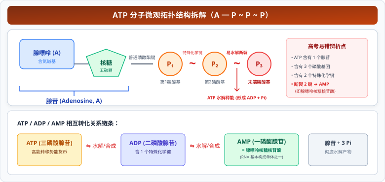
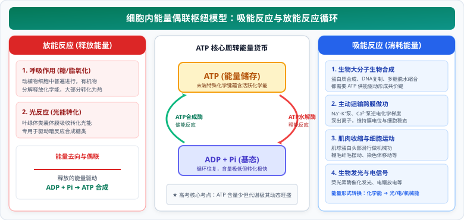

# 02 细胞的能量货币ATP

> **【导读与第一性原理】**
>
> - **教材坐标**：必修1 第5章 第2节《细胞的能量“货币”ATP》
> - **核心生命观念**：物质与能量观、稳态与平衡观
> - **认知引导**：人体细胞在剧烈奔跑时，每分钟需要消耗几十克甚至数百克 ATP，然而体内的 ATP 总储量竟然仅仅只有几毫克到几克，甚至不足以维持细胞几秒钟的剧烈收缩！为什么细胞不大量储备现成的 ATP，而是选择像维持极高周转率的“流动货币”一样，让 ATP 与 ADP 之间进行高频飞速的循环转化？为什么 ATP 去掉两个磷酸基团后，会变成搭建 RNA 的砖块？本节将带你透视细胞最核心的能量通货。

---

## 一、 教材基础与核心机理透析

### 1. ATP 分子的化学组成与微观构型

#### (1) 名称与元素组成

- **中文全名**：**腺苷三磷酸（Adenosine Triphosphate, ATP）**。
- **组成元素**：**C、H、O、N、P**（与核酸 DNA/RNA、细胞膜磷脂完全一致）。

#### (2) 结构简式与分子拆解

$$\text{A}-\text{P}\sim\text{P}\sim\text{P}$$

  

- **特殊的化学键（旧称高能磷酸键）**：
  - 由于相邻磷酸基团都带有负电荷，彼此之间存在强烈的静电排斥；
  - 尤其是**末端的那个特殊的化学键（$\sim$）**极不稳定，容易断裂；
  - 水解时，末端磷酸基团脱离并转移到其他蛋白质或酶分子上（磷酸化），同时释放出高达 $30.54\text{ kJ/mol}$ 的大量自由能。

#### (3) 核心跨学科联动：ATP 与 RNA 的血缘纽带

$$\text{ATP} \xrightarrow{\text{脱去末端 1 个磷酸基团}} \text{ADP (腺苷二磷酸)} \xrightarrow{\text{脱去中间 1 个磷酸基团}} \text{AMP (腺苷一磷酸)}$$

- **AMP 的本质**：由 1 分子腺嘌呤 + 1 分子核糖 + 1 分子磷酸基团构成，其化学本质就是**腺嘌呤核糖核苷酸**！它是合成 RNA 的四大基本原料之一！

---

### 2. ATP 与 ADP 的相互转化──细胞的能量流动循环

$$\text{ATP} \underset{\text{ATP合成酶，线粒体/叶绿体/胞质基质}}{\overset{\text{ATP水解酶，需能生命活动}}{\rightleftharpoons}} \text{ADP} + \text{Pi} + \text{能量}$$

#### (1) 为什么说“ATP 与 ADP 的转化不是可逆反应”？（高考必背辨析）

| 对比维度           | ATP 的水解过程                                             | ATP 的合成过程                                                     | 结论判定                 |
| :----------------- | :--------------------------------------------------------- | :----------------------------------------------------------------- | :----------------------- |
| **催化酶类别**     | **ATP 水解酶**                                             | **ATP 合成酶**                                                     | **酶不同**（酶具专一性） |
| **能量来源与去向** | 来源于特殊的化学键释放的高能；去向为各种吸能生命活动       | 来源于有机物氧化分解的化学能或光能；储存在特殊的化学键中           | **能量不可逆**           |
| **反应场所**       | 广泛发生于全细胞所有需要能量的亚微结构（核糖体、细胞膜等） | 仅发生于**细胞质基质、线粒体（基质与内膜）、叶绿体（类囊体薄膜）** | **场所不同**             |

- **辩证统一**：物质是可逆循环的（$\text{ATP} \rightleftharpoons \text{ADP} + \text{Pi}$），但**能量流动是单向不可逆的**！

#### (2) ATP 合成的能量来源

- **动物、真菌与大多数微生物**：依靠**细胞呼吸**（有机物分步氧化分解释放的化学能）。
- **绿色植物与光能自养生物**：依靠**细胞呼吸（化学能）**与**光合作用（吸收的光能）**。

---

### 3. 吸能反应与放能反应的能量偶联（Energy Coupling）

  

1. **吸能反应（Endothermic reactions）**：
   - 往往与 **ATP 的水解反应相偶联**；
   - 由 ATP 水解提供能量，直接驱动反应进行（如蛋白质合成、DNA 复制、物质的主动运输、肌纤维滑动收缩）。
2. **放能反应（Exothermic reactions）**：
   - 往往与 **ATP 的合成反应相偶联**；
   - 葡萄糖等有机物分步氧化释放的能量，被捕获并储存到新合成的 ATP 分子中。
3. **含量极低与高频周转的生命策略**：
   - 细胞内 ATP 的储备量**极少**（仅能维持细胞数秒的代谢活动）；
   - 但 ATP 和 ADP 的相互转化**极其迅速、动态平衡**，确保了细胞在任何生理工况下都能即用即造，杜绝高能化合物过量积累造成的热耗散与渗透压崩溃。

---

## 二、 核心矢量图解 (SVG)

<svg xmlns="http://www.w3.org/2000/svg" viewBox="0 0 780 370" width="100%">
  <!-- 背景板 -->
  <rect x="0" y="0" width="780" height="370" rx="12" fill="#F8FAFC" stroke="#E2E8F0" stroke-width="1.5"/>
  <!-- 顶部标题条 -->
  <g transform="translate(20, 16)">
    <rect x="0" y="0" width="740" height="42" rx="8" fill="#1E293B"/>
    <text x="370" y="26" fill="#FFFFFF" font-size="16" font-weight="bold" text-anchor="middle" letter-spacing="1">ATP 分子结构微观解析与吸能/放能偶联循环天平</text>
  </g>
  <!-- 左侧卡片：ATP 微观结构与断键机理 (局部坐标系) -->
  <g transform="translate(20, 72)">
    <rect x="0" y="0" width="360" height="280" rx="8" fill="#FFFFFF" stroke="#CBD5E1" stroke-width="1.5"/>
    <rect x="0" y="0" width="360" height="36" rx="8" fill="#EFF6FF" stroke="#BFDBFE" stroke-width="1"/>
    <text x="180" y="23" fill="#1D4ED8" font-size="14" font-weight="bold" text-anchor="middle">ATP 分子结构式与单体血缘解析</text>
    <!-- 结构拆解图元 -->
    <g transform="translate(15, 48)">
      <!-- 结构组成 -->
      <rect x="0" y="0" width="330" height="60" rx="6" fill="#F0F9FF" stroke="#BAE6FD" stroke-width="1"/>
      <text x="12" y="18" fill="#0369A1" font-size="11.5" font-weight="bold">结构简式：A - P ~ P ~ P (C, H, O, N, P)</text>
      <text x="12" y="36" fill="#334155" font-size="10.5">● A (腺苷) = 腺嘌呤 (碱基) + 核糖 (五碳糖)</text>
      <text x="12" y="52" fill="#334155" font-size="10.5">● ~ 为特殊的化学键（强静电排斥，高转移势能）</text>
      <!-- 断键与 AMP 本质 -->
      <g transform="translate(0, 68)">
        <rect x="0" y="0" width="330" height="74" rx="6" fill="#FEFCE8" stroke="#FEF08A" stroke-width="1"/>
        <text x="12" y="18" fill="#854D0E" font-size="11.5" font-weight="bold">末端磷酸基团转移与 AMP 本质：</text>
        <text x="12" y="34" fill="#4B5563" font-size="10.5">水解脱去【末端磷酸】：形成 ADP + 释放 30.54 kJ/mol</text>
        <text x="12" y="50" fill="#2563EB" font-size="10.5" font-weight="bold">连续脱去 2 个磷酸：生成 AMP (腺苷一磷酸)</text>
        <text x="12" y="66" fill="#DC2626" font-size="10.5" font-weight="bold">➔ AMP 即为【腺嘌呤核糖核苷酸】（RNA 基本单体）！</text>
      </g>
      <!-- 磷酸化机制 -->
      <g transform="translate(0, 150)">
        <rect x="0" y="0" width="330" height="42" rx="6" fill="#F0FDF4" stroke="#BBF7D0" stroke-width="1"/>
        <text x="12" y="17" fill="#166534" font-size="11" font-weight="bold">蛋白质磷酸化 (Phosphorylation)：</text>
        <text x="12" y="33" fill="#15803D" font-size="10">末端磷酸基团转移至载体蛋白，引起构象改变与活性激活</text>
      </g>
    </g>
  </g>
  <!-- 右侧卡片：ATP 循环与吸能/放能偶联天平 (局部坐标系) -->
  <g transform="translate(400, 72)">
    <rect x="0" y="0" width="360" height="280" rx="8" fill="#FFFFFF" stroke="#CBD5E1" stroke-width="1.5"/>
    <rect x="0" y="0" width="360" height="36" rx="8" fill="#FEF3C7" stroke="#FDE68A" stroke-width="1"/>
    <text x="180" y="23" fill="#B45309" font-size="14" font-weight="bold" text-anchor="middle">ATP 与 ADP 动态转化与能量偶联网络</text>
    <!-- 循环图元 -->
    <g transform="translate(15, 48)">
      <!-- 放能合成 ATP -->
      <rect x="0" y="0" width="330" height="60" rx="6" fill="#FFFBEB" stroke="#FCD34D" stroke-width="1"/>
      <text x="12" y="18" fill="#78350F" font-size="11.5" font-weight="bold">【放能反应】与 ATP 合成相偶联：</text>
      <text x="12" y="34" fill="#92400E" font-size="10.5">● 呼吸作用（氧化分解有机物释放化学能）</text>
      <text x="12" y="49" fill="#92400E" font-size="10.5">● 光合作用光反应（光合色素吸收转换光能）</text>
      <!-- 吸能消耗 ATP -->
      <g transform="translate(0, 68)">
        <rect x="0" y="0" width="330" height="64" rx="6" fill="#F8FAFC" stroke="#E2E8F0" stroke-width="1"/>
        <text x="12" y="18" fill="#1E293B" font-size="11.5" font-weight="bold">【吸能反应】与 ATP 水解相偶联：</text>
        <text x="12" y="34" fill="#4B5563" font-size="10.5">● 生物大分子合成（蛋白质、DNA、RNA、多糖合成）</text>
        <text x="12" y="49" fill="#2563EB" font-size="10.5">● 离子逆浓度主动运输、大脑思考、肌肉收缩</text>
      </g>
      <!-- 动态平衡法则 -->
      <g transform="translate(0, 140)">
        <rect x="0" y="0" width="330" height="52" rx="6" fill="#EFF6FF" stroke="#BFDBFE" stroke-width="1"/>
        <text x="165" y="18" fill="#1D4ED8" font-size="11.5" font-weight="bold" text-anchor="middle">动态平衡核心：【含量少，转化快】</text>
        <text x="165" y="35" fill="#1E40AF" font-size="10.5" text-anchor="middle">物质可逆循环，能量单向流动不可逆！</text>
      </g>
    </g>
  </g>
</svg>

---

## 三、 高频易错点与考场排雷 (WARNING)

::: warning ⚠️ 致命陷阱 1：ATP 与 ADP 的转化是可逆反应吗？

- **典型误区**：看见反应式双向箭头 $\rightleftharpoons$，就误以为这是化学意义上的可逆反应。
- **微观本质剖析**：
  - 这**绝对不是可逆反应**！
  - **催化酶不同**：合成靠 ATP 合成酶，水解靠 ATP 水解酶；
  - **能量形式不同**：合成能量来自光能或呼吸化学能，水解释放的高能用于做功或发光发热；
  - **反应场所不同**：合成仅限叶绿体、线粒体和胞质基质，水解发生于全细胞所有需能位点。
  - **结论**：**物质可逆，能量不可逆！**
    :::

::: warning ⚠️ 致命陷阱 2：ATP 去掉两个磷酸基团后是什么物质？

- **典型误区**：认为水解后是腺苷，或者是 DNA 单体。
- **微观本质剖析**：
  - ATP 中五碳糖是**核糖**而非脱氧核糖；
  - 去掉两个磷酸基团后剩余部分是 **AMP（腺苷一磷酸）**，即**腺嘌呤核糖核苷酸**，是合成 **RNA** 的原料！
  - 只有五碳糖为脱氧核糖时才是 dAMP（合成 DNA 的原料）。
    :::

---

## 四、 高考真题命题角度与长句表达规范

### 1. 规范答题逻辑链模板

- **设问方向**：“人体在剧烈运动时，肌肉细胞中 ATP 的消耗速率成倍增加，但测得细胞中 ATP 的含量却几乎保持不变，请解释原因。”
- **教材级标准答题模板**：
  `虽然剧烈运动时肌肉细胞消耗 ATP 的速率大幅增加，但同时 ADP 浓度的升高会迅速激活细胞内的呼吸酶系，促进细胞呼吸（有氧呼吸和无氧呼吸）速率加快，使得 ATP 的合成速率同步大幅提升；由于 ATP 和 ADP 之间能够实现极其迅速且高效的动态转化，ATP 的合成与消耗速率达到新的动态平衡，因此细胞内 ATP 的含量能保持相对稳定。`

### 2. 经典高考真题变式设问

- **设问方向**：“某些离子泵在进行主动运输时需要经历自身磷酸化过程，简述 ATP 驱动离子泵进行逆浓度运输的机理。”
- **标准答题逻辑**：
  `离子泵具有 ATP 水解酶活性；当离子与泵结合后，ATP 分子末端的磷酸基团水解脱离并转移结合到离子泵蛋白质分子上（使其磷酸化）；磷酸化导致离子泵的空间构象发生改变，将其结合位点转向膜的另一侧，进而将离子逆浓度梯度释放到膜外或膜内，随后去磷酸化恢复原构象。`
