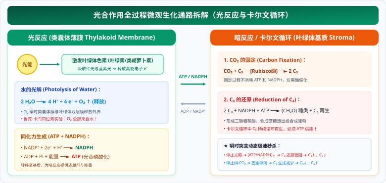

# 04 光合作用微观机理与瞬时突变动态模型

> **【导读与第一性原理】**
> - **教材坐标**：必修1 第5章 第4节《光合作用与能量转化》
> - **核心生命观念**：物质与能量观、稳态与平衡观
> - **认知引导**：地球上几乎所有的生命能量，最终都源自 1.5 亿公里外太阳聚变释放的光子。然而，光子是瞬息即逝的电磁波，植物如何才能将这奔涌的光量子，凝固在稳定分子的化学键中？大自然给出的优雅方案是：首先在类囊体薄膜上利用光能劈开水分子，把光能转化为极不稳定的“高能中间体”（ATP 与 NADPH）；紧接着在基质中，利用这些高能中间体驱动卡尔文循环，将空气中惰性的二氧化碳固定为糖类。本节将从光子捕获到暗反应碳流动，解析光合作用的核心机理与高考突变模型。

---

## 一、 教材基础与微观机理透析

### 1. 捕获光能的色素与光合结构

#### (1) 叶绿体的亚微结构
- **双层膜**：外膜与内膜；
- **基粒（Grana）**：由数十个囊状结构──**类囊体（Thylakoids）**堆叠而成。这种折叠堆叠极大地扩展了受光表面积；
- **叶绿体基质（Stroma）**：充满液态酶体系，是进行暗反应（卡尔文循环）的场所；基质中含有少量双链环状 DNA 和 70S 核糖体。

#### (2) 光合色素的分离与吸收光谱
光合色素分布在**类囊体薄膜上**：
- **叶绿素（约占 $3/4$）**：
  - **叶绿素 a（蓝绿色）**与**叶绿素 b（黄绿色）**；
  - 主要吸收**红光和蓝紫光**。
- **类胡萝卜素（约占 $1/4$）**：
  - **胡萝卜素（橙黄色）**与**叶黄素（黄色）**；
  - 主要吸收**蓝紫光**。
- *现象解释*：绿光由于几乎不被叶绿素和类胡萝卜素吸收，大部分被反射出来，因此叶片呈现绿色。

#### (3) 绿叶中色素的提取和分离实验（纸层析法）
- **提取试剂**：**无水乙醇**（溶解并提取脂溶性色素）；加入少量 **$\text{CaCO}_3$（防止研磨中叶绿素被酸破坏）** 和 **$\text{SiO}_2$（使研磨充分）**。
- **层析液**：脂溶性有机混合物（汽油、石油醚、丙酮等）。
- **分离原理**：不同色素在层析液中的**溶解度不同**；溶解度高的随层析液在滤纸上扩散得快，溶解度低的扩散得慢。
- **层析结果（由上至下）**：
  $$\begin{aligned}
  \text{胡萝卜素 (橙黄色)} &\implies \text{溶解度最高，扩散最快（最上一条）} \\
  \text{叶黄素 (黄色)} &\implies \text{溶解度次之} \\
  \text{叶绿素 a (蓝绿色)} &\implies \text{含量最多，色素带最宽} \\
  \text{叶绿素 b (黄绿色)} &\implies \text{溶解度最低，扩散最慢（最下一条）}
  \end{aligned}$$
- **关键操作禁令**：层析时**滤液细线绝不能触及层析液液面**，否则色素会直接溶解在层析液中而无法在滤纸上分离！

---

### 2. 光合作用全过程微观生化通路拆解

  

#### (1) 光反应阶段（Light Reactions）
- **场所**：**叶绿体类囊体薄膜**。
- **必需条件**：光照、光合色素、酶、水、$\text{NADP}^+$、$\text{ADP}$ 和 $\text{Pi}$。
- **微观生化过程**：
  1. **水的光解**：$2H_2O \xrightarrow{\text{光、光合色素}} 4H^+ + 4e^- + O_2$（氧气以气体形式释放出细胞）。
  2. **$\text{NADPH}$ 与 $\text{ATP}$ 的生成**：光能驱动电子传递链将质子抽入类囊体腔，形成跨膜质子电化学梯度（化学渗透假说）；质子经 ATP 合成酶回流基质合成 **$\text{ATP}$**；末端电子与基质中的 $\text{H}^+$ 还原 $\text{NADP}^+$ 生成 **$\text{NADPH}$（还原型辅酶Ⅱ）**。
- **能量转化**：光能 $\to$ $\text{ATP}$ 和 $\text{NADPH}$ 中活跃的化学能。

#### (2) 暗反应阶段（碳反应 / 卡尔文循环，Calvin Cycle）
- **场所**：**叶绿体基质**。
- **必需条件**：多种专一性酶（如 Rubisco 酶）、$\text{CO}_2$、$\text{ATP}$、$\text{NADPH}$。
- **微观生化过程**：
  1. **$\text{CO}_2$ 的固定**：外界吸收或线粒体呼吸产生的 $\text{CO}_2$ 与细胞内部的五碳化合物（$C_5$）在酶催化下结合，迅速生成两个三碳化合物（$C_3$）。
     $$CO_2 + C_5 \xrightarrow{\text{Rubisco酶}} 2C_3$$
  2. **$C_3$ 的还原**：在有关酶催化下，$C_3$ 接受 **$\text{ATP}$ 释放的能量**并被 **$\text{NADPH}$ 还原（提供氢和能量）**，一部分转化为储存能量的糖类有机物 $(CH_2O)$，另一部分经过一系列生化转变重新再生为 $C_5$，维持卡尔文循环的持续运转。
     $$2C_3 + NADPH + ATP \xrightarrow{\text{酶}} (CH_2O) + C_5 + NADP^+ + ADP + Pi$$
- **能量转化**：$\text{ATP}$ 和 $\text{NADPH}$ 中活跃的化学能 $\to$ 储存在糖类中有机物中稳定的化学能。

---

## 二、 高考高频压轴模型：光照与 CO₂ 突变瞬时动态矩阵

当外界环境突然改变时，由于物质的“生成速率”与“消耗速率”瞬间失衡，叶绿体内各中间产物的含量将发生特异性突变（高考极高频考点！）：

| 环境突变条件 | 光反应 / 碳反应初发故障 | $C_3$ 含量动态 | $C_5$ 含量动态 | ATP & NADPH 含量动态 | $(CH_2O)$ 合成速率 |
| :--- | :--- | :--- | :--- | :--- | :--- |
| **突停光照 （遮光，$\text{CO}_2$ 充足）** | 光反应骤停，缺乏 ATP 和 NADPH，**$C_3$ 还原停止**；但 $CO_2$ 固定继续 | **迅速增加 ↑** （来源不断，去路受阻） | **迅速减少 ↓** （来源受阻，去路继续） | **迅速减少 ↓** （停止合成，被原暗反应消耗） | **迅速下降 ↓** |
| **突增光照 （强光，$\text{CO}_2$ 恒定）** | 光反应剧增，生成大量 ATP 和 NADPH，**$C_3$ 还原加速**；$CO_2$ 固定未及跟进 | **迅速减少 ↓** （去路激增，来源暂定） | **迅速增加 ↑** （还原再生激增，固定暂定） | **迅速增加 ↑** （光合产能激增） | **显著上升 ↑** |
| **突停 $\text{CO}_2$ 供应 （气孔关闭，光照充足）** | $\text{CO}_2$ 浓度骤降，**$CO_2$ 固定骤停**；光反应正常提供 ATP/NADPH，$C_3$ 还原继续 | **迅速减少 ↓** （来源切断，去路继续） | **迅速增加 ↑** （去路切断，来源继续再生） | **迅速增加 ↑** （持续合成，暗反应消耗受阻积累） | **迅速下降 ↓** |
| **突增 $\text{CO}_2$ 供应 （充气，光照恒定）** | $\text{CO}_2$ 浓度激增，**$CO_2$ 固定剧增**；消耗大量 $C_5$ 生成大量 $C_3$ | **迅速增加 ↑** （来源剧增） | **迅速减少 ↓** （固定消耗激增） | **暂时减少 ↓** （暗反应还原 $C_3$ 消耗加速） | **显著上升 ↑** |

> **【秒杀推导通用心法】**：
> 1. **看源头与去路**：任何物质的瞬间增减，取决于“生成量”与“消耗量”的相对速率。
> 2. **光照变动，先卡还原**：停光照 $\implies$ ATP/NADPH 没了 $\implies$ 还原停滞 $\implies$ $C_3$ 堆积如山（增），$C_5$ 无法再生（减）。
> 3. **二氧化碳变动，先卡固定**：停 $\text{CO}_2$ $\implies$ 固定停滞 $\implies$ $C_5$ 没人消耗（增），$C_3$ 失去源头（减）。

---

## 三、 核心矢量图解 (SVG)

<svg xmlns="http://www.w3.org/2000/svg" viewBox="0 0 780 370" width="100%">
  <!-- 背景板 -->
  <rect x="0" y="0" width="780" height="370" rx="12" fill="#F8FAFC" stroke="#E2E8F0" stroke-width="1.5"/>
  <!-- 顶部标题条 -->
  <g transform="translate(20, 16)">
    <rect x="0" y="0" width="740" height="42" rx="8" fill="#1E293B"/>
    <text x="370" y="26" fill="#FFFFFF" font-size="16" font-weight="bold" text-anchor="middle" letter-spacing="1">光反应-暗反应能量物质协同微观网络与突变响应矩阵</text>
  </g>
  <!-- 左侧卡片：光反应与暗反应微观偶联机理 (局部坐标系) -->
  <g transform="translate(20, 72)">
    <rect x="0" y="0" width="360" height="280" rx="8" fill="#FFFFFF" stroke="#CBD5E1" stroke-width="1.5"/>
    <rect x="0" y="0" width="360" height="36" rx="8" fill="#F0FDF4" stroke="#86EFAC" stroke-width="1"/>
    <text x="180" y="23" fill="#15803D" font-size="14" font-weight="bold" text-anchor="middle">光反应与卡尔文循环微观耦合通路</text>
    <!-- 微观反应通路 -->
    <g transform="translate(15, 48)">
      <!-- 光反应 -->
      <rect x="0" y="0" width="330" height="58" rx="6" fill="#F0FDF4" stroke="#BBF7D0" stroke-width="1"/>
      <text x="12" y="18" fill="#166534" font-size="11" font-weight="bold">【类囊体薄膜】光反应阶段：</text>
      <text x="12" y="34" fill="#334155" font-size="10">● 水光解：2 H₂O ➔ 4 H⁺ + 4 e⁻ + O₂ (释放)</text>
      <text x="12" y="49" fill="#16A34A" font-size="10.5" font-weight="bold">● 光能 ➔ 活跃化学能储存于【ATP + NADPH】</text>
      <!-- 能量穿梭传递 -->
      <g transform="translate(0, 64)">
        <rect x="0" y="0" width="330" height="30" rx="4" fill="#FEFCE8" stroke="#FEF08A" stroke-width="1"/>
        <text x="165" y="19" fill="#854D0E" font-size="11" font-weight="bold" text-anchor="middle">ATP + NADPH 转移至基质 ➔ 提供能量与 [H]</text>
      </g>
      <!-- 暗反应 -->
      <g transform="translate(0, 100)">
        <rect x="0" y="0" width="330" height="60" rx="6" fill="#F0F9FF" stroke="#BAE6FD" stroke-width="1"/>
        <text x="12" y="18" fill="#0369A1" font-size="11" font-weight="bold">【叶绿体基质】暗反应（卡尔文循环）：</text>
        <text x="12" y="34" fill="#334155" font-size="10">● CO₂ 固定：CO₂ + C₅ ➔ 2 C₃ (Rubisco 酶)</text>
        <text x="12" y="49" fill="#2563EB" font-size="10.5" font-weight="bold">● C₃ 还原：2 C₃ + NADPH + ATP ➔ (CH₂O) + C₅</text>
      </g>
      <!-- 关键禁区警示 -->
      <g transform="translate(0, 166)">
        <rect x="0" y="0" width="330" height="30" rx="4" fill="#FEF2F2" stroke="#FECACA" stroke-width="1"/>
        <text x="165" y="19" fill="#991B1B" font-size="10.5" font-weight="bold" text-anchor="middle">⚠️ 光反应产生的 ATP 绝不出叶绿体！专供暗反应！</text>
      </g>
    </g>
  </g>
  <!-- 右侧卡片：突变瞬时动态高考秒杀矩阵 (局部坐标系) -->
  <g transform="translate(400, 72)">
    <rect x="0" y="0" width="360" height="280" rx="8" fill="#FFFFFF" stroke="#CBD5E1" stroke-width="1.5"/>
    <rect x="0" y="0" width="360" height="36" rx="8" fill="#FEF3C7" stroke="#FDE68A" stroke-width="1"/>
    <text x="180" y="23" fill="#B45309" font-size="14" font-weight="bold" text-anchor="middle">光照 / CO₂ 突变中间产物代换矩阵</text>
    <!-- 突变矩阵图元 -->
    <g transform="translate(15, 48)">
      <!-- 突变 1：停光照 -->
      <rect x="0" y="0" width="330" height="42" rx="6" fill="#FFFBEB" stroke="#FCD34D" stroke-width="1"/>
      <text x="12" y="17" fill="#78350F" font-size="11" font-weight="bold">① 突停光照 (光 ➔ 暗，CO₂ 恒定)：</text>
      <text x="12" y="32" fill="#B91C1C" font-size="10.5" font-weight="bold">【C₃ 骤增 ↑】 【C₅ 骤降 ↓】 【ATP/NADPH 骤降 ↓】</text>
      <!-- 突变 2：增光照 -->
      <g transform="translate(0, 48)">
        <rect x="0" y="0" width="330" height="42" rx="6" fill="#F8FAFC" stroke="#E2E8F0" stroke-width="1"/>
        <text x="12" y="17" fill="#1E293B" font-size="11" font-weight="bold">② 突增光照 (弱光 ➔ 强光，CO₂ 恒定)：</text>
        <text x="12" y="32" fill="#16A34A" font-size="10.5" font-weight="bold">【C₃ 骤降 ↓】 【C₅ 骤增 ↑】 【ATP/NADPH 激增 ↑】</text>
      </g>
      <!-- 突变 3：停 CO2 -->
      <g transform="translate(0, 96)">
        <rect x="0" y="0" width="330" height="42" rx="6" fill="#F8FAFC" stroke="#E2E8F0" stroke-width="1"/>
        <text x="12" y="17" fill="#1E293B" font-size="11" font-weight="bold">③ 突停 CO₂ (气孔关闭，光照充足)：</text>
        <text x="12" y="32" fill="#2563EB" font-size="10.5" font-weight="bold">【C₃ 骤降 ↓】 【C₅ 骤增 ↑】 【ATP/NADPH 积累 ↑】</text>
      </g>
      <!-- 核心口诀框 -->
      <g transform="translate(0, 144)">
        <rect x="0" y="0" width="330" height="54" rx="6" fill="#EFF6FF" stroke="#BFDBFE" stroke-width="1"/>
        <text x="165" y="18" fill="#1D4ED8" font-size="11" font-weight="bold" text-anchor="middle">【高考瞬时秒杀心法】</text>
        <text x="12" y="34" fill="#1E40AF" font-size="10.5">光照变看还原：无光还原断，C₃积存 C₅完</text>
        <text x="12" y="48" fill="#1E40AF" font-size="10.5">CO₂变看固定：无碳固定断，C₅存积 C₃完</text>
      </g>
    </g>
  </g>
</svg>

---

## 四、 高频易错点与考场排雷 (WARNING)

::: warning ⚠️ 致命陷阱 1：光反应产生的 ATP 能够供全细胞所有生命活动使用吗？
- **典型误区**：认为光合作用产生的能量可以直接用于细胞的胞吞胞吐或肌肉收缩。
- **微观本质剖析**：
  - **叶绿体类囊体薄膜上光反应生成的 ATP 绝不离开叶绿体**！
  - 这些 ATP **仅在叶绿体基质中用于暗反应中 $C_3$ 的还原**；
  - 细胞内其他一切吸能生命活动（如蛋白质合成、主动运输、细胞分裂）所需的 ATP，**全部依赖细胞呼吸（线粒体与细胞质基质）产生**！
:::

::: warning ⚠️ 致命陷阱 2：暗反应在完全黑暗的条件下能持续进行吗？
- **典型误区**：看见名字叫“暗反应”，就以为在黑暗中可以永远持续发生。
- **微观本质剖析**：
  - 暗反应本身**虽然不需要光照参与，但它必须依赖光反应提供的两种关键原料──ATP 和 NADPH**；
  - 在持续黑暗条件下，叶绿体内原有的 ATP 和 NADPH 在几秒钟内便被消耗殆尽，导致暗反应的 $C_3$ 还原过程被迫停滞；
  - 因此，**暗反应在持续黑暗中很快就会停止**！
:::

---

## 五、 高考真题命题角度与长句表达规范

### 1. 规范答题逻辑链模板
- **设问方向**：“在光照充足的温室大棚中，突然将大棚密闭并抽干其中的二氧化碳，短时间内植物叶肉细胞中五碳化合物（C₅）与 NADPH 的含量均会大幅上升，请解释原因。”
- **教材级标准答题模板**：
  `因为突然抽干二氧化碳后，暗反应中二氧化碳的固定过程瞬间受阻，五碳化合物（C₅）的消耗速率大幅下降；而此时光照依然充足，光反应正常进行产生大量 ATP 和 NADPH，原本积累的三碳化合物（C₃）继续被还原并再生为 C₅，导致 C₅ 的生成速率远大于消耗速率，因而 C₅ 含量大幅上升；同时由于缺乏 C₃ 接受还原，暗反应消耗 NADPH 的速率急剧下降，而光反应仍在持续生成 NADPH，最终导致 NADPH 在基质中大量积累增加。`

### 2. 经典高考真题变式设问
- **设问方向**：“鲁宾和卡门采用同位素标记法证明光合作用释放的氧气全部来源于水，请写出其严格对照实验的设计思路。”
- **标准答题逻辑**：
  `设置两组对照实验：第一组向小球藻提供 H₂¹⁸O 和普通的 C¹⁶O₂，在光照等相同适宜条件下培养并检测释放的气体；第二组向等量小球藻提供普通的 H₂¹⁶O 和被标记的 C¹⁸O₂，在相同条件下培养检测释放的气体；结果第一组释放的气体全部为 ¹⁸O₂，第二组释放的气体全部为 ¹⁶O₂，从而严密证明了光合作用释放的氧气全部来自水的光解，而不是来自二氧化碳。`
