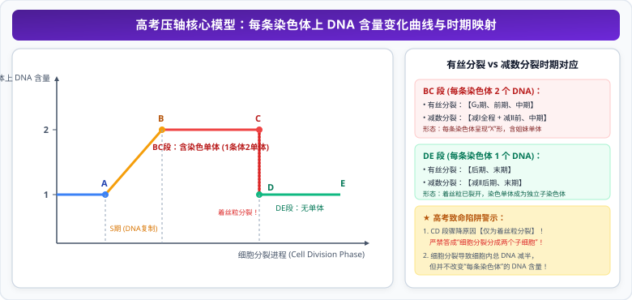

# 01 细胞增殖与有丝分裂

> **【导读与第一性原理】**
> - **教材坐标**：必修1 第6章 第1节《细胞的增殖》
> - **核心生命观念**：结构与功能观、物质与能量观、信息观
> - **认知引导**：大自然中的大象由上百亿个细胞构成，而小小的老鼠同样由细胞构成。为什么大象的细胞并不比老鼠的细胞大？为什么细胞不能像气球一样无限膨胀，而是必须通过有丝分裂一分为二？从物理几何第一性原理来看，立方体的表面积与体积之比随着边长增加而急剧下降，造成物质交换效率崩溃。细胞如何精密编排染色体的高级折叠与纺锤丝牵引，确保数十亿碱基对被绝对均等平分？本节将带你解析细胞增殖的微观力学与数学模型。

---

## 一、 教材基础与核心机理透析

### 1. 细胞不能无限长大的底层物理化学限制

1. **细胞表面积与体积的关系（相对表面积限制）**：
   $$\frac{\text{表面积 } (S)}{\text{体积 } (V)} = \frac{6r^2}{r^3} = \frac{6}{r}$$
   - 细胞体积越大，其**相对表面积（$S/V$ 比值）就越小**；
   - 细胞与外界环境进行物质交换完全依赖细胞膜表面，相对表面积过小会导致细胞物质吸收与代谢废物排出的**交换效率显著下降**，无法满足巨大体积内部的代谢需求。
2. **细胞核的控制范围（核质比限制）**：
   - 细胞核是遗传与代谢的调控中枢，其转录产生的 mRNA 与指导合成的蛋白质所能有效扩散和调控的细胞质范围是有限的。

---

### 2. 细胞周期（Cell Cycle）的界定与时相划分

#### (1) 适用前提与科学定义
- **适用对象**：**只有连续分裂的细胞才具有细胞周期**！
  - *典型实例*：早期胚胎受精卵、植物根尖分生区细胞、茎形成层细胞、皮肤生发层细胞、造血干细胞、癌细胞。
  - *无细胞周期特例*：高度分化不再分裂的细胞（成熟红细胞、神经元、浆细胞、肌纤维）；进行减数分裂的性原细胞。
- **完整定义**：连续分裂的细胞，**从一次分裂完成时开始，到下一次分裂完成时为止**，为一个细胞周期。
- **时间分配原则**：分裂间期占整个细胞周期的 **$90\% \sim 95\%$**，分裂期仅占 $5\% \sim 10\%$（因此显微镜下观察分生区装片时，**大多数细胞都处于分裂间期**）。

#### (2) 细胞周期的微观时相
- **分裂间期（Interphase）**：
  - **$G_1$ 期（DNA 复制前期）**：主要进行 RNA 和核糖体、酶等蛋白质的大量合成，为 DNA 复制准备原料。
  - **$S$ 期（DNA 复制期）**：进行**染色体 DNA 的半保留复制**以及组蛋白的合成。
  - **$G_2$ 期（DNA 复制后期）**：合成微管蛋白等有丝分裂所需的特异性蛋白质，为分裂期准备能量与物质。
- **分裂期（M 期）**：分为前期、中期、后期、末期。

---

### 3. 有丝分裂各时期染色体行为与动植物区别

#### (1) 各期动态微观口诀与特征
- **间期（复制合成非等闲）**：完成 **DNA 分子的复制和有关蛋白质的合成**；细胞适度生长。每条染色体复制后形成两条**姐妹染色单体**，由一个共同的着丝粒连接，呈松散细丝状的染色质状态。
- **前期（仁膜消失现两体）**：**核仁解体、核膜消失**；染色质螺旋缠绕变粗变短形成**染色体**；细胞两极发出微管形成**纺锤体**；染色体散乱分布于纺锤体中央。
- **中期（形定数晰赤道齐）**：纺锤丝牵引染色体，使所有染色体的**着丝粒整齐排列在细胞中央的“赤道板”平面上**；此时染色体高度螺旋，**形态最稳定、数目最清晰**，是进行染色体核型分析与计数观察的最佳时期！
- **后期（粒裂妹分奔两极）**：**着丝粒分裂，姐妹染色单体分开，成为两条子染色体**；在纺锤丝牵引下分别移向细胞两极。此时**染色体数目瞬间加倍**，染色单体数目清零！
- **末期（两消两现重开始）**：染色体解螺旋重新变为细丝状染色质；**纺锤体消失**；**核膜、核仁重新构建**；细胞质分裂形成两个子细胞。

#### (2) 高等植物细胞 vs 动物细胞有丝分裂的两大本质差异

| 比较维度 | 高等植物细胞有丝分裂 | 动物细胞有丝分裂 |
| :--- | :--- | :--- |
| **前期纺锤体形成机制** | 由细胞两极的细胞质直接发出**纺锤丝**形成纺锤体 | 由在间期完成倍增的**中心体（中心粒）**移向两极发出**星射线**形成纺锤体 |
| **末期细胞质分裂机制** | 赤道板位置出现**细胞板**（高尔基体聚集出芽），向四周扩展形成新**细胞壁** | 细胞膜从中央赤道板区域**向内凹陷溢裂**，将细胞质缢裂成两部分 |

---

## 二、 染色体、核 DNA 与每条染色体 DNA 含量定量模型

### 1. 经典数量演变对比表（设体细胞染色体数为 $2N$，核 DNA 含量为 $2C$）：

| 分裂时期 | 间期 | 前期 | 中期 | 后期 | 末期 |
| :--- | :--- | :--- | :--- | :--- | :--- |
| **染色体数目** | $2N$ | $2N$ | $2N$ | **$4N$（着丝粒分裂加倍）** | $4N \to 2N$ |
| **核 DNA 分子数** | $2C \to 4C$ | $4C$ | $4C$ | $4C$ | $4C \to 2C$ |
| **染色单体数目** | $0 \to 4N$ | $4N$ | $4N$ | **$0$（着丝粒分裂清零）** | $0$ |

---

### 2. 高考压轴核心模型：每条染色体上 DNA 含量变化曲线

$$\frac{\text{DNA 分子总数}}{\text{染色体总数}} \in [1, 2]$$

  

- **$AB$ 段（$=1$）**：间期 DNA 复制前（$G_1$ 期），每条染色体由 1 个 DNA 构成；
- **$BC$ 升高段（$1 \to 2$）**：**间期 $S$ 期 DNA 半保留复制**，形成姐妹染色单体；
- **$CD$ 平台期（$=2$）**：分裂前期和中期，每条染色体含有 2 条姐妹染色单体和 2 个 DNA 分子；
- **$DE$ 骤降段（$2 \to 1$）（高考绝对核心设问）**：
  - **诱发机理**：**有丝分裂后期着丝粒分裂，姐妹染色单体分开形成两条子染色体**！
  - **排雷警告**：该骤降过程**与细胞质是否分裂、细胞是否一分为二完全无关**！

---

## 三、 核心矢量图解 (SVG)

<svg xmlns="http://www.w3.org/2000/svg" viewBox="0 0 780 370" width="100%">
  <!-- 背景板 -->
  <rect x="0" y="0" width="780" height="370" rx="12" fill="#F8FAFC" stroke="#E2E8F0" stroke-width="1.5"/>
  <!-- 顶部标题条 -->
  <g transform="translate(20, 16)">
    <rect x="0" y="0" width="740" height="42" rx="8" fill="#1E293B"/>
    <text x="370" y="26" fill="#FFFFFF" font-size="16" font-weight="bold" text-anchor="middle" letter-spacing="1">有丝分裂各期染色体行为演变与每条染色体DNA模型图谱</text>
  </g>
  <!-- 左侧卡片：有氧有丝分裂染色体四期行为口诀 (局部坐标系) -->
  <g transform="translate(20, 72)">
    <rect x="0" y="0" width="360" height="280" rx="8" fill="#FFFFFF" stroke="#CBD5E1" stroke-width="1.5"/>
    <rect x="0" y="0" width="360" height="36" rx="8" fill="#EFF6FF" stroke="#BFDBFE" stroke-width="1"/>
    <text x="180" y="23" fill="#1D4ED8" font-size="14" font-weight="bold" text-anchor="middle">有丝分裂染色体各期特征微观口诀</text>
    <!-- 口诀与行为 -->
    <g transform="translate(15, 48)">
      <!-- 前期 -->
      <rect x="0" y="0" width="330" height="42" rx="6" fill="#F0F9FF" stroke="#BAE6FD" stroke-width="1"/>
      <text x="12" y="18" fill="#0369A1" font-size="11.5" font-weight="bold">前期：仁膜消失现两体</text>
      <text x="12" y="34" fill="#334155" font-size="10.5">核仁核膜解体，染色质变染色体，纺锤体出现散乱分布</text>
      <!-- 中期 -->
      <g transform="translate(0, 48)">
        <rect x="0" y="0" width="330" height="42" rx="6" fill="#FEFCE8" stroke="#FEF08A" stroke-width="1"/>
        <text x="12" y="18" fill="#854D0E" font-size="11.5" font-weight="bold">中期：形定数晰赤道齐（观察最佳期）</text>
        <text x="12" y="34" fill="#4B5563" font-size="10.5">着丝粒排列在赤道板平面，染色体形态稳定、数目清晰</text>
      </g>
      <!-- 后期 -->
      <g transform="translate(0, 96)">
        <rect x="0" y="0" width="330" height="42" rx="6" fill="#FEF2F2" stroke="#FECACA" stroke-width="1"/>
        <text x="12" y="18" fill="#991B1B" font-size="11.5" font-weight="bold">后期：粒裂妹分奔两极（数目加倍）</text>
        <text x="12" y="34" fill="#DC2626" font-size="10.5">着丝粒分裂，染色单体分开成子染色体，染色体数倍增！</text>
      </g>
      <!-- 末期 -->
      <g transform="translate(0, 144)">
        <rect x="0" y="0" width="330" height="44" rx="6" fill="#F0FDF4" stroke="#86EFAC" stroke-width="1"/>
        <text x="12" y="18" fill="#166534" font-size="11.5" font-weight="bold">末期：两消两现重开始</text>
        <text x="12" y="34" fill="#15803D" font-size="10.5">植物形成【细胞板】向外展；动物膜中部凹陷缢裂</text>
      </g>
    </g>
  </g>
  <!-- 右侧卡片：每条染色体DNA含量模型与考点 (局部坐标系) -->
  <g transform="translate(400, 72)">
    <rect x="0" y="0" width="360" height="280" rx="8" fill="#FFFFFF" stroke="#CBD5E1" stroke-width="1.5"/>
    <rect x="0" y="0" width="360" height="36" rx="8" fill="#FEF3C7" stroke="#FDE68A" stroke-width="1"/>
    <text x="180" y="23" fill="#B45309" font-size="14" font-weight="bold" text-anchor="middle">每条染色体 DNA 含量定量折线模型</text>
    <!-- 定量折线图解 -->
    <g transform="translate(15, 48)">
      <!-- 曲线阶段 1：上升段 -->
      <rect x="0" y="0" width="330" height="52" rx="6" fill="#FFFBEB" stroke="#FCD34D" stroke-width="1"/>
      <text x="12" y="18" fill="#78350F" font-size="11" font-weight="bold">1 ➔ 2 升高段：间期 S 期 DNA 复制</text>
      <text x="12" y="34" fill="#92400E" font-size="10.5">每条染色体形成 2 条姐妹染色单体，DNA 含量倍增</text>
      <!-- 曲线阶段 2：平台期 -->
      <g transform="translate(0, 58)">
        <rect x="0" y="0" width="330" height="46" rx="6" fill="#F8FAFC" stroke="#E2E8F0" stroke-width="1"/>
        <text x="12" y="18" fill="#1E293B" font-size="11" font-weight="bold">平台期 (=2)：分裂前期 + 中期</text>
        <text x="12" y="33" fill="#475569" font-size="10.5">每条染色体含有两个 DNA 分子与两条姐妹单体</text>
      </g>
      <!-- 曲线阶段 3：骤降段 -->
      <g transform="translate(0, 110)">
        <rect x="0" y="0" width="330" height="78" rx="6" fill="#EFF6FF" stroke="#BFDBFE" stroke-width="1"/>
        <text x="12" y="18" fill="#1D4ED8" font-size="11.5" font-weight="bold">2 ➔ 1 骤降段微观机理（高考压轴必考）：</text>
        <text x="12" y="36" fill="#DC2626" font-size="11" font-weight="bold">● 原因：后期【着丝粒分裂，姐妹单体分离】</text>
        <text x="12" y="52" fill="#1E40AF" font-size="10.5">● 警示：与细胞质一分为二完全无关！</text>
        <text x="12" y="68" fill="#15803D" font-size="10.5">● 下降后时期：有丝分裂后期与末期（每条染色体含 1 DNA）</text>
      </g>
    </g>
  </g>
</svg>

---

## 四、 高频易错点与考场排雷 (WARNING)

::: warning ⚠️ 致命陷阱 1：赤道板与细胞板的本质辨析
- **赤道板（Equatorial plate）**：只是细胞中央的一个**假想空间平面**，在显微镜下**根本不存在真实的物理结构**，严禁用“出现赤道板”来描述细胞分裂现象！
- **细胞板（Cell plate）**：是植物细胞有丝分裂末期在赤道板位置出现的**真实物理膜性结构**（由高尔基体分泌囊泡融合而成），随着其向四周扩展演变成为新的细胞壁。
:::

::: warning ⚠️ 致命陷阱 2：观察根尖分生区有丝分裂实验中能否看到一个细胞连续分裂？
- **典型误区**：在显微镜下试图持续观察某一个处于中期的细胞如何进入后期。
- **微观本质剖析**：
  - 实验解离步骤使用了**盐酸和酒精混合液（$1:1$）**，解离的目的是使组织细胞相互分离开；
  - 但同时，**盐酸在解离时已经将细胞杀死，细胞停止在被杀死的瞬间**！
  - 显微镜下看到的全部是死细胞，**绝不可能观察到同一个细胞的动态分裂过程**！必须通过在视野中移动装片寻找处于不同时期的其他细胞。
:::

---

## 五、 高考真题命题角度与长句表达规范

### 1. 规范答题逻辑链模板
- **设问方向**：“在‘观察根尖分生区组织细胞的有丝分裂’实验中，解离后为什么必须进行漂洗？若未漂洗直接染色会导致什么后果？”
- **教材级标准答题模板**：
  `解离使用的是盐酸与酒精混合液，盐酸呈强酸性；洗去药液（漂洗）的目的是防止解离过度导致根尖酥烂，更重要的是洗去细胞内残留的盐酸，防止酸性环境与呈碱性的龙胆紫或醋酸洋红染液发生中和反应，从而破坏染色剂的染色效果，导致染色体无法着色观察。`

### 2. 经典高考真题变式设问
- **设问方向**：“有丝分裂中，染色体在间期复制完成后，为什么不立即在前期将姐妹染色单体分开，而是要等到后期才分裂？”
- **标准答题逻辑**：
  `在前期和中期，两条姐妹染色单体连在同一个着丝粒上，有利于纺锤丝牵引染色体整齐排列在赤道板平面上完成精确对齐；等到后期着丝粒同步分裂，纺锤丝能够将分裂后形态结构完全相同的两条子染色体精确地拉向细胞两极，从而确保亲代染色体（遗传物质）极其精准地平均分配到两个子细胞中，保证了亲子代细胞之间遗传性状的稳定性。`
