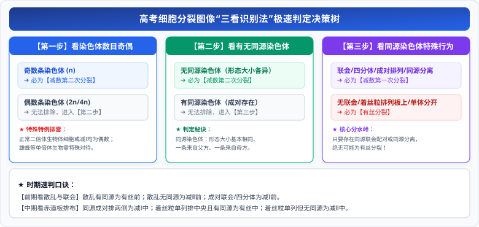

# 02 减数分裂与受精作用（核心模型）

> **【导读与第一性原理】**
>
> - **教材坐标**：必修2 第2章 第1节《减数分裂和受精作用》
> - **核心生命观念**：信息观、进化与适应观、稳态与平衡观
> - **认知引导**：如果双亲的精子和卵细胞直接通过有丝分裂产生（各自携带完整体细胞的 46 条染色体），那么受精结合的受精卵将拥有 92 条染色体，下一代更是高达 184 条，物种的基因组很快就会因“染色体爆炸”而崩溃！大自然必须在配子形成时执行一次精密的“对半减数”。为什么染色体复制一次却要分裂两次？孟德尔的分离定律和自由组合定律，其微观物理基础究竟在哪个纳秒发生？本节将彻底拆解减数分裂微观力学与细胞图像秒杀判定模型。

---

## 一、 教材基础与微观机理透析

### 1. 减数分裂的概念（教材黑体字）

$$\textbf{减数分裂（Meiosis）是进行有性生殖的生物，在产生成熟生殖细胞时进行的染色体复制一次、而细胞连续分裂两次的细胞分裂方式。}$$

- **分裂结果**：成熟生殖细胞中的染色体数目比原始生殖细胞**减少了一半**。

---

### 2. 精子与卵细胞形成的微观生化全过程

#### (1) 减数分裂前的间期

- 精原细胞体积增大，完成 **DNA 复制和有关蛋白质合成**，由精原细胞转变为**初级精母细胞**；细胞中染色体数仍为 $2N$，核 DNA 含量由 $2C \to 4C$。

#### (2) 减数第一次分裂（减Ⅰ：同源分离，数目减半期）

- **前期Ⅰ（联会互换期）**：
  - **同源染色体配对（联会）**，形成**四分体**（1 个四分体 $= 1$ 对同源染色体 $= 2$ 条染色体 $= 4$ 条姐妹染色单体 $= 4$ 个 DNA 分子）；
  - 四分体中的**非姐妹染色单体之间经常发生缠绕，并交换相应的片段（交叉互换）**，这是基因重组的重要物理来源！
- **中期Ⅰ**：各对同源染色体成对排列在赤道板的两侧。
- **后期Ⅰ（分离与自由组合，核心关键期！）**：
  - **同源染色体彼此分离，分别向细胞两极移动**；
  - 与此同时，**非同源染色体自由组合**！
  - _考纲联动_：**这是孟德尔分离定律和自由组合定律的细胞学基础！**
- **末期Ⅰ**：细胞一分为二，形成两个**次级精母细胞**；染色体数目**减半（$2N \to N$）**。染色体数目减半的根本原因是**同源染色体的分离**！

#### (3) 减数第二次分裂（减Ⅱ：着丝粒分裂，类似有丝分裂）

- **前期Ⅱ & 中期Ⅱ**：染色体散乱分布（前期Ⅱ）后着丝粒排在赤道板中央（中期Ⅱ），**此时细胞内绝对没有同源染色体**！
- **后期Ⅱ**：**着丝粒分裂，姐妹染色单体分开，成为两条子染色体**，在纺锤丝牵引下移向两极；**染色体数目瞬间加倍（由 $N \to 2N$）**！
- **末期Ⅱ**：核膜核仁重现，形成 4 个精细胞；精细胞经过复杂的形态变形（形成鞭毛、线粒体鞘、顶体）最终成为成熟精子。

#### (4) 精子形成 vs 卵细胞形成的本质差异

| 比较项目                 | 精子的形成过程                                                   | 卵细胞的形成过程                                                                   |
| :----------------------- | :--------------------------------------------------------------- | :--------------------------------------------------------------------------------- |
| **场所**                 | 睾丸的曲细精管                                                   | 卵巢                                                                               |
| **细胞质分裂方式**       | 两次分裂**均为均等分裂**                                         | 初级卵母细胞（后期Ⅰ）与次级卵母细胞（后期Ⅱ）**均为不均等分裂**（第一极体均等分裂） |
| **变形阶段**             | **需要** 经过复杂的变态变形                                      | **不需要** 变形                                                                    |
| **终产物比例**           | 1 个精原细胞 $\to$ **4 个成熟精子**                              | 1 个卵原细胞 $\to$ **1 个成熟卵细胞 + 3 个极体（退化消失）**                       |
| **大卵细胞的生物学意义** | 储存大量营养物质（卵黄），为受精卵早期胚胎发育提供物质和能量储备 |

---

## 二、 高考压轴核心技能：细胞分裂图像“三看识别法”

面对任意一张未标注分裂类型的细胞染色体显微图像，按照以下决策树极速秒杀：

  

---

## 三、 核心矢量图解 (SVG)

<svg xmlns="http://www.w3.org/2000/svg" viewBox="0 0 780 370" width="100%">
  <!-- 背景板 -->
  <rect x="0" y="0" width="780" height="370" rx="12" fill="#F8FAFC" stroke="#E2E8F0" stroke-width="1.5"/>
  <!-- 顶部标题条 -->
  <g transform="translate(20, 16)">
    <rect x="0" y="0" width="740" height="42" rx="8" fill="#1E293B"/>
    <text x="370" y="26" fill="#FFFFFF" font-size="16" font-weight="bold" text-anchor="middle" letter-spacing="1">减数分裂微观染色体动力学与三看识别法秒杀决策树</text>
  </g>
  <!-- 左侧卡片：减数分裂微观两阶段阶梯 (局部坐标系) -->
  <g transform="translate(20, 72)">
    <rect x="0" y="0" width="360" height="280" rx="8" fill="#FFFFFF" stroke="#CBD5E1" stroke-width="1.5"/>
    <rect x="0" y="0" width="360" height="36" rx="8" fill="#EFF6FF" stroke="#BFDBFE" stroke-width="1"/>
    <text x="180" y="23" fill="#1D4ED8" font-size="14" font-weight="bold" text-anchor="middle">减数分裂两次连续分裂微观机制</text>
    <!-- 阶段阶梯 -->
    <g transform="translate(15, 48)">
      <!-- 减Ⅰ分裂 -->
      <rect x="0" y="0" width="330" height="70" rx="6" fill="#F0FDF4" stroke="#BBF7D0" stroke-width="1"/>
      <text x="12" y="18" fill="#166534" font-size="11.5" font-weight="bold">减数第一次分裂（减Ⅰ：减半期）</text>
      <text x="12" y="34" fill="#334155" font-size="10.5">● 前期Ⅰ：同源染色体联会形成【四分体】，交叉互换</text>
      <text x="12" y="50" fill="#15803D" font-size="10.5">● 后期Ⅰ：【同源染色体分离，非同源自由组合】（基因重组）</text>
      <text x="12" y="64" fill="#DC2626" font-size="10" font-weight="bold">➔ 产生 2 个次级性母细胞，染色体数减半 (2N ➔ N)</text>
      <!-- 减Ⅱ分裂 -->
      <g transform="translate(0, 76)">
        <rect x="0" y="0" width="330" height="70" rx="6" fill="#FEFCE8" stroke="#FEF08A" stroke-width="1"/>
        <text x="12" y="18" fill="#854D0E" font-size="11.5" font-weight="bold">减数第二次分裂（减Ⅱ：着丝粒分裂期）</text>
        <text x="12" y="34" fill="#4B5563" font-size="10.5">● 全程无同源染色体存在！</text>
        <text x="12" y="50" fill="#2563EB" font-size="10.5" font-weight="bold">● 后期Ⅱ：【着丝粒分裂】，姐妹单体分离（N ➔ 2N 暂倍增）</text>
        <text x="12" y="64" fill="#4B5563" font-size="10">➔ 产生 4 个生殖细胞（含 N 条单染色体）</text>
      </g>
      <!-- 精卵差异提醒 -->
      <g transform="translate(0, 152)">
        <rect x="0" y="0" width="330" height="42" rx="4" fill="#FEF2F2" stroke="#FECACA" stroke-width="1"/>
        <text x="12" y="17" fill="#991B1B" font-size="10.5" font-weight="bold">卵细胞特异性：【不均等分裂】</text>
        <text x="12" y="32" fill="#B91C1C" font-size="10">后期Ⅰ与后期Ⅱ细胞质不均等缢裂，确保卵细胞富含营养！</text>
      </g>
    </g>
  </g>
  <!-- 右侧卡片：三看识别法秒杀决策树 (局部坐标系) -->
  <g transform="translate(400, 72)">
    <rect x="0" y="0" width="360" height="280" rx="8" fill="#FFFFFF" stroke="#CBD5E1" stroke-width="1.5"/>
    <rect x="0" y="0" width="360" height="36" rx="8" fill="#FEF3C7" stroke="#FDE68A" stroke-width="1"/>
    <text x="180" y="23" fill="#B45309" font-size="14" font-weight="bold" text-anchor="middle">分裂图像“三看识别法”秒杀决策树</text>
    <!-- 三看决策步进 -->
    <g transform="translate(15, 48)">
      <!-- 一看奇偶 -->
      <rect x="0" y="0" width="330" height="42" rx="6" fill="#FFFBEB" stroke="#FCD34D" stroke-width="1"/>
      <text x="12" y="18" fill="#78350F" font-size="11.5" font-weight="bold">一看染色体奇偶：</text>
      <text x="12" y="33" fill="#92400E" font-size="10.5">奇数 ➔ 必为【减数第二次分裂】（前Ⅱ或中Ⅱ）</text>
      <!-- 二看同源 -->
      <g transform="translate(0, 48)">
        <rect x="0" y="0" width="330" height="46" rx="6" fill="#F8FAFC" stroke="#E2E8F0" stroke-width="1"/>
        <text x="12" y="18" fill="#1E293B" font-size="11.5" font-weight="bold">二看有无同源染色体：</text>
        <text x="12" y="34" fill="#2563EB" font-size="10.5">无同源 ➔ 必为【减数第二次分裂】（含后Ⅱ与末Ⅱ）</text>
      </g>
      <!-- 三看行为 -->
      <g transform="translate(0, 100)">
        <rect x="0" y="0" width="330" height="84" rx="6" fill="#EFF6FF" stroke="#BFDBFE" stroke-width="1"/>
        <text x="12" y="18" fill="#1D4ED8" font-size="11.5" font-weight="bold">三看同源染色体特殊行为（有同源时）：</text>
        <text x="12" y="36" fill="#166534" font-size="10.5">● 有联会 / 四分体 / 同源分离 ➔ 【减数第一次分裂】</text>
        <text x="12" y="52" fill="#DC2626" font-size="10.5" font-weight="bold">● 无特殊行为（着丝粒排在赤道板 / 姐妹单体移两极）：</text>
        <text x="12" y="68" fill="#DC2626" font-size="10.5" font-weight="bold">  ➔ 必为【有丝分裂】！</text>
      </g>
    </g>
  </g>
</svg>

---

## 四、 高频易错点与考场排雷 (WARNING)

::: warning ⚠️ 致命陷阱 1：减数第二次分裂后期细胞中有没有同源染色体？

- **典型误区**：看见减Ⅱ后期着丝粒分裂，染色体数目暂时变成了 $2N$（偶数），且形态两两相同，误以为“恢复了同源染色体”。
- **微观本质剖析**：
  - 减Ⅱ后期的这 $2N$ 条染色体，是由**原来的姐妹染色单体分开后演变而来的子染色体**；
  - 它们所携带的基因原本完全相同（由同一条染色体复制而来），属于“姐妹”，**绝对不是一对分别来自父方和母方的同源染色体**！
  - **结论**：**整个减数第二次分裂（包括后期）始终绝对没有同源染色体！**
    :::

::: warning ⚠️ 致命陷阱 2：减数分裂染色体数目减半发生的真实节点

- **典型误区**：以为染色体数目是在减Ⅱ分裂完成时才减半的。
- **微观本质剖析**：
  - **减数第一次分裂结束时，染色体数目就已经减半（$2N \to N$）**，诱因是同源染色体的均等分离进入两个子细胞；
  - 减数第二次分裂本质上只是姐妹染色单体的分离，末期结束时染色体数目依然维持为 $N$，**减Ⅱ并没有导致染色体数目相对初级性母细胞再次减半**！
    :::

---

## 五、 高考真题命题角度与长句表达规范

### 1. 规范答题逻辑链模板

- **设问方向**：“简述减数分裂和受精作用对于维持有性生殖生物遗传稳定性和多样性的重要意义。”
- **教材级标准答题模板**：
  `减数分裂使成熟生殖细胞中的染色体数目比原始生殖细胞减少一半，而受精作用使精子和卵细胞结合恢复了体细胞中正常的染色体数目，两者紧密配合保证了有性生殖生物前后代体细胞染色体数目的恒定，维持了物种遗传的相对稳定性；同时，减数分裂过程中非同源染色体的自由组合和四分体非姐妹单体的交叉互换，以及受精作用中精卵细胞的随机结合，创造了极其丰富多样的配子与合子基因组合，为生物进化提供了丰富的原材料，大大增强了生物对多变环境的适应性。`

### 2. 经典高考真题变式设问

- **设问方向**：“基因型为 AaBb（两对基因独立遗传）的一个精原细胞，经过减数分裂产生了 4 个精细胞，其基因型种类可能是什么？为什么？”
- **标准答题逻辑**：
  `在不发生染色体互换的情况下，产生 4 个精细胞只有 2 种基因型（AB 和 ab，或者 Ab 和 aB）；因为一个初级精母细胞在减数第一次分裂后期，非同源染色体自由组合只能出现一种组合取向，产生两个次级精母细胞；减数第二次分裂只是姐妹染色单体分离，因此只能产生两种互补配对的精细胞；若四分体时期发生了非姐妹染色单体互换，则可能产生 4 种基因型的精细胞（AB、Ab、aB、ab）。`
