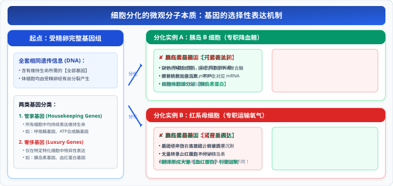

# 03 细胞分化与细胞全能性

> **【导读与第一性原理】**
>
> - **教材坐标**：必修1 第6章 第2节《细胞的分化》
> - **核心生命观念**：结构与功能观、进化与适应观
> - **认知引导**：人体起源于单一的一个受精卵细胞。经过数十次分裂，为什么同一个生命体内部，有的细胞变成了坚硬致密的骨骼，有的变成了能够收缩牵引的肌纤维，有的变成了能够发射微弱电脉冲的脑神经元？既然它们拥有 $100\%$ 完全相同的 DNA 遗传密码“蓝图”，是什么决定了各细胞截然不同的命运？一个已经高度分化的胡萝卜根细胞，又凭什么能重新长出一株开花结果的完整植物？本节将带你从表观遗传与基因表达开关第一性原理，透视细胞分化与全能性。

---

## 一、 教材基础与核心机理透析

### 1. 细胞分化（Cell Differentiation）的现象与特征

#### (1) 科学定义（教材黑体字）

在个体发育中，由一个或一种细胞增殖产生的后代，在**形态、结构和生理功能上发生稳定性差异**的过程，称为细胞分化。

#### (2) 细胞分化的四大生物学特征

1. **持久性**：细胞分化贯穿于生物体整个生命进程中，但在**胚胎时期达到最大限度**。
2. **普遍性**：在多细胞生物界中普遍存在，是生物个体正常发育的基础。
3. **稳定性与不可逆性**：一般来说，分化了的细胞将一直保持分化后的特化状态，直到死亡（在自然生理条件下不会自发逆转）。
4. **遗传物质守恒性**：分化后的细胞，其**细胞核内的遗传物质 DNA 分子序列完全保持不变**！

---

### 2. 细胞分化的微观实质──基因的选择性表达

#### (1) 第一性原理微观本质（高考绝对核心考点）

同一个生物体所有的体细胞，均由最初的受精卵经过有丝分裂增殖而来，因此**所有体细胞都含有该个体全套完全相同的遗传信息（相同基因组）**。

- 细胞分化的根本原因，**绝不是基因发生增减或丢失**；
- 而是**在个体发育过程中，不同细胞内遗传信息的执行情况不同，即【基因的选择性表达】（Selective Gene Expression）**！

  

#### (2) 细胞内两类基因的考场高频辨析

| 基因分类                               | 表达特征                                                               | 典型基因实例                                                                   | 考题设问判断技巧                                                         |
| :------------------------------------- | :--------------------------------------------------------------------- | :----------------------------------------------------------------------------- | :----------------------------------------------------------------------- |
| **管家基因 (Housekeeping genes)**      | 在**所有活细胞中均表达**，维持细胞最基本的生命活动与生存所必需         | 呼吸酶基因、ATP 合成酶基因、核糖体蛋白基因、核孔蛋白基因、细胞骨架微管蛋白基因 | 无论红细胞还是肌细胞，只要是活细胞，**均能检测到其 mRNA 与蛋白质**       |
| **奢侈基因 (Luxury / 组织特异性基因)** | **仅在特定组织细胞中选择性表达**，决定特定细胞独特的形态结构与专一功能 | 胰岛素基因（仅胰岛 B 细胞表达）、血红蛋白基因（仅红细胞表达）、唾液淀粉酶基因  | 某细胞中**只存在特定一种奢侈 mRNA/蛋白质**，是判定该细胞分化类型的金标准 |

---

### 3. 细胞的全能性（Totipotency）与实现条件

#### (1) 概念与物质基础

- **定义**：细胞经分裂和分化后，仍具有**产生完整有机体或分化成其他各种细胞的潜能和特性**。
- **根本物质基础**：生物体的每一个活体细胞中，**都含有该物种生长、发育和繁殖所需的【全套遗传信息】（全套 DNA）**。

#### (2) 植物细胞全能性的经典验证──植物组织培养

- 1958 年，美国科学家**斯图尔德（Steward）**取胡萝卜韧皮部细胞，在离体状态下加入人工配制的营养液（水、无机盐、蔗糖、氨基酸、植物激素等），成功诱导细胞脱分化形成**愈伤组织**，再分化分生出胚状体，最终长成了**一株完整的能够开花结实的新胡萝卜植株**！
- **实现植物细胞全能性的三大必备条件**：
  $$\text{离体状态} + \text{适宜的营养与植物激素（生长素与细胞分裂素配比）} + \text{无菌适宜环境}$$

#### (3) 动物细胞的细胞核全能性

- **动物体细胞全能性受到极大限制**：至今为止，科学界**尚未能将单个高度分化的动物体细胞在体外直接培养成一个完整的动物个体**！
- **动物体细胞的【细胞核】具有全能性**：
  - 英国科学家**克隆羊“多莉”（Dolly）**的培育成功证明：将高度分化的成年母羊乳腺体细胞的**细胞核**，移植到去核的卵母细胞中，在特定电刺激和化学激活下，能够重新启动发育程序，最终发育成完整个体；
  - **核心结论**：**动物体细胞全能性受到限制，但动物体细胞核依然完整保留着全套遗传基因，具有全能性！**

#### (4) 全能性大小的排序规则

1. **受精卵**（全能性最高） $>$ **生殖细胞（精子/卵细胞）** $>$ **体细胞**；
2. **植物体细胞** $>$ **动物体细胞**；
3. **幼嫩/未分化干细胞** $>$ **高度特化成熟细胞**；
4. **规律反比模型**：通常情况下，**细胞分化程度越高，其全能性表达的潜能就越低（越难以被重新激活）**。

---

## 二、 核心矢量图解 (SVG)

<svg xmlns="http://www.w3.org/2000/svg" viewBox="0 0 780 370" width="100%">
  <!-- 背景板 -->
  <rect x="0" y="0" width="780" height="370" rx="12" fill="#F8FAFC" stroke="#E2E8F0" stroke-width="1.5"/>
  <!-- 顶部标题条 -->
  <g transform="translate(20, 16)">
    <rect x="0" y="0" width="740" height="42" rx="8" fill="#1E293B"/>
    <text x="370" y="26" fill="#FFFFFF" font-size="16" font-weight="bold" text-anchor="middle" letter-spacing="1">细胞分化基因选择性表达微观开关与细胞全能性图谱</text>
  </g>
  <!-- 左侧卡片：基因选择性表达微观调控开关 (局部坐标系) -->
  <g transform="translate(20, 72)">
    <rect x="0" y="0" width="360" height="280" rx="8" fill="#FFFFFF" stroke="#CBD5E1" stroke-width="1.5"/>
    <rect x="0" y="0" width="360" height="36" rx="8" fill="#EFF6FF" stroke="#BFDBFE" stroke-width="1"/>
    <text x="180" y="23" fill="#1D4ED8" font-size="14" font-weight="bold" text-anchor="middle">细胞分化微观本质：基因选择性表达</text>
    <!-- 调控图元 -->
    <g transform="translate(15, 48)">
      <!-- DNA 同质性 -->
      <rect x="0" y="0" width="330" height="44" rx="6" fill="#F0F9FF" stroke="#BAE6FD" stroke-width="1"/>
      <text x="12" y="18" fill="#0369A1" font-size="11.5" font-weight="bold">遗传基底同一性：</text>
      <text x="12" y="34" fill="#334155" font-size="10.5">同一生物体各种特化体细胞【核内 DNA 序列完全相同】！</text>
      <!-- 管家 vs 奢侈 -->
      <g transform="translate(0, 50)">
        <rect x="0" y="0" width="330" height="74" rx="6" fill="#FEFCE8" stroke="#FEF08A" stroke-width="1"/>
        <text x="12" y="18" fill="#854D0E" font-size="11.5" font-weight="bold">转录开关二分法则：</text>
        <text x="12" y="36" fill="#4B5563" font-size="10.5">● 管家基因（呼吸酶/ATP酶）：全细胞通用【常开】</text>
        <text x="12" y="52" fill="#2563EB" font-size="10.5">● 奢侈基因（胰岛素/血红蛋白）：特化细胞【选择性开】</text>
        <text x="12" y="68" fill="#DC2626" font-size="10.5" font-weight="bold">➔ 产生特异 mRNA 与专一蛋白质，赋予形态功能差异</text>
      </g>
      <!-- 稳定性警示 -->
      <g transform="translate(0, 130)">
        <rect x="0" y="0" width="330" height="42" rx="4" fill="#F8FAFC" stroke="#E2E8F0" stroke-width="1"/>
        <text x="165" y="17" fill="#0F172A" font-size="10.5" font-weight="bold" text-anchor="middle">分化特征：持久性、普遍性、稳定性与不可逆性</text>
        <text x="165" y="33" fill="#64748B" font-size="10" text-anchor="middle">胚胎时期分化程度达到最高峰！</text>
      </g>
    </g>
  </g>
  <!-- 右侧卡片：细胞全能性层级与实现条件 (局部坐标系) -->
  <g transform="translate(400, 72)">
    <rect x="0" y="0" width="360" height="280" rx="8" fill="#FFFFFF" stroke="#CBD5E1" stroke-width="1.5"/>
    <rect x="0" y="0" width="360" height="36" rx="8" fill="#F0FDF4" stroke="#86EFAC" stroke-width="1"/>
    <text x="180" y="23" fill="#15803D" font-size="14" font-weight="bold" text-anchor="middle">细胞全能性金字塔与表达实现</text>
    <!-- 全能性图元 -->
    <g transform="translate(15, 48)">
      <!-- 全能性阶梯 -->
      <rect x="0" y="0" width="330" height="54" rx="6" fill="#F0FDF4" stroke="#BBF7D0" stroke-width="1"/>
      <text x="12" y="18" fill="#166534" font-size="11.5" font-weight="bold">全能性高低递减阶梯：</text>
      <text x="12" y="34" fill="#334155" font-size="10.5">受精卵 &gt; 生殖细胞 &gt; 体细胞（植物细胞 &gt; 动物细胞）</text>
      <text x="12" y="47" fill="#15803D" font-size="10">分化程度越低，全能性潜能越高！</text>
      <!-- 植物 vs 动物表达 -->
      <g transform="translate(0, 60)">
        <rect x="0" y="0" width="330" height="74" rx="6" fill="#FFFBEB" stroke="#FDE68A" stroke-width="1"/>
        <text x="12" y="18" fill="#B45309" font-size="11.5" font-weight="bold">全能性实现关键区别：</text>
        <text x="12" y="34" fill="#92400E" font-size="10.5">● 植物：【体细胞具备全能性】（离体组培长成完整植株）</text>
        <text x="12" y="50" fill="#DC2626" font-size="10.5" font-weight="bold">● 动物：体细胞全能性受限，【体细胞核具备全能性】</text>
        <text x="12" y="66" fill="#78350F" font-size="10">（克隆羊多莉：体细胞核 + 去核卵母细胞 ➔ 胚胎发育成完整个体）</text>
      </g>
      <!-- 终极判定判据 -->
      <g transform="translate(0, 140)">
        <rect x="0" y="0" width="330" height="42" rx="4" fill="#FEF2F2" stroke="#FECACA" stroke-width="1"/>
        <text x="165" y="17" fill="#991B1B" font-size="10.5" font-weight="bold" text-anchor="middle">⚠️ 全能性表达的唯一金标准：</text>
        <text x="165" y="33" fill="#B91C1C" font-size="10" text-anchor="middle">必须最终发育成【完整个体】或分化出【所有组织器官】！</text>
      </g>
    </g>
  </g>
</svg>

---

## 三、 高频易错点与考场排雷 (WARNING)

::: warning ⚠️ 致命陷阱 1：细胞分化导致 DNA 发生改变了吗？

- **典型误区**：认为红细胞有血红蛋白基因，肌细胞有肌球蛋白基因，各细胞 DNA 序列不同。
- **微观本质剖析**：
  - **同一个体的所有体细胞 DNA 序列完全一致！没有任何基因丢失**！
  - 发生差异的仅仅是**转录出的 mRNA 种类**和**翻译出的特定蛋白质种类**！
  - 考场排除法：选项出现“细胞分化导致基因改变/DNA缺失”，**直接秒杀判错**！
    :::

::: warning ⚠️ 致命陷阱 2：动物细胞全能性 vs 动物体细胞核全能性

- **典型误区**：看见克隆羊“多莉”诞生，就断言“动物体细胞具有全能性”。
- **微观本质剖析**：
  - 多莉羊的诞生依靠的是**核移植技术**；
  - 实验证明的是**动物体细胞的“细胞核”具有全能性**，而不是“动物体细胞整体具有全能性”！因为单个体细胞在目前科学条件下无法直接发育成动物个体。
    :::

---

## 四、 高考真题命题角度与长句表达规范

### 1. 规范答题逻辑链模板

- **设问方向**：“人体胰岛 B 细胞和浆细胞均来源于同一个受精卵，请从微观分子水平解释为什么胰岛 B 细胞能产生胰岛素而浆细胞能产生抗体？”
- **教材级标准答题模板**：
  `人体胰岛 B 细胞和浆细胞由同一个受精卵经有丝分裂增殖而来，核内含有完全相同的基因组，都同时携带胰岛素基因和抗体基因；但在个体发育过程中发生了细胞分化，两类细胞内基因的表达情况不同（基因的选择性表达）：在胰岛 B 细胞中，胰岛素基因处于开启转录状态合成胰岛素，而抗体基因处于关闭沉默状态；在浆细胞中，抗体基因处于开启转录状态合成抗体，而胰岛素基因处于关闭沉默状态。`

### 2. 经典高考真题变式设问

- **设问方向**：“为什么高度分化的植物叶肉细胞在离体状态下，加入适宜的营养物质和植物激素后，能够重新长成一株完整的植物？”
- **标准答题逻辑**：
  `因为高度分化的植物叶肉细胞仍然保留着该物种生长发育所需的全部遗传信息；在离体、适宜营养以及特定生长素与细胞分裂素配比的诱导下，植物细胞可以发生脱分化形成愈伤组织，并重新激活休眠基因的表达，进而通过细胞分裂和再分化形成根、芽等器官，最终发育成一株完整的植物，这体现了植物细胞具有全能性。`
