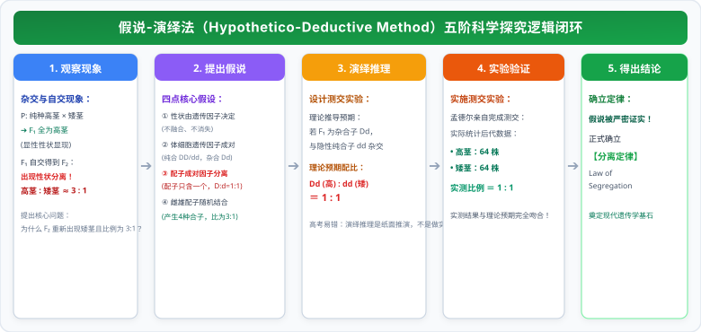

# 01 孟德尔的一对相对性状杂交实验（分离定律与配子法）

> **【导读与第一性原理】**
> - **教材坐标**：必修2 第1章 第1节《孟德尔的豌豆杂交实验（一）》
> - **核心生命观念**：信息观、物质与能量观、科学思维（假说-演绎法）
> - **认知引导**：在孟德尔之前，人们普遍相信“融合遗传”──就像把一杯红墨水倒进一杯蓝墨水，后代只能混合成不可逆的紫色。如果是这样，白化病、红绿色盲等隐性性状一旦与正常人结合，为何不仅没有被永远“稀释”，反而会在隔代后代中毫发无损地重新涌现？奥地利修道士孟德尔用 8 年时间、数万株豌豆，揭示了遗传的离散颗粒本质（颗粒遗传）。本节将从科学方法论与数理统计第一性原理，拆解现代遗传学的奠基定律。

---

## 一、 教材基础与核心机理透析

### 1. 孟德尔杂交实验的成功要素

#### (1) 理想实验材料──豌豆（Pisum sativum）的四大天然优势
1. **严格的自花传粉、闭花受粉**：在花未开放时就已完成传粉过程，自然状态下**绝无外来花粉干扰，永远是纯种**。
2. **具有多对稳定且易于区分的相对性状**：如高茎 vs 矮茎、圆粒 vs 皱粒、黄子叶 vs 绿子叶，性状界限分明，肉眼极易辨析。
3. **花冠较大，便于人工异花传粉去雄操作**。
4. **单株结实多、子代个体数量庞大**：便于运用大数定律进行统计学概率分析。

#### (2) 人工异花传粉的标准化四步操作法（考场实验细节）

> **【操作流程闭环】**：
> $$\textbf{母本花蕾期去雄} \longrightarrow \textbf{套袋隔离} \longrightarrow \textbf{人工采集父本花粉授粉} \longrightarrow \textbf{再次套袋隔离}$$

- **去雄时间点**：必须在**花蕾期（花粉未成熟前）**彻底剪去母本的全部雄蕊，防止自花受粉；
- **套袋的目的**：防止外界其他未知花粉落在柱头上造成实验污染；
- **授粉与再套袋**：待雌蕊成熟后，将父本花粉涂抹在母本柱头上，立即重新套上纸袋，直到果实种子发育成熟。

---

### 2. 科学方法论的典范──假说-演绎法（Hypothetico-Deductive Method）

孟德尔之所以能超越前人，关键在于其运用了严格的**“观察现象 $\to$ 提出问题 $\to$ 做出假说 $\to$ 演绎推理 $\to$ 实验验证 $\to$ 得出结论”**闭环：

  

- **微观细胞学本质（高考必背核心）**：
  > **核心概念**：**在减数分裂形成配子时（减数第一次分裂后期），等位基因随着同源染色体的分开而分离，分别进入两个配子中。**

---

## 二、 高考高频解题工具：连续自交模型与自由交配配子法

### 1. 杂合子连续自交 $n$ 代纯合化递推数学模型

设亲代全部为杂合子 $Dd$（第 $0$ 代），连续自交 $n$ 代，子代中不进行人工淘汰：

$$\begin{cases}
\text{杂合子 } (Dd) \text{ 比例} = \left(\frac{1}{2}\right)^n \\
\text{纯合子 } (DD + dd) \text{ 总比例} = 1 - \left(\frac{1}{2}\right)^n \\
\text{显性纯合子 } (DD) \text{ 比例} = \text{隐性纯合子 } (dd) \text{ 比例} = \frac{1}{2}\left[1 - \left(\frac{1}{2}\right)^n\right]
\end{cases}$$

> **【农业育种应用】**：随着自交代数 $n$ 的增加，杂合子比例趋近于 $0$，纯合子比例趋近于 $1$。这是获得稳定遗传纯种品种的经典育种数学基础！

### 2. 随机交配（自由交配）的秒杀利器──配子概率法（Gamete Frequency）

在群体遗传学计算中，若群体中个体发生**随机自由交配**，直接罗列每种交配组合极其繁琐易错；**最简单的方法是直接计算雄配子与雌配子的基因频率**！

- **算法两步走**：
  1. 计算群体产生的显性配子 $D$ 的概率 $p$，隐性配子 $d$ 的概率 $q$（且 $p + q = 1$）；
  2. 雌雄配子随机结合，子代基因型分布符合展开式：
     $$(pD + qd)^2 = p^2 DD + 2pq Dd + q^2 dd$$

> **【典型高考例题极速破解】**：
> 某植物种群中，基因型为 $DD$ 的个体占 $1/3$，$Dd$ 的个体占 $2/3$（无 $dd$ 个体）。若让该群体自由交配，求后代中矮茎（$dd$）个体的比例？
> - **配子法计算**：
>   - 隐性配子 $d$ 的频率 $q = \frac{2}{3} \times \frac{1}{2} = \frac{1}{3}$；
>   - 显性配子 $D$ 的频率 $p = 1 - \frac{1}{3} = \frac{2}{3}$；
>   - 自由交配产生矮茎（$dd$）个体的概率 $= q^2 = \left(\frac{1}{3}\right)^2 = \frac{1}{9}$！
> - 若将题目改为**该群体自交**，后代矮茎比例 $= \frac{2}{3} \times \frac{1}{4} = \frac{1}{6}$。两者截然不同！

---

## 三、 核心矢量图解 (SVG)

<svg xmlns="http://www.w3.org/2000/svg" viewBox="0 0 780 370" width="100%">
  <!-- 背景板 -->
  <rect x="0" y="0" width="780" height="370" rx="12" fill="#F8FAFC" stroke="#E2E8F0" stroke-width="1.5"/>
  <!-- 顶部标题条 -->
  <g transform="translate(20, 16)">
    <rect x="0" y="0" width="740" height="42" rx="8" fill="#1E293B"/>
    <text x="370" y="26" fill="#FFFFFF" font-size="16" font-weight="bold" text-anchor="middle" letter-spacing="1">孟德尔假说-演绎法逻辑闭环与配子法计算图谱</text>
  </g>
  <!-- 左侧卡片：假说-演绎法五步科学逻辑 (局部坐标系) -->
  <g transform="translate(20, 72)">
    <rect x="0" y="0" width="360" height="280" rx="8" fill="#FFFFFF" stroke="#CBD5E1" stroke-width="1.5"/>
    <rect x="0" y="0" width="360" height="36" rx="8" fill="#EFF6FF" stroke="#BFDBFE" stroke-width="1"/>
    <text x="180" y="23" fill="#1D4ED8" font-size="14" font-weight="bold" text-anchor="middle">假说-演绎法科学探究闭环</text>
    <!-- 五步图元 -->
    <g transform="translate(15, 48)">
      <!-- 观察与提问 -->
      <rect x="0" y="0" width="330" height="40" rx="6" fill="#F0F9FF" stroke="#BAE6FD" stroke-width="1"/>
      <text x="12" y="17" fill="#0369A1" font-size="11" font-weight="bold">① 发现问题：F₁ 显隐比 3:1</text>
      <text x="12" y="32" fill="#334155" font-size="10">纯种高矮杂交得高茎；自交 F₂ 恒现 3:1 性状分离</text>
      <!-- 假说 -->
      <g transform="translate(0, 46)">
        <rect x="0" y="0" width="330" height="44" rx="6" fill="#FEFCE8" stroke="#FEF08A" stroke-width="1"/>
        <text x="12" y="17" fill="#854D0E" font-size="11" font-weight="bold">② 作出假说：核心是【等位基因分离】</text>
        <text x="12" y="32" fill="#4B5563" font-size="10">成对基因随配子形成而分离，配子只含其一，随机结合</text>
      </g>
      <!-- 演绎 -->
      <g transform="translate(0, 96)">
        <rect x="0" y="0" width="330" height="42" rx="6" fill="#EFF6FF" stroke="#BFDBFE" stroke-width="1"/>
        <text x="12" y="17" fill="#1D4ED8" font-size="11" font-weight="bold">③ 演绎推理：设计【测交实验】预测 1:1</text>
        <text x="12" y="32" fill="#1E40AF" font-size="10">推论若 F₁ 为 Dd，则 Dd × dd 预期后代必为高:矮=1:1</text>
      </g>
      <!-- 验证与结论 -->
      <g transform="translate(0, 144)">
        <rect x="0" y="0" width="330" height="42" rx="6" fill="#F0FDF4" stroke="#86EFAC" stroke-width="1"/>
        <text x="12" y="17" fill="#166534" font-size="11" font-weight="bold">④ 验证与结论：实测证实 ➔ 确立分离定律</text>
        <text x="12" y="32" fill="#15803D" font-size="10">实测结果高度吻合 1:1，证明假说成立！</text>
      </g>
    </g>
  </g>
  <!-- 右侧卡片：连续自交 vs 随机交配配子模型 (局部坐标系) -->
  <g transform="translate(400, 72)">
    <rect x="0" y="0" width="360" height="280" rx="8" fill="#FFFFFF" stroke="#CBD5E1" stroke-width="1.5"/>
    <rect x="0" y="0" width="360" height="36" rx="8" fill="#FEF3C7" stroke="#FDE68A" stroke-width="1"/>
    <text x="180" y="23" fill="#B45309" font-size="14" font-weight="bold" text-anchor="middle">自交纯合化与随机交配配子概率模型</text>
    <!-- 模型解析 -->
    <g transform="translate(15, 48)">
      <!-- 连续自交 -->
      <rect x="0" y="0" width="330" height="66" rx="6" fill="#FFFBEB" stroke="#FCD34D" stroke-width="1"/>
      <text x="12" y="18" fill="#78350F" font-size="11.5" font-weight="bold">连续自交 n 代纯合化数学规律：</text>
      <text x="12" y="36" fill="#92400E" font-size="10.5">● 杂合子 (Dd) 比例 = (1/2)ⁿ ➔ 趋近于 0</text>
      <text x="12" y="52" fill="#92400E" font-size="10.5">● 纯合子 (DD + dd) 比例 = 1 - (1/2)ⁿ ➔ 趋近于 1</text>
    </g>
    <!-- 自由交配配子法 -->
    <g transform="translate(15, 122)">
      <rect x="0" y="0" width="330" height="68" rx="6" fill="#F8FAFC" stroke="#E2E8F0" stroke-width="1"/>
      <text x="12" y="18" fill="#1E293B" font-size="11.5" font-weight="bold">自由交配极速秒杀：【配子概率法】</text>
      <text x="12" y="36" fill="#2563EB" font-size="10.5">设产生配子：D 占 p，d 占 q (p + q = 1)</text>
      <text x="12" y="52" fill="#DC2626" font-size="10.5" font-weight="bold">➔ 自由交配后代：p² DD + 2pq Dd + q² dd</text>
    </g>
    <!-- 考场排雷 -->
    <g transform="translate(15, 196)">
      <rect x="0" y="0" width="330" height="32" rx="4" fill="#FEF2F2" stroke="#FECACA" stroke-width="1"/>
      <text x="165" y="20" fill="#991B1B" font-size="10" font-weight="bold" text-anchor="middle">⚠️ 区分【自交】(同基因相交) 与【自由交配】(所有个体随机交配)！</text>
    </g>
  </g>
</svg>

---

## 四、 高频易错点与考场排雷 (WARNING)

::: warning ⚠️ 致命陷阱 1：分离定律的微观发生时刻
- **典型误区**：认为等位基因分离发生在减数第二次分裂后期着丝粒分裂时。
- **微观本质剖析**：
  - 在不发生互换的情况下，**等位基因位于同源染色体的相同位置上**；
  - 减数第一次分裂后期，**同源染色体分开移向两极，导致位于其上的等位基因随之分离**！
  - 只有在减Ⅰ前期发生非姐妹染色单体互换的情况下，等位基因才会延迟到减Ⅱ后期随着单体分离而分离。
:::

::: warning ⚠️ 致命陷阱 2：测交实验到底是“假说”还是“实验”？
- **典型误区**：把“设计测交实验”当成了“实验验证”，把“测交预测”当成了实验事实。
- **微观本质剖析**：
  - 孟德尔在纸面上写出“若 $F_1$ 为 $Dd$，与 $dd$ 杂交后代应该为 $1:1$”，这是在纸上进行的**逻辑演绎推理（演绎阶段）**；
  - 随后孟德尔真正在农田中将植株杂交，数出 64 株高茎和 64 株矮茎，这才是**实验验证阶段**！两者不可混为一谈。
:::

---

## 五、 高考真题命题角度与长句表达规范

### 1. 规范答题逻辑链模板
- **设问方向**：“简述孟德尔在验证分离定律时，为什么必须设计测交实验（让 F₁ 与隐性纯合子杂交）而不是让 F₁ 自交？”
- **教材级标准答题模板**：
  `因为隐性纯合子（dd）只能产生一种含隐性遗传因子的配子（d），它与 F₁ 杂交时，配子中的隐性基因不会掩盖 F₁ 产生的配子中所携带的遗传因子；因此测交后代的表现型种类和比例，能够直接、直观地反映出杂合子 F₁ 在减数分裂时产生的配子种类和比例，从而直接验证了成对遗传因子在形成配子时彼此分离的假说。`

### 2. 经典高考真题变式设问
- **设问方向**：“某种植物的花色受一对等位基因控制，红花对白花为显性。现有一株开红花的植株，若要快速鉴定其是纯合子还是杂合子，请设计最简便的实验方案并写出预期结果。”
- **标准答题逻辑**：
  `【对于雌雄同株能自花传粉的植物】：最简便的方法是让该红花植株进行自交，统计并观察子代的表现型。预期结果：若子代全部开红花，则该植株为纯合子；若子代出现白花植株（发生性状分离），则该植株为杂合子。`
