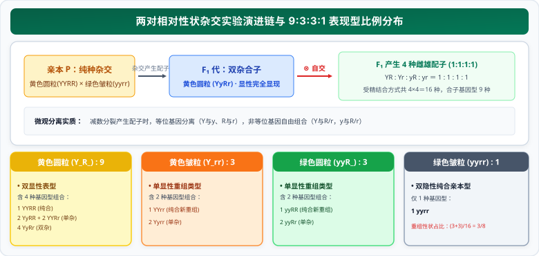

# 02 两对相对性状杂交实验与 9:3:3:1 变式全景矩阵（自由组合定律）

> **【导读与第一性原理】**
>
> - **教材坐标**：必修2 第1章 第2节《孟德尔的豌豆杂交实验（二）》
> - **核心生命观念**：信息观、物质观、数学与统计模型（独立性与乘法原理）
> - **认知引导**：当生命面对不仅一对、而是成千上万对性状的代际流转时，这些性状是像粘在一起的包裹整体传递，还是彼此独立分配？孟德尔通过黄色圆粒与绿色皱粒豌豆的杂交实验给出了震撼答案：不同性状在遗传中表现出惊人的“模块化独立性”。本节从第一性原理出发，以概率论乘法法则为手术刀，将高维复杂的多对性状层层解耦为独立的一对性状，彻底攻破高考核心压轴考点——$9:3:3:1$ 变式与致死矩阵。

---

## 一、 教材基础与自由组合定律微观机理

<ClientOnly>
  <PunnettSquarePuzzle />
</ClientOnly>

### 1. 两对相对性状杂交实验的现象与假说

  

- **性状拆分透析（独立分离现象）**：
  - 单看种子形状：圆粒 : 皱粒 = $(9+3) : (3+1) = 12 : 4 = 3 : 1$；
  - 单看子叶颜色：黄色 : 绿色 = $(9+3) : (3+1) = 12 : 4 = 3 : 1$。
  - **关键结论**：两对相对性状的遗传**各自严格遵循分离定律**。两对性状同时遗传时，组合结果恰好等于各自独立概率的乘积：
    $$(3 \text{ 黄} : 1 \text{ 绿}) \times (3 \text{ 圆} : 1 \text{ 皱}) = 9 \text{ 黄圆} : 3 \text{ 黄皱} : 3 \text{ 绿圆} : 1 \text{ 绿皱}$$

---

### 2. 自由组合定律的微观细胞学本质

- **发生时期**：**减数第一次分裂后期（减数Ⅰ后期）**。
- **实质内容（高考答题金句）**：
  $$\textbf{位于非同源染色体上的非等位基因的分离或组合是互不干扰的；在减数分裂形成配子的过程中，}$$
  $$\textbf{同源染色体上的等位基因彼此分离的同时，非同源染色体上的非等位基因自由组合。}$$
- **限制前提**：两对或多对等位基因必须**分别位于不同的同源染色体上**（非同源染色体），若位于同一对同源染色体上，则遵循**连锁互换定律**。

---

## 二、 高考解题第一思维：乘法拆分法与配子棋盘

### 1. 拆分法（独立事件乘法原理）

任何涉及多对等位基因（位于非同源染色体上）的杂交问题，一律分解为若干个分离定律分别求解，再用乘法法则相乘：

- **配子种类数**：$AaBbCc \to 2 \times 2 \times 2 = 8$ 种配子。
- **子代基因型数**：$AaBb \times AaBb \to 3(AA, Aa, aa) \times 3(BB, Bb, bb) = 9$ 种基因型。
- **子代表现型数**：$AaBb \times aabb \to 2 \times 2 = 4$ 种表现型。

### 2. $F_2$ 经典 16 组合配子棋盘结构分析（双杂合自交 $AaBb \otimes$）

| 组合分类              | 基因型                              | 数量与比例                      | 表现型     |
| :-------------------- | :---------------------------------- | :------------------------------ | :--------- |
| **双显性** ($A\_B\_$) | $1 AABB + 2 AaBB + 2 AABb + 4 AaBb$ | 4种基因型，共 9/16              | 双显性表型 |
| **单显隐** ($A\_bb$)  | $1 AAbb + 2 Aabb$                   | 2种基因型，共 3/16              | A单显表型  |
| **单隐显** ($aaB\_$)  | $1 aaBB + 2 aaBb$                   | 2种基因型，共 3/16              | B单显表型  |
| **双隐性** ($aabb$)   | $1 aabb$                            | 1种基因型，共 1/16              | 双隐性表型 |
| **纯合子总和**        | $AABB + AAbb + aaBB + aabb$         | 4种，每种各 1/16，共 4/16 (1/4) | 对角线上   |
| **双杂合子**          | $AaBb$                              | 1种，共 4/16 (1/4)              | 反对角线上 |

---

## 三、 高考压轴核心：$9:3:3:1$ 变式全景矩阵与致死模型

当两对基因共同决定同一对相对性状时，基因间的互作会导致表现型比例发生合并，但**其背后的基因型比例（1:2:1:2:4:2:1:2:1）始终不变**。

### 1. 常见基因互作变式全景对照表

| 表现型比例 ($F_2$ 自交) | 测交后代比例 ($F_1 \times aabb$) | 基因互作类型与机理                                                                                     | 生化代谢或生理模型实例                                                         |
| :---------------------- | :------------------------------- | :----------------------------------------------------------------------------------------------------- | :----------------------------------------------------------------------------- |
| **$9 : 7$**             | $1 : 3$                          | **互补作用 (双显协同)**：只有同时含有 $A$ 和 $B$ 才表现显性，缺一不可 ($A\_B\_ : \text{其余} = 9 : 7$) | 前体物质 $\xrightarrow{A\text{酶}}$ 中间物 $\xrightarrow{B\text{酶}}$ 紫色色素 |
| **$9 : 6 : 1$**         | $1 : 2 : 1$                      | **单显同效应**：双显性一种表型，单显性（$A\_bb$ 或 $aaB\_$）效应相同合并，双隐性另一种                 | 葫芦瓜形：圆盘形(9) : 圆球形(6) : 长筒形(1)                                    |
| **$15 : 1$**            | $3 : 1$                          | **重叠/并显作用**：只要含显性基因（$A$ 或 $B$ 任一）即表现为同一显性，双隐性为另一种                   | 荠菜蒴果三角形(15)与卵圆形(1)                                                  |
| **$9 : 3 : 4$**         | $1 : 1 : 2$                      | **隐性上位**：隐性基因纯合（如 $aa$）抑制另一对基因表达 ($aaB\_$ 与 $aabb$ 表型相同)                   | 鼠毛色：黑($A\_B\_$, 9) : 褐($A\_bb$, 3) : 白($aa\_\_$, 4)                     |
| **$12 : 3 : 1$**        | $2 : 1 : 1$                      | **显性上位**：显性基因（如 $A$）存在时遮盖另一对基因的表现 ($A\_B\_$ 与 $A\_bb$ 合并为 12)             | 燕麦颖片：黑颖($A\_\_$, 12) : 黄颖($aaB\_$, 3) : 白颖($aabb$, 1)               |
| **$13 : 3$**            | $3 : 1$                          | **显性抑制**：显性抑制基因（如 $I$）抑制显性色素基因 $C$ 表达，仅 $C\_ii$ 上色                         | 鸡羽毛颜色：白色($I\_\_$ 及 $ccii$, 13) : 有色($C\_ii$, 3)                     |

---

### 2. 致死效应计算模型

#### (1) 隐性纯合致死

若 $aa$ 纯合胚胎致死，则在所有含 $aa$ 的基因型消失后：

- 存活后代总数变为 $16 - 4 = 12$ 份；
- 双显性 $A\_B\_ (9)$ : 单显性 $A\_bb (3) = 9 : 3 = 3 : 1$。

#### (2) 显性纯合致死（如 $AA$ 和 $BB$ 致死）

- $AABB (1)$、$AABb (2)$、$AAbb (1)$、$AaBB (2)$、$aaBB (1)$ 均致死；
- 存活个体仅剩下杂合状态及双隐性，表现型与基因型比例根据存活情况重新按比例重归一化。

#### (3) 配子致死（花粉不育或花粉管无法萌发）

- **解题铁律**：分别列出雌、雄亲本产生的**可育配子种类及其概率**，绘制棋盘法重新交叉相乘。
  - 例：雄配子 $Ab$ 50% 致死，则雄配子实际比例为 $AB:Ab:aB:ab = 2:1:2:2$（总和7份），雌配子仍为 $1:1:1:1$（总和4份），组合矩阵求乘积即可。

---

## 四、 核心图解：自由组合定律微观图景与变式矩阵

<svg xmlns="http://www.w3.org/2000/svg" viewBox="0 0 780 370" width="100%" height="100%">
  <defs>
    <linearGradient id="bgGrad2" x1="0%" y1="0%" x2="100%" y2="100%">
      <stop offset="0%" stop-color="#f8fafc"/>
      <stop offset="100%" stop-color="#f1f5f9"/>
    </linearGradient>
    <linearGradient id="primaryGrad2" x1="0%" y1="0%" x2="100%" y2="100%">
      <stop offset="0%" stop-color="#059669"/>
      <stop offset="100%" stop-color="#10b981"/>
    </linearGradient>
    <linearGradient id="accentGrad2" x1="0%" y1="0%" x2="100%" y2="100%">
      <stop offset="0%" stop-color="#3b82f6"/>
      <stop offset="100%" stop-color="#60a5fa"/>
    </linearGradient>
    <filter id="shadow2" x="-5%" y="-5%" width="110%" height="115%" filterUnits="userSpaceOnUse">
      <feDropShadow dx="0" dy="2" stdDeviation="3" flood-color="#0f172a" flood-opacity="0.08"/>
    </filter>
  </defs>
  <!-- 背景面板 -->
  <rect width="780" height="370" rx="16" fill="url(#bgGrad2)" stroke="#cbd5e1" stroke-width="1.5"/>
  <!-- 顶部标题横幅 -->
  <rect x="20" y="16" width="740" height="42" rx="10" fill="url(#primaryGrad2)" filter="url(#shadow2)"/>
  <text x="390" y="42" text-anchor="middle" font-size="16" font-weight="bold" fill="#ffffff" letter-spacing="1">自由组合定律微观染色体行为与 F₂ 变式拆分矩阵全景</text>
  <!-- 左侧板块：减数分裂微观行为 (减数I后期) -->
  <g transform="translate(20, 72)">
    <rect width="360" height="280" rx="12" fill="#ffffff" stroke="#cbd5e1" stroke-width="1.2" filter="url(#shadow2)"/>
    <rect x="0" y="0" width="360" height="34" rx="12" fill="#e0f2fe"/>
    <text x="180" y="23" text-anchor="middle" font-size="13" font-weight="bold" fill="#0369a1">微观机理：减数Ⅰ后期非同源染色体自由组合</text>
    <!-- 组合类型 1 -->
    <text x="95" y="58" text-anchor="middle" font-size="11" font-weight="bold" fill="#0f172a">组合方向 ① (50%)</text>
    <!-- 细胞分裂模拟图 -->
    <circle cx="95" cy="100" r="34" fill="#f8fafc" stroke="#94a3b8" stroke-width="1.5" stroke-dasharray="3,3"/>
    <!-- 染色体示意 -->
    <line x1="82" y1="84" x2="82" y2="116" stroke="#ef4444" stroke-width="4.5" stroke-linecap="round"/>
    <text x="73" y="103" font-size="10" font-weight="bold" fill="#b91c1c">A</text>
    <line x1="108" y1="84" x2="108" y2="116" stroke="#3b82f6" stroke-width="4.5" stroke-linecap="round"/>
    <text x="115" y="103" font-size="10" font-weight="bold" fill="#1d4ed8">B</text>
    <text x="95" y="150" text-anchor="middle" font-size="10.5" font-weight="bold" fill="#475569">➔ 配子：AB 与 ab</text>
    <!-- 组合类型 2 -->
    <text x="265" y="58" text-anchor="middle" font-size="11" font-weight="bold" fill="#0f172a">组合方向 ② (50%)</text>
    <circle cx="265" cy="100" r="34" fill="#f8fafc" stroke="#94a3b8" stroke-width="1.5" stroke-dasharray="3,3"/>
    <line x1="252" y1="84" x2="252" y2="116" stroke="#ef4444" stroke-width="4.5" stroke-linecap="round"/>
    <text x="243" y="103" font-size="10" font-weight="bold" fill="#b91c1c">A</text>
    <line x1="278" y1="84" x2="278" y2="116" stroke="#0ea5e9" stroke-width="4.5" stroke-linecap="round"/>
    <text x="285" y="103" font-size="10" font-weight="bold" fill="#0284c7">b</text>
    <text x="265" y="150" text-anchor="middle" font-size="10.5" font-weight="bold" fill="#475569">➔ 配子：Ab 与 aB</text>
    <!-- 说明文本框 -->
    <rect x="15" y="170" width="330" height="96" rx="8" fill="#f1f5f9" stroke="#e2e8f0"/>
    <text x="25" y="190" font-size="11" font-weight="bold" fill="#0f172a">核心要点推导：</text>
    <text x="25" y="210" font-size="10.5" fill="#334155">• 一个精原细胞 (AaBb) 产生配子：仅 2 种（4个）</text>
    <text x="25" y="228" font-size="10.5" fill="#334155">• 一个卵原细胞 (AaBb) 产生配子：仅 1 种（1个）</text>
    <text x="25" y="246" font-size="10.5" fill="#047857" font-weight="bold">• 一个雄性/雌性个体 (AaBb) 产生配子：4 种 (1:1:1:1)</text>
  </g>
  <!-- 右侧板块：9:3:3:1 变式矩阵决策流 -->
  <g transform="translate(400, 72)">
    <rect width="360" height="280" rx="12" fill="#ffffff" stroke="#cbd5e1" stroke-width="1.2" filter="url(#shadow2)"/>
    <rect x="0" y="0" width="360" height="34" rx="12" fill="#ecfdf5"/>
    <text x="180" y="23" text-anchor="middle" font-size="13" font-weight="bold" fill="#047857">解题决策：F₂ 比例合并与基因互作定型</text>
    <!-- 比例分类条 -->
    <g transform="translate(15, 46)">
      <!-- 标准 9:3:3:1 -->
      <rect x="0" y="0" width="330" height="32" rx="6" fill="#f8fafc" stroke="#cbd5e1"/>
      <text x="10" y="20" font-size="11" font-weight="bold" fill="#0f172a">9 : 3 : 3 : 1</text>
      <text x="105" y="20" font-size="10" fill="#475569">经典双显 : 单显A : 单显B : 双隐</text>
      <!-- 9:7 互补 -->
      <rect x="0" y="38" width="330" height="32" rx="6" fill="#fef2f2" stroke="#fecaca"/>
      <text x="10" y="58" font-size="11" font-weight="bold" fill="#b91c1c">9 : 7</text>
      <text x="105" y="58" font-size="10" fill="#991b1b">双显(9) : [单显A+单显B+双隐](7) (互补协同)</text>
      <!-- 9:6:1 单显同效 -->
      <rect x="0" y="76" width="330" height="32" rx="6" fill="#fefce8" stroke="#fef08a"/>
      <text x="10" y="96" font-size="11" font-weight="bold" fill="#854d0e">9 : 6 : 1</text>
      <text x="105" y="96" font-size="10" fill="#713f12">双显(9) : [单显A+单显B](6) : 双隐(1)</text>
      <!-- 9:3:4 隐性上位 -->
      <rect x="0" y="114" width="330" height="32" rx="6" fill="#eff6ff" stroke="#bfdbfe"/>
      <text x="10" y="134" font-size="11" font-weight="bold" fill="#1d4ed8">9 : 3 : 4</text>
      <text x="105" y="134" font-size="10" fill="#1e40af">双显(9) : 单显A(3) : [单显B+双隐](4) (隐性上位)</text>
      <!-- 15:1 重叠基因 -->
      <rect x="0" y="152" width="330" height="32" rx="6" fill="#f0fdf4" stroke="#bbf7d0"/>
      <text x="10" y="172" font-size="11" font-weight="bold" fill="#15803d">15 : 1</text>
      <text x="105" y="172" font-size="10" fill="#166534">[双显+单显A+单显B](15) : 双隐(1) (有显即显)</text>
      <!-- 13:3 显性抑制 -->
      <rect x="0" y="190" width="330" height="32" rx="6" fill="#faf5ff" stroke="#e9d5ff"/>
      <text x="10" y="210" font-size="11" font-weight="bold" fill="#7e22ce">13 : 3</text>
      <text x="105" y="210" font-size="10" fill="#6b21a8">[双显+单显B+双隐](13) : 单显A(3) (抑制效应)</text>
    </g>
  </g>
</svg>

---

## 五、 考场排雷与高频陷阱指南

> [!WARNING]
>
> ### 陷阱 1：两对等位基因是否遵循自由组合定律的实验判断方案
>
> - **考场问法**：请设计杂交实验，验证控制两对相对性状的基因位于两对同源染色体上（遵循自由组合定律）。
> - **标准方案 A（自交法，最简便）**：让双杂合子（$F_1$）自交，若子代出现 **$9:3:3:1$ 及其变式**，则证明两对基因位于两对非同源染色体上；若子代仅出现 **$3:1$ 或 $1:2:1$**，则位于同一对同源染色体上（完全连锁）。
> - **标准方案 B（测交法，最直接）**：让双杂合子（$F_1$）与双隐性纯合子（$aabb$）杂交，若测交后代表现型比例为 **$1:1:1:1$ 及其变式**，则证明两对基因自由组合。

> [!WARNING]
>
> ### 陷阱 2：“个体产生配子种类”与“细胞产生配子种类”的偷换概念
>
> - **一个精原细胞**（$AaBb$）经减数分裂产生 4 个精子，但**只有 2 种基因型**（同源分开，非同源自由组合只选一种组合方式）；
> - **一个卵原细胞**（$AaBb$）经减数分裂产生 1 个卵细胞和 3 个极体，**只有 1 种基因型**；
> - **一个精原细胞群体/雄性个体**（$AaBb$）能产生 **4 种基因型**的精子，比例为 $1:1:1:1$。

---

## 六、 高考生物规范答题长句模板

### 1. 阐释自由组合定律微观实质长句

- **试题情境**：解释为什么杂交子代 $F_2$ 会出现不同于亲本的新表现型组合？
- **满分答题规范**：
  > 在产生配子的**减数第一次分裂后期**，**同源染色体上的等位基因彼此分离**的同时，**非同源染色体上的非等位基因自由组合**，产生了基因重组型的雌雄配子；雌雄配子**随机结合**，从而在子代中出现新的性状组合。

### 2. $9:3:3:1$ 变式原因长句表达

- **试题情境**：纯种红花与纯种白花杂交，$F_1$ 全为红花，$F_1$ 自交 $F_2$ 红花与白花比例为 $9:7$，请解释产生该比例的遗传学原因。
- **满分答题规范**：
  > 该花色性状受**两对独立遗传的等位基因（位于非同源染色体上）**共同控制；只有当**两对显性基因同时存在（即基因型为 $A\_B\_$）**时才表现为红花，其余基因型（$A\_bb$、$aaB\_$、$aabb$）均表现为白花，因此 $F_2$ 表型比例为 **$9:7$**。
