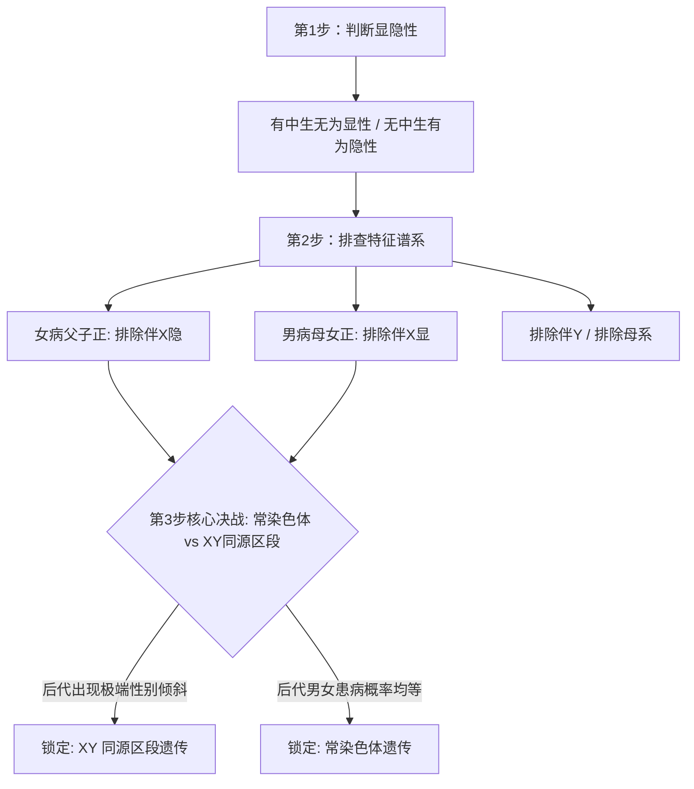

# 03 伴性遗传与遗传系谱图三步排查法升级模型

> **【导读与第一性原理】**
> - **教材坐标**：必修2 第2章 第2节《基因在染色体上》、第3节《伴性遗传》
> - **核心生命观念**：信息观、进化与适应观、假说-演绎科学思维
> - **认知引导**：孟德尔发现了遗传因子的分离与自由组合，但这些神秘的“因子”究竟实体存在于细胞的何处？萨顿通过减数分裂与孟德尔定律的惊人平行性提出了“染色体假说”，而摩尔根则用一只白眼雄果蝇，将基因确凿无疑地锚定在了 X 染色体上。当性染色体参与遗传分配时，性状的表现便与性别产生了不可分割的连锁效应。面对高考最复杂的遗传系谱图，传统口诀往往在面对“XY 同源区段”时折戟沉沙。本节将带你构建全网最严密的**三步排查升级决战模型**，一招击穿谱系推导与伴性致死陷阱。

---

## 一、 教材基础与核心机理透析

### 1. 萨顿假说与摩尔根果蝇杂交实验

#### (1) 萨顿假说的科学方法：类比推理法
- **核心逻辑**：基因和染色体行为存在着明显的**平行关系**（成对存在、分离、自由组合、保持独立性与完整性）。
- **局限与意义**：类比推理得出的假说具有猜测性，**并未提供直接实验证据**，必须经过假说-演绎法的实验验证。

#### (2) 摩尔根果蝇杂交实验（假说-演绎法确证基因在染色体上）
- **现象发现**：
  $$\text{P: 红眼雌果蝇} \times \text{白眼雄果蝇} \longrightarrow \text{F}_1: \text{红眼（雌雄均有）}$$
  $$\text{F}_1 \text{雌雄交配} \longrightarrow \text{F}_2: \text{红眼雌 : 红眼雄 : 白眼雄} = 2 : 1 : 1$$
  - 白眼性状全部出现在雄性个体中！眼色遗传与性别直接相关。
- **摩尔根的假说**：控制白眼的隐性基因（$w$）位于 **X 染色体**上，而 **Y 染色体上没有其等位基因**（即 X 染色体特有非同源区段）。
- **测交验证**：
  - 让 $\text{F}_1$ 红眼雌蝇（$X^W X^w$）与白眼雄蝇（$X^w Y$）测交：后代红眼雌、白眼雌、红眼雄、白眼雄比例为 $1:1:1:1$；
  - 关键验证：**白眼雌蝇（$X^w X^w$）与红眼雄蝇（$X^W Y$）杂交**，后代**雌蝇全为红眼（$X^W X^w$），雄蝇全为白眼（$X^w Y$）**！彻底证实假说！

---

### 2. 伴性遗传的四大家族经典图谱

```
  【伴X隐性】(如红绿色盲、血友病)        【伴X显性】(如抗维生素D佝偻病)
  • 交叉遗传 / 隔代遗传                 • 世代连续遗传
  • 男性患者多于女性                     • 女性患者多于男性
  • 母病子必病，女病父必病               • 父病女必病，子病母必病

  【伴Y遗传】(如外耳道多毛症)           【母系遗传】(线粒体DNA控制)
  • 传男不传女，父传子、子传孙           • 母病子女全病，母正子女全正
```

---

## 二、 高考高频定量计算与数学模型

### 1. 高考升级版：遗传系谱图“三步排查法”决战模型

面对复杂遗传系谱图，严格按照如下三步阶梯推导，绝不遗漏隐蔽考点：



#### 🟢 第一步：判显隐性
- **无中生有为隐性**：双亲正常，子代有病 $\longrightarrow$ 隐性遗传病；
- **有中生无为显性**：双亲患病，子代正常 $\longrightarrow$ 显性遗传病。

#### 🔵 第二步：找“突破口”排除伴 X 非同源 / 伴 Y / 母系
- **排除母系**：母病子正 或 母正子病 $\longrightarrow$ 排除母系遗传；
- **排除伴 Y**：若出现女患者，或患病父亲生出正常儿子 $\longrightarrow$ 排除伴 Y；
- **排除伴 X 隐性（寻找“女病”缺陷）**：找病女。若**病女的父亲正常**，或**病女的儿子正常** $\longrightarrow$ **必定排除伴 X 隐性**（因 $X^b X^b$ 的父亲与儿子必带 $X^b$，必患病）；
- **排除伴 X 显性（寻找“男病”缺陷）**：找病男。若**病男的母亲正常**，或**病男的女儿正常** $\longrightarrow$ **必定排除伴 X 显性**（因 $X^B Y$ 的母亲与女儿必带 $X^B$，必患病）。

#### 🟡 第三步：核心决战──常染色体 vs XY 同源区段判别

当第二步排除了伴 X 非同源区段后，传统模型直接草率定为常染色体，**但在高考压轴题中，必须在此进行分流！**

##### 【情况 A：隐性病】（已排除仅 X 隐，在“常隐”与“XY 同源隐”中抉择）
- **核心交配谱系**：寻找 **正常双亲（杂合）生出患病后代** 或 **隐性雌 $\times$ 显性雄**。
- **决定性特征**：若为 XY 同源区段隐性，父亲基因型可为 $X^b Y^B$（表型正常），母亲为 $X^B X^b$：
  - 女儿（$X^b X^b$）患病；儿子（$X^B Y^B$ 或 $X^b Y^B$）**全部正常**！
- **结论法则**：
  - 若**后代表型出现极端的性别偏向**（如正常双亲生出病女，但儿子全部正常） $\longrightarrow$ **属于 XY 同源区段隐性**！
  - 若**后代男女患病机会均等**，病女的同胞兄弟亦有患病可能 $\longrightarrow$ **常染色体隐性**。

##### 【情况 B：显性病】（已排除仅 X 显，在“常显”与“XY 同源显”中抉择）
- **核心交配谱系**：寻找 **患病雄性（显性杂合） $\times$ 正常雌性（隐性纯合 $X^b X^b$）**。
- **决定性特征**：患病父亲基因型有两种可能：$X^B Y^b$ 或 $X^b Y^B$：
  - 组合一（$X^B Y^b \times X^b X^b$）：**女儿全部患病，儿子全部正常**；
  - 组合二（$X^b Y^B \times X^b X^b$）：**儿子全部患病，女儿全部正常**！
- **结论法则**：
  - 只要看到**患病父亲与正常母亲结婚，后代呈现“全男病、女正常”或“全女病、男正常”的绝对性别对立** $\longrightarrow$ **锁定 XY 同源区段显性**！
  - 若后代男女患病比例接近 $1:1$ $\longrightarrow$ **常染色体显性**。

---

### 2. 性别比例 $2:1$ 伴性致死模型

在果蝇或昆虫杂交实验中，若子代**雌雄比例不等于 $1:1$**，优先锁定伴性致死：
- **经典现象**：某对亲本杂交，子代表型比为：**雌蝇 : 雄蝇 $= 2 : 1$**。
- **生物学机理**：隐性致死基因 $a$ 位于 X 染色体特有区段上。
  $$\text{P: 杂合雌}(X^A X^a) \times \text{正常雄}(X^A Y)$$
  $$\text{子代受精卵: } X^A X^A(\text{雌活}), X^A X^a(\text{雌活}), X^A Y(\text{雄活}), X^a Y(\textbf{雄性纯合致死！})$$
  - 存活后代雌雄比恰好为 **$2 : 1$**！
- **逆向推导技巧**：只要雄性出现半数致死，且存活雄性表现型全为显性，必为母本提供致死隐性配子 $X^a$。

---

## 三、 核心矢量图解 (SVG)

<svg xmlns="http://www.w3.org/2000/svg" viewBox="0 0 780 370" width="100%">
  <!-- 背景板 -->
  <rect x="0" y="0" width="780" height="370" rx="12" fill="#F8FAFC" stroke="#E2E8F0" stroke-width="1.5"/>
  
  <!-- 顶部标题条 -->
  <g transform="translate(20, 16)">
    <rect x="0" y="0" width="740" height="42" rx="8" fill="#1E293B"/>
    <text x="370" y="26" fill="#FFFFFF" font-size="16" font-weight="bold" text-anchor="middle" letter-spacing="1">遗传系谱图“三步排查法”与 XY 同源区段升级决战谱</text>
  </g>

  <!-- 左侧卡片：前两步快速排查 (局部坐标系) -->
  <g transform="translate(20, 72)">
    <rect x="0" y="0" width="360" height="280" rx="8" fill="#FFFFFF" stroke="#CBD5E1" stroke-width="1.5"/>
    <rect x="0" y="0" width="360" height="36" rx="8" fill="#EFF6FF" stroke="#BFDBFE" stroke-width="1"/>
    <text x="180" y="23" fill="#1D4ED8" font-size="14" font-weight="bold" text-anchor="middle">Step 1 &amp; 2: 显隐判断与经典突破口排除</text>

    <g transform="translate(15, 48)">
      <!-- Step 1 -->
      <rect x="0" y="0" width="330" height="42" rx="6" fill="#FEFCE8" stroke="#FEF08A" stroke-width="1"/>
      <text x="12" y="17" fill="#854D0E" font-size="11" font-weight="bold">【第一步】判显隐性（抓父母与子女表型差）</text>
      <text x="12" y="32" fill="#713F12" font-size="10">• 无中生有 ➔ 隐性病   |   • 有中生无 ➔ 显性病</text>

      <!-- Step 2-1: 女病父子正 -->
      <g transform="translate(0, 48)">
        <rect x="0" y="0" width="330" height="46" rx="6" fill="#F0F9FF" stroke="#BAE6FD" stroke-width="1"/>
        <text x="12" y="17" fill="#0369A1" font-size="11" font-weight="bold">【第二步·隐性】女病父子正 ➔ 排除伴 X 隐</text>
        <text x="12" y="33" fill="#0C4A6E" font-size="10">若病女（XᵇXᵇ）其父或其子正常（带Xᴮ），必非仅X隐！</text>
      </g>

      <!-- Step 2-2: 男病母女正 -->
      <g transform="translate(0, 100)">
        <rect x="0" y="0" width="330" height="46" rx="6" fill="#FAF5FF" stroke="#E9D5FF" stroke-width="1"/>
        <text x="12" y="17" fill="#7E22CE" font-size="11" font-weight="bold">【第二步·显性】男病母女正 ➔ 排除伴 X 显</text>
        <text x="12" y="33" fill="#581C87" font-size="10">若病男（XᴮY）其母或其女正常（纯隐xᵇxᵇ），必非仅X显！</text>
      </g>

      <!-- 排除母系与伴Y -->
      <g transform="translate(0, 152)">
        <rect x="0" y="0" width="330" height="40" rx="6" fill="#F1F5F9" stroke="#CBD5E1" stroke-width="1"/>
        <text x="12" y="17" fill="#334155" font-size="11" font-weight="bold">【母系与伴 Y 速排】</text>
        <text x="12" y="31" fill="#475569" font-size="10">母病子正排母系；有女患者或病父生正子排伴 Y</text>
      </g>
    </g>
  </g>

  <!-- 右侧卡片：第三步核心升级决战 (局部坐标系) -->
  <g transform="translate(400, 72)">
    <rect x="0" y="0" width="360" height="280" rx="8" fill="#FFFFFF" stroke="#CBD5E1" stroke-width="1.5"/>
    <rect x="0" y="0" width="360" height="36" rx="8" fill="#FEF3C7" stroke="#FDE68A" stroke-width="1"/>
    <text x="180" y="23" fill="#B45309" font-size="14" font-weight="bold" text-anchor="middle">Step 3 核心升级：常染色体 vs XY 同源区段</text>

    <g transform="translate(15, 48)">
      <!-- 决战 1: 隐性病分流 -->
      <rect x="0" y="0" width="330" height="66" rx="6" fill="#EFF6FF" stroke="#BFDBFE" stroke-width="1.5"/>
      <text x="12" y="18" fill="#1D4ED8" font-size="11" font-weight="bold">【隐性病决战】观察后代是否锁定性别倾斜</text>
      <text x="12" y="36" fill="#1E40AF" font-size="10">• 正常双亲生出病女，但【儿子全正常】➔ 锁死 XY 同源隐！</text>
      <text x="12" y="52" fill="#64748B" font-size="10">（父 XᵇYᴮ 传递显性Yᴮ保儿子全正；若男女患病均等 ➔ 常隐）</text>

      <!-- 决战 2: 显性病分流 -->
      <g transform="translate(0, 74)">
        <rect x="0" y="0" width="330" height="66" rx="6" fill="#F0FDF4" stroke="#86EFAC" stroke-width="1.5"/>
        <text x="12" y="18" fill="#166534" font-size="11" font-weight="bold">【显性病决战】看病父（杂合）× 正母（隐纯）</text>
        <text x="12" y="36" fill="#15803D" font-size="10">• 【儿子全病、女儿全正】(父 XᵇYᴮ) ➔ 锁死 XY 同源显！</text>
        <text x="12" y="52" fill="#15803D" font-size="10">• 【女儿全病、儿子全正】(父 XᴮYᵇ) ➔ 锁死 XY 同源显！</text>
      </g>

      <!-- 终极排雷警告 -->
      <g transform="translate(0, 148)">
        <rect x="0" y="0" width="330" height="44" rx="6" fill="#FEF2F2" stroke="#FECACA" stroke-width="1"/>
        <text x="12" y="17" fill="#B91C1C" font-size="11" font-weight="bold">⚠️ 终极避坑警示</text>
        <text x="12" y="33" fill="#991B1B" font-size="10">未指明“不考虑XY同源”时，排仅X后绝不可盲猜常染色体！</text>
      </g>
    </g>
  </g>
</svg>

---

## 四、 高频易错点与考场排雷 (WARNING)

> [!WARNING]
> ### 🚨 考场排雷一：概率计算中的“语境定语陷阱”
> 在计算患病概率时，必须严格区分以下两种设问：
> 1. **“生一个患病男孩的概率”**：事件包含**生男孩**和**患病**两重独立或伴性条件。
>    - 常染色体遗传：$= \text{患病概率} \times \frac{1}{2}$；
>    - 伴 X 隐性遗传（母 $X^A X^a \times$ 父 $X^A Y$）：全部子代中患病男孩（$X^a Y$）占 $\frac{1}{4}$！
> 2. **“生出的男孩中患病的概率”**（或“若已知该孩子是男孩，其患病的概率”）：
>    - 性别已锁定为雄性分母！在男孩群体内（$X^A Y, X^a Y$）计算患病个体占比，概率为 $\frac{1}{2}$！

> [!WARNING]
> ### 🚨 考场排雷二：将“伴 X 显性”误判为“常染色体显性”
> **【致命陷阱】**：若家系中父亲患病，生了一个患病女儿和一个患病儿子，考生常误以为“男女都有病，必为常显”。
> - **本质排雷**：伴 X 显性中，若母亲也是患者（$X^B X^b$ 杂合），儿子完全可以从母亲获得致病基因 $X^B$ 而发病！只有当**患病父亲与正常母亲结婚（$X^B Y \times X^b X^b$）**时，后代才会严格呈现“男全正、女全病”。若母亲为患者，决不能简单依据“儿子患病”排除伴 X 显性！

---

## 五、 高考真题命题角度与长句表达规范

### 1. 区分基因位于常染色体还是伴 X 染色体的杂交实验设计

> **【真题设问】**：已知果蝇的刚毛与截毛由一对等位基因控制，显隐性已知（刚毛为显性）。现有纯合刚毛和截毛雌雄果蝇若干，请设计最简捷的一次杂交实验，确定该对基因位于常染色体上还是 X 染色体的特有区段上。（写出亲本表型组合、预期结果与结论）

**【规范满分作答模板】**：
- **亲本组合选择**：
  选取 **隐性雌性（截毛雌果蝇）** 与 **显性雄性（纯合刚毛雄果蝇）** 进行单对杂交。
- **预期结果与结论**：
  1. 若杂交后代中，**雌果蝇全为刚毛，雄果蝇全为截毛**（表现为与性别相关的交叉遗传），则控制该性状的基因**位于 X 染色体的特有区段上**；
  2. 若杂交后代中，**无论雌雄果蝇全为刚毛**，则控制该性状的基因**位于常染色体上**。

---

### 2. 区分基因位于常染色体还是 X、Y 同源区段的实验设计

> **【真题设问】**：若已证明控制刚毛与截毛的基因不位于 X 染色体特有区段，现需进一步探究其位于常染色体还是 X、Y 染色体的同源区段，请利用纯合截毛雌蝇与刚毛雄蝇进行实验设计。

**【规范满分作答模板】**：
- **实验思路**：
  让纯合截毛雌蝇（$X^b X^b$ 或 $bb$）与纯合刚毛雄蝇（$X^B Y^B$ 或 $BB$）杂交获得 $\text{F}_1$，选取 $\text{F}_1$ 中的**刚毛雄蝇**与**纯合截毛雌蝇**进行回交（测交），观察统计后代的性别及表现型。
- **预期结果与结论**：
  1. 若回交后代中，**雄果蝇全为刚毛，雌果蝇全为截毛**（或雌果蝇全为刚毛，雄果蝇全为截毛），即后代表现型与性别严格相关，则该基因位于 **X、Y 染色体的同源区段**；
  2. 若回交后代中，**雌雄果蝇均有刚毛与截毛，且比例均接近 $1:1$**，则该基因位于**常染色体**上。
