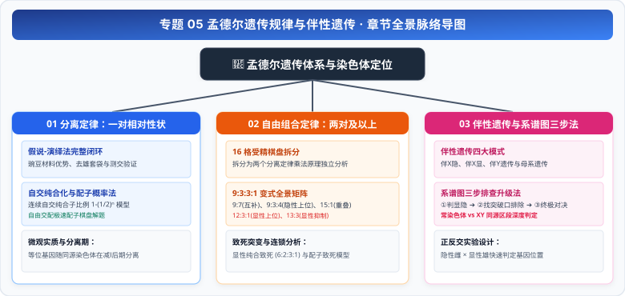

# 专题 05 孟德尔遗传规律与伴性遗传

> **【专题导读与知识体系】**
>
> - **教材对应**：人教版必修2《遗传与进化》第1章《遗传因子的发现》、第2章《基因和染色体的关系》
> - **核心思想**：从颗粒遗传理论到基因在染色体上的定位，揭示生命信息离散传递与重组的数学本质。
> - **高考权重**：高考生物最强计算与逻辑推理压轴板块，年年必考，常与基因工程、现代进化理论综合命题。

<CCChapterOverview />

---

## 章节脉络与核心导航

  

### 本专题包含以下核心篇章：

1. [**01 孟德尔的一对相对性状杂交实验（分离定律与配子法）**](./01%20孟德尔的一对相对性状杂交实验（分离定律与配子法）.md)
   - 豌豆实验材料优势与去雄套袋规范、假说-演绎法五大环节、微观分离实质、连续自交纯合化曲线与自由交配配子概率法。
2. [**02 两对相对性状杂交实验与9331变式全景矩阵（自由组合定律）**](./02%20两对相对性状杂交实验与9331变式全景矩阵（自由组合定律）.md)
   - 自由组合定律实质、16 格棋盘拆分法、$9:7$ / $9:3:4$ / $9:6:1$ / $15:1$ / $12:3:1$ / $13:3$ 基因互作变式归类、纯合与配子致死模型。
3. [**03 伴性遗传与遗传系谱图三步排查法**](./03%20伴性遗传与遗传系谱图三步排查法.md)
   - 摩尔根果蝇杂交实验、三大区段模型、独家遗传系谱图“三步排查升级法”（常染色体 vs XY 同源区段深度分流判别）、高考排雷与规范长句论证。
