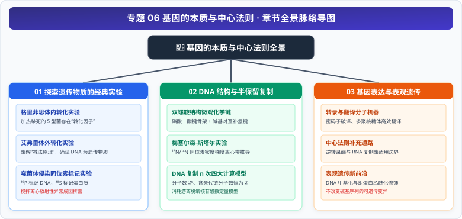

# 专题 06 基因的本质与中心法则（复制、转录与翻译）

> **【专题导读与知识体系】**
>
> - **教材对应**：人教版必修2《遗传与进化》第3章《基因的本质》、第4章《基因的表达》
> - **核心思想**：从经典实验探究（减法原理、同位素标记）到双螺旋分子的化学键与半保留守恒，再到中心法则的五向信息流与表观遗传修饰，展现生命信息的精准复制与多维调控。
> - **高考权重**：高考生物必考的核心基础与实验设计重镇，聚焦同位素离心条带分析、DNA复制计算、转录翻译偶联及DNA甲基化调控等高频热点。

<CCChapterOverview />

---

## 章节脉络与核心导航

  

### 本专题包含以下核心篇章：

1. [**01 探索遗传物质本质的经典实验（格里菲思、艾弗里、噬菌体侵染）**](./01%20探索遗传物质本质的经典实验（格里菲思、艾弗里、噬菌体侵染）.md)
   - 肺炎链球菌体内与体外转化实验的减法原理设计、T2 噬菌体侵染大肠杆菌同位素示踪操作要点、上清液与沉淀物放射性异常微观机理排雷。
2. [**02 DNA 的双螺旋结构与半保留复制计算模型**](./02%20DNA%20的双螺旋结构与半保留复制计算模型.md)
   - DNA 双螺旋反向平行物理化学特征、磷酸二酯键与氢键断裂/形成条件、梅塞尔森-斯塔尔同位素离心带推导、连续复制 $n$ 次四大数学守恒计算模型。
3. [**03 基因的表达（转录、翻译、中心法则与表观遗传）**](./03%20基因的表达（转录、翻译、中心法则与表观遗传）.md)
   - 转录与翻译的微观催化机理、密码子简并性与通用性、多聚核糖体流水线与移动方向判定、中心法则全景信息流、DNA 甲基化与表观遗传前沿机制。
