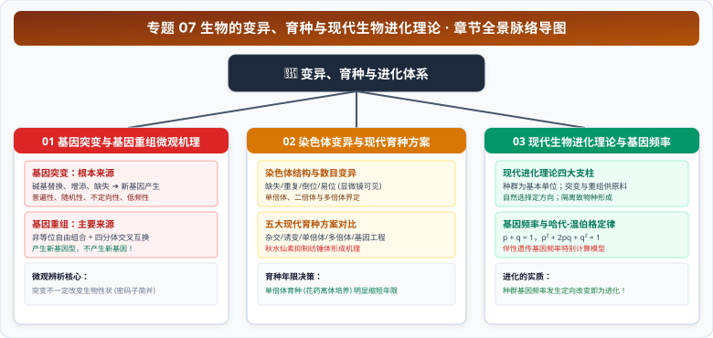

# 专题 07 生物的变异、育种与现代生物进化理论

> **【专题导读与知识体系】**
> - **教材对应**：人教版必修2《遗传与进化》第5章《基因突变及其他变异》、第6章《生物的进化》
> - **核心思想**：从分子与染色体水平揭示变异的本质，建立人类利用变异改造生物的育种工程学思维，并以种群基因库为抓手统一阐明生命多样性与适应性的演化历程。
> - **高考权重**：高考常考的实验与理论大题综合区，常融合减数分裂异常配子溯源、育种技术方案决策设计、伴 X 与常染色体基因频率计算等压轴设问。

<CCChapterOverview />

---

## 章节脉络与核心导航

  

### 本专题包含以下核心篇章：

1. [**01 基因突变与基因重组微观机理与辨析**](./01%20基因突变与基因重组微观机理与辨析.md)
   - 碱基增添/缺失/替换机理、镰刀型细胞贫血症、突变不引起性状改变的深层机理、基因重组类型与显隐性突变实验判定。
2. [**02 染色体变异与现代育种方案全景**](./02%20染色体变异与现代育种方案全景.md)
   - 染色体结构变异（缺失/重复/倒位/易位）、染色体组与单倍体/二倍体/多倍体判定、秋水仙素作用机理、三倍体无子西瓜与五大育种方案核心参数大阅兵。
3. [**03 现代生物进化理论与基因频率定量计算**](./03%20现代生物进化理论与基因频率定量计算.md)
   - 达尔文自然选择学说评价、现代进化理论四大支柱、协同进化与生物多样性、常染色体与伴 X 染色体基因频率及哈迪-温伯格平衡速杀模型。
