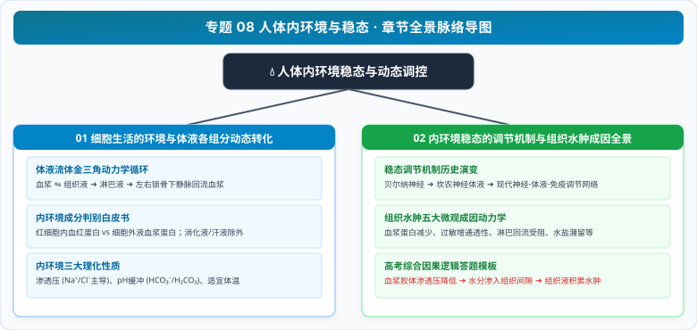

# 专题 08 人体内环境与稳态

> **【专题导读与知识体系】**
>
> - **教材对应**：人教版选择性必修1《稳态与调节》第1章《人体的内环境与稳态》
> - **核心思想**：从原始海洋单细胞的直接物质交换到多细胞陆生生命的“随身微缩海洋”，揭示内环境作为细胞与外界物质交换媒介的演化意义，并以动态平衡模型剖析组织水肿等病理机制。
> - **高考权重**：高考稳态与调节板块的基石章节，常考内环境成分判定（如血红蛋白 vs 血浆蛋白、体外液体）、金三角单双向流动、跨膜层数精确计算及组织水肿五大成因分析。

<CCChapterOverview />

---

## 章节脉络与核心导航

  

### 本专题包含以下核心篇章：

1. [**01 细胞生活的环境与体液各组分动态转化**](./01%20细胞生活的环境与体液各组分动态转化.md)
   - 体液系统划分、血浆-组织液-淋巴液动态水力学网络、内环境成分“四看排查法”、三大理化性质及 pH 缓冲对平衡微观机理。
2. [**02 内环境稳态的调节机制与组织水肿成因全景**](./02%20内环境稳态的调节机制与组织水肿成因全景.md)
   - 神经-体液-免疫稳态调节网络、直接参与物质交换的四大器官系统、组织水肿五大病理诱因全景矩阵及长句论证规范。
