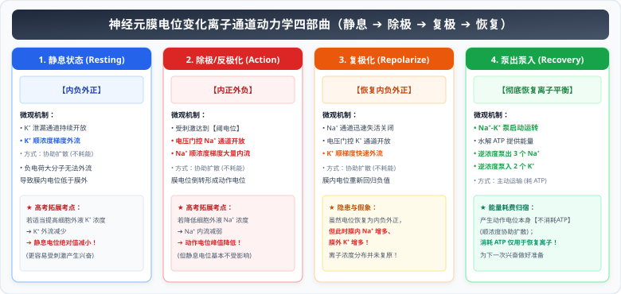

# 01 神经调节微观机理与膜电位分析模型

> **【导读与第一性原理】**
>
> - **教材坐标**：选择性必修1 第2章 第1~4节《神经调节的结构基础》《神经调节的基本方式》《神经冲动的产生和传导》《神经系统的分级调节》
> - **核心生命观念**：结构与功能观、物质与能量观、信息与系统控制论
> - **认知引导**：神经元如何仅凭细胞膜内外几毫伏的离子跨膜电位差，实现毫米秒级的超高速信息编码与传导？当你的指尖无意触碰到灼热的铁壶，为什么手臂会在你意识到“烫”之前就已经闪电般缩回？在神经元相接的 20 纳米突触微缝隙中，电信号如何被转化为化学信号？本节从跨膜电化学梯度与通道动力学第一性原理出发，系统解构神经冲动的产生、传导与突触单向阀门的控制逻辑。

---

## 一、 教材基础与反射弧结构功能

### 1. 反射与反射弧

- **反射的定义**：在中枢神经系统参与下，机体对内外环境刺激所作出的**规律性应答**。反射是**神经调节的基本方式**。
- **反射的结构基础──反射弧（五部分严密闭环）**：
  $$\textbf{感受器} \longrightarrow \textbf{传入神经} \longrightarrow \textbf{神经中枢} \longrightarrow \textbf{传出神经} \longrightarrow \textbf{效应器}$$

| 反射弧结构组成 | 结构特征与判断依据                     | 生理功能                             | 受损后的表现                   |
| :------------- | :------------------------------------- | :----------------------------------- | :----------------------------- |
| **感受器**     | 感觉神经末梢或特化的感受细胞           | 感受内外部刺激，将刺激转化为神经冲动 | 既无感觉，又无效应             |
| **传入神经**   | 神经纤维上具有**神经节**（核外膨大部） | 将感受器产生的兴奋向中枢传导         | 既无感觉，又无效应             |
| **神经中枢**   | 脑和脊髓的灰质部分（含突触）           | 对传入的信号进行综合分析、编码处理   | 既无感觉，又无效应             |
| **传出神经**   | 无神经节，直接与效应器相连             | 将中枢发出的兴奋指令传导至效应器     | **有感觉，但无效应**（无反应） |
| **效应器**     | **传出神经末梢及其所支配的肌肉或腺体** | 发生规律性应答（肌肉收缩或腺体分泌） | **有感觉，但无效应**（无反应） |

> [!IMPORTANT]
> **反射发生的必备条件**：
>
> 1. 必须有**适宜的刺激**（强度达到阈刺激）；
> 2. 必须保证**反射弧结构的完整性**！
> 3. 若反射弧某处受损（如传出神经被切断），刺激感受器虽然肌肉不收缩，但只要传入神经和大脑皮层完好，**机体依然能产生感觉**。

---

### 2. 非条件反射 vs 条件反射

- **非条件反射**：先天遗传、生来就有的本能反射，神经中枢位于**大脑皮层以下（脊髓或脑干）**，形式固定、终生不退（如膝跳反射、缩手反射、婴儿吮吸、吃梅分泌唾液）。
- **条件反射**：后天在非条件反射基础上经学习和训练建立的，神经中枢位于**大脑皮层**，具有极大的可塑性（如望梅止渴、谈虎色变、听到铃声进教室）。
- **条件反射的建立与消退**：
  - **建立机制**：无关刺激（如铃声）与非条件刺激（如食物）在时间上多次结合（强化）；
  - **消退机制**：条件刺激不再伴随非条件刺激的强化，条件反射就会逐渐减弱直至消退。**条件反射的消退不是反射的简单丧失，而是大脑皮层建立了新的抑制过程**。

---

## 二、 膜电位产生机理与兴奋在神经纤维上的传导

<ClientOnly>
  <ActionPotentialOscilloscope />
</ClientOnly>

### 1. 静息电位与动作电位的离子通道动力学

神经细胞膜内外存在巨大的离子浓度差：**细胞内 $K^+$ 浓度显著高于细胞外，细胞外 $Na^+$ 浓度显著高于细胞内**。

  

- **跨膜运输方式辨析**：
  - 静息时 $K^+$ 外流：**协助扩散**（顺浓度梯度，不消耗 ATP）；
  - 兴奋时 $Na^+$ 内流：**协助扩散**（顺浓度梯度，不消耗 ATP）；
  - 维持/恢复膜内外离子浓度差（$Na^+-K^+$ 泵）：**主动运输**（逆浓度梯度，消耗 ATP）。
- **离子浓度改变对电位的影响（高考压轴热点）**：
  - 若**降低细胞外液 $Na^+$ 浓度**：$Na^+$ 跨膜浓度差减小，内流减少 $\implies$ **动作电位峰值降低**，而静息电位基本不变；
  - 若**升高细胞外液 $K^+$ 浓度**：$K^+$ 跨膜浓度差减小，外流减少 $\implies$ **静息电位绝对值减小**（向 $0\text{ mV}$ 靠拢，细胞更容易被激发兴奋）。

---

### 2. 兴奋在神经纤维上的双向传导与局部电流

- 膜外局部电流方向：**未兴奋部位 $\to$ 兴奋部位**；
- 膜内局部电流方向：**兴奋部位 $\to$ 未兴奋部位**（与兴奋传导方向**完全一致**）。
- **生物学规律**：在离体神经纤维上给予刺激，兴奋呈**双向传导**；而在完整的反射弧中，由于突触的存在，兴奋只能进行**单向传导**。

---

## 三、 兴奋在突触处的单向传递机制

### 1. 突触的亚微观构造

突触是神经元之间或神经元与效应器细胞相接触的特化结构，由三部分组成：

1. **突触前膜**：轴突末梢膨大成**突触小体**的膜；
2. **突触间隙**：充满**组织液**（内环境成分）；
3. **突触后膜**：下一个神经元的胞体膜、树突膜或肌细胞膜（含有特异性受体）。

---

### 2. 传递全过程与信号转化

$$\textbf{电信号 (轴突动作电位)} \xrightarrow{\textbf{突触前膜释放递质}} \textbf{化学信号 (神经递质)} \xrightarrow{\textbf{突触后膜受体结合}} \textbf{电信号 (后膜动作电位)}$$

- **递质释放机制**：突触小泡向突触前膜移动，以**胞吐（耗能）**方式将神经递质排入突触间隙。
- **两类神经递质的效应**：
  - **兴奋性递质**（如乙酰胆碱 ACh、谷氨酸）：与突触后膜受体结合 $\to$ **$Na^+$ 通道开放，$Na^+$ 大量内流** $\to$ 突触后膜产生动作电位，引起后膜兴奋；
  - **抑制性递质**（如 $\gamma$-氨基丁酸 GABA、甘氨酸）：与突触后膜受体结合 $\to$ **$Cl^-$ 通道开放，$Cl^-$ 大量内流** $\to$ 膜内负电荷进一步增加（超极化），后膜更难以兴奋，表现为抑制。
- **递质的去向**：发挥作用后，神经递质被突触间隙中的酶**迅速水解灭活**，或被突触前膜**重摄取回收**，防止突触后膜发生持续性兴奋或抑制。
- **突触延搁与单向性**：
  - **单向传递原因**：**神经递质只存在于突触小泡中，只能由突触前膜释放，然后作用于突触后膜**；
  - 突触处的信号转换需要一定时间（突触延搁），故突触传递速度远慢于神经纤维上的传导速度。

---

## 四、 核心图解：动作电位微观离子流与电流计指针偏转模型

<svg xmlns="http://www.w3.org/2000/svg" viewBox="0 0 780 370" width="100%" height="100%">
  <defs>
    <linearGradient id="bgGrad91" x1="0%" y1="0%" x2="100%" y2="100%">
      <stop offset="0%" stop-color="#f8fafc"/>
      <stop offset="100%" stop-color="#f1f5f9"/>
    </linearGradient>
    <linearGradient id="titleGrad91" x1="0%" y1="0%" x2="100%" y2="100%">
      <stop offset="0%" stop-color="#2563eb"/>
      <stop offset="100%" stop-color="#1d4ed8"/>
    </linearGradient>
    <filter id="shadow91" x="-5%" y="-5%" width="110%" height="115%" filterUnits="userSpaceOnUse">
      <feDropShadow dx="0" dy="2" stdDeviation="3" flood-color="#0f172a" flood-opacity="0.08"/>
    </filter>
  </defs>
  <!-- 背景底板 -->
  <rect width="780" height="370" rx="16" fill="url(#bgGrad91)" stroke="#cbd5e1" stroke-width="1.5"/>
  <!-- 顶部标题横幅 -->
  <rect x="20" y="16" width="740" height="42" rx="10" fill="url(#titleGrad91)" filter="url(#shadow91)"/>
  <text x="390" y="42" text-anchor="middle" font-size="16" font-weight="bold" fill="#ffffff" letter-spacing="1">动作电位离子动力学曲线与膜外双极电流计偏转模型</text>
  <!-- 左侧：动作电位离子通透性曲线 -->
  <g transform="translate(20, 72)">
    <rect width="360" height="280" rx="12" fill="#ffffff" stroke="#cbd5e1" stroke-width="1.2" filter="url(#shadow91)"/>
    <rect x="0" y="0" width="360" height="34" rx="12" fill="#eff6ff"/>
    <text x="180" y="23" text-anchor="middle" font-size="13" font-weight="bold" fill="#1e40af">动作电位动力学：离子通道开关与曲线解析</text>
    <!-- 坐标轴 -->
    <g transform="translate(45, 45)">
      <line x1="10" y1="160" x2="285" y2="160" stroke="#64748b" stroke-width="1.5"/>
      <line x1="20" y1="10" x2="20" y2="175" stroke="#64748b" stroke-width="1.5"/>
      <text x="280" y="175" font-size="9" fill="#64748b">时间 (ms)</text>
      <text x="15" y="10" font-size="9" fill="#64748b">电位 (mV)</text>
      <!-- 零电位虚线 -->
      <line x1="20" y1="65" x2="285" y2="65" stroke="#cbd5e1" stroke-dasharray="3,3"/>
      <text x="5" y="68" font-size="8.5" fill="#94a3b8">0</text>
      <text x="-5" y="138" font-size="8.5" fill="#94a3b8">-70</text>
      <text x="-5" y="32" font-size="8.5" fill="#94a3b8">+30</text>
      <!-- 电位曲线 -->
      <path d="M 20,135 L 70,135 Q 95,135 120,30 Q 145,135 170,145 L 230,135 L 280,135" fill="none" stroke="#2563eb" stroke-width="2.5"/>
      <!-- 阶段标注 -->
      <!-- a点: 静息 -->
      <circle cx="50" cy="135" r="4" fill="#10b981"/>
      <text x="50" y="152" text-anchor="middle" font-size="9" font-weight="bold" fill="#047857">a:静息(K⁺外流)</text>
      <!-- b点: 峰值 (动作电位) -->
      <circle cx="120" cy="30" r="4" fill="#ef4444"/>
      <text x="120" y="20" text-anchor="middle" font-size="9" font-weight="bold" fill="#b91c1c">b:峰值(Na⁺大量内流)</text>
      <!-- c点: 复极化 -->
      <circle cx="155" cy="110" r="4" fill="#f59e0b"/>
      <text x="195" y="112" font-size="9" font-weight="bold" fill="#b45309">c:复极化(K⁺外流)</text>
    </g>
    <!-- 底部结论总结 -->
    <rect x="15" y="222" width="330" height="46" rx="6" fill="#f8fafc" stroke="#cbd5e1"/>
    <text x="25" y="240" font-size="9.5" font-weight="bold" fill="#0f172a">浓度考点总结：</text>
    <text x="25" y="255" font-size="8.5" fill="#334155">外液Na⁺降低 ➔ 峰值b下降； 外液K⁺升高 ➔ 静息a绝对值减小(易兴奋)。</text>
  </g>
  <!-- 右侧：膜外双极电流计偏转决策图 -->
  <g transform="translate(400, 72)">
    <rect width="360" height="280" rx="12" fill="#ffffff" stroke="#cbd5e1" stroke-width="1.2" filter="url(#shadow91)"/>
    <rect x="0" y="0" width="360" height="34" rx="12" fill="#f0fdf4"/>
    <text x="180" y="23" text-anchor="middle" font-size="13" font-weight="bold" fill="#166534">实验实战：电流计双极相连与偏转模型</text>
    <!-- 图例展示 -->
    <g transform="translate(20, 48)">
      <!-- 神经纤维棒 -->
      <rect x="10" y="30" width="300" height="18" rx="6" fill="#f1f5f9" stroke="#94a3b8"/>
      <text x="160" y="43" text-anchor="middle" font-size="9" fill="#64748b">神经纤维 (膜外未兴奋为正)</text>
      <!-- 电极 a 与 b (均在膜外) -->
      <circle cx="90" cy="30" r="3" fill="#2563eb"/>
      <text x="90" y="22" text-anchor="middle" font-size="10" font-weight="bold" fill="#1d4ed8">A极</text>
      <circle cx="230" cy="30" r="3" fill="#2563eb"/>
      <text x="230" y="22" text-anchor="middle" font-size="10" font-weight="bold" fill="#1d4ed8">B极</text>
      <!-- 导线与电流表 -->
      <path d="M 90,20 L 90,2 Q 160,-12 230,2 L 230,20" fill="none" stroke="#2563eb" stroke-width="1.5"/>
      <circle cx="160" cy="-5" r="14" fill="#ffffff" stroke="#2563eb" stroke-width="1.5"/>
      <text x="160" y="-1" text-anchor="middle" font-size="10" font-weight="bold" fill="#1d4ed8">G</text>
      <!-- 刺激点 S1 (在A极左侧) -->
      <polygon points="40,22 45,12 35,12" fill="#ef4444"/>
      <text x="40" y="8" text-anchor="middle" font-size="9" font-weight="bold" fill="#b91c1c">刺激点S₁</text>
    </g>
    <!-- 偏转推导卡片 -->
    <g transform="translate(15, 115)">
      <rect x="0" y="0" width="330" height="48" rx="6" fill="#f8fafc" stroke="#e2e8f0"/>
      <text x="10" y="18" font-size="10" font-weight="bold" fill="#0f172a">1. 刺激点 S₁ 在 A 极左侧（距离不等）：</text>
      <text x="10" y="34" font-size="9" fill="#2563eb">兴奋先到A极（A负B正偏左）➔ 再到B极（B负A正偏右）➔ 【偏转2次，方向相反】</text>
      <rect x="0" y="54" width="330" height="48" rx="6" fill="#f8fafc" stroke="#e2e8f0"/>
      <text x="10" y="72" font-size="10" font-weight="bold" fill="#0f172a">2. 刺激点 S₂ 在 AB 正中间：</text>
      <text x="10" y="88" font-size="9" fill="#059669">兴奋同时到达 A 与 B 两极（电位差始终为零） ➔ 【指针完全不偏转】！</text>
      <rect x="0" y="108" width="330" height="42" rx="6" fill="#fef2f2" stroke="#fecaca"/>
      <text x="10" y="125" font-size="10" font-weight="bold" fill="#b91c1c">3. 若 AB 之间含突触且刺激突触前：</text>
      <text x="10" y="139" font-size="9" fill="#991b1b">突触延搁 ➔ 两次偏转时间间隔显著拉长；若刺激后膜 ➔ 仅偏转1次！</text>
    </g>
  </g>
</svg>

---

## 五、 考场排雷与高频陷阱指南

> [!WARNING]
>
> ### 陷阱 1：刺激传出神经引起肌肉收缩，这属于反射吗？
>
> - **考场标准答案**：**不属于反射！**
> - **得分论据**：反射必须经过**完整的反射弧**（感受器 $\to$ 传入神经 $\to$ 神经中枢 $\to$ 传出神经 $\to$ 效应器）。直接电刺激传出神经或肌肉，兴奋没有经过感受器、传入神经与神经中枢，因此不能称为反射（只能称为机体或组织的应激性反应）。

> [!WARNING]
>
> ### 陷阱 2：药物对突触传递影响的四种作用机理
>
> 高考生物常考神经药物或毒素的微观靶点：
>
> 1. **阻断递质合成或释放**（如肉毒杆菌毒素抑制乙酰胆碱释放 $\to$ 肌肉松弛性麻痹）；
> 2. **与突触后膜受体竞争性结合**（如箭毒与乙酰胆碱受体结合，阻碍递质结合 $\to$ 肌肉无法兴奋收缩）；
> 3. **抑制递质降解酶的活性**（如有机磷农药抑制乙酰胆碱酯酶 $\to$ 乙酰胆碱无法水解持续刺激后膜 $\to$ 肌肉持续痉挛收缩）；
> 4. **抑制突触前膜对递质的重摄取**（如可卡因抑制多巴胺转运蛋白 $\to$ 多巴胺在突触间隙持久蓄积 $\to$ 大脑奖赏中枢持续异常兴奋）。

---

## 六、 高考生物规范答题长句模板

### 1. 阐释兴奋在突触处只能单向传递的标准长句

- **试题情境**：解释神经元之间兴奋传递方向不可逆的微观结构原因。
- **满分答题规范**：
  > 因为**神经递质只存在于突触小体的突触小泡中**，只能由**突触前膜以胞吐方式释放**到突触间隙，然后**特异性地作用于突触后膜上的受体**，引起突触后膜电位改变，而不能逆向发生，因此神经元之间兴奋的传递是**单向的**。

### 2. 分析改变外液离子浓度对电位影响的长句

- **试题情境**：患者出现低血钾症时，其神经系统兴奋性往往显著下降，肌肉无力，试从膜电位角度阐述机理。
- **满分答题规范**：
  > 细胞外液 $K^+$ 浓度降低，导致神经细胞膜内外 **$K^+$ 浓度梯度增大**，在静息状态下 **$K^+$ 外流量显著增加**，使得神经纤维**静息电位的绝对值增大（超极化）**；因此，神经细胞需要受到**更强强度的刺激（阈电位差增大）**才能产生动作电位，导致神经肌肉系统的兴奋性明显降低。
