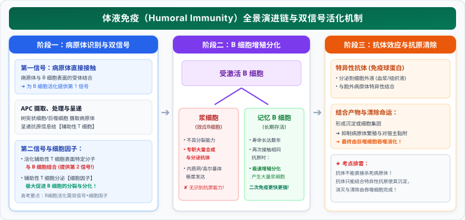

# 03 免疫系统的微观防御与体液-细胞免疫全景

> **【导读与第一性原理】**
> - **教材坐标**：选择性必修1 第4章 第1节《免疫系统的组成和功能》、第2节《特异性免疫》
> - **核心生命观念**：结构与功能观、进化与适应观、信息识别与防御网络
> - **认知引导**：我们每时每刻都在呼吸着数以万计的真菌孢子，皮肤表面附着着数十亿的细菌，但人体为何没有在几小时内被微生物腐蚀蚕食？因为我们体内拥有一支数量多达数万亿、巡逻于血液与淋巴管之间的精密防御部队──免疫系统。面对漫游在组织液中的游离细菌（胞外病原体），与遁入细胞深处将宿主作为病毒工厂的狡猾入侵者（胞内病原体），免疫大军如何兵分两路？体液免疫如何发射精确制导的抗体导弹？细胞免疫又是如何执行对被感染靶细胞的“定点清除”？本节带你深入微观免疫战场，解密生命最精巧的特异性识别网络。

---

## 一、 教材基础与免疫系统微观兵团架构

### 1. 免疫系统的三大生理功能

- **免疫防御（最基本功能）**：机体排除外来抗原性异物（如病原体）的保护机制。
  - 异常：功能过强导致**过敏反应**；功能过弱导致**免疫缺陷病**或反复严重感染。
- **免疫自稳**：机体清除体内衰老、损伤的自身细胞，维持内环境稳态。
  - 异常：功能失调会导致免疫系统攻击自身健康组织，诱发**自身免疫病**。
- **免疫监视**：机体识别和清除突变的细胞（如早期癌细胞），防止肿瘤发生。
  - 异常：监视功能低下或突变细胞逃逸，易导致**恶性肿瘤（癌症）**形成。

---

### 2. 人体的三道防线体系

| 防线层次 | 构成成分与物理屏障 | 免疫类型 | 核心生物学特征 |
| :--- | :--- | :--- | :--- |
| **第一道防线** | **皮肤、黏膜**及其分泌物（胃酸、泪液溶菌酶、呼吸道纤毛） | **非特异性免疫**（生来就有，人人具备） | 阻挡病原体入侵，无特异识别性，针对一切外来病原微生物 |
| **第二道防线** | 体液中的**杀菌物质**（如溶菌酶）和**吞噬细胞**（中性粒细胞、巨噬细胞） | **非特异性免疫**（生来就有） | 溶解、吞噬消灭穿透屏障的病原体，引起局部炎症反应 |
| **第三道防线** | **免疫器官**（骨髓、胸腺、脾、淋巴结）与**免疫细胞**（T细胞、B细胞） | **特异性免疫**（后天获得） | **针对特定病原体精准作战**；产生**免疫记忆**，作用持久强烈 |

---

### 3. 免疫系统的微观细胞分类与功能对比

1. **抗原呈递细胞（APC）**：包括**树突状细胞（呈递能力最强）**、**巨噬细胞**和 **B 细胞**。能摄取、加工处理抗原，并将其呈递在细胞表面供 T 细胞识别。
2. **淋巴细胞**：
   - **B 淋巴细胞**：在**骨髓**中产生并在**骨髓**中成熟；受抗原刺激后增殖分化为**浆细胞**（效应 B 细胞）和**记忆 B 细胞**；
   - **T 淋巴细胞**：在**骨髓**中产生，迁移至**胸腺**中成熟。分为：
     - **辅助性 T 细胞（$Th$）**：识别 APC 呈递的抗原，分泌**细胞因子**，作为指挥官激活 B 细胞和细胞毒性 T 细胞；
     - **细胞毒性 T 细胞（$Tc$）**：识别并密切接触被病原体感染的靶细胞，**诱导靶细胞发生细胞凋亡**。
3. **免疫活性物质**：
   - **抗体**：由**浆细胞**分泌的特异性免疫球蛋白；
   - **细胞因子**：白细胞介素、干扰素、肿瘤坏死因子等（主要由辅助性 T 细胞分泌）；
   - **溶菌酶**：唾液、泪液及体液中普遍存在的酶，可破坏细菌肽聚糖细胞壁。

---

## 二、 特异性免疫两大核心协同战役全景

### 1. 体液免疫（Humoral Immunity）——迎战胞外病原体

针对**细胞外液中游离的病原体及其外毒素**：

  

> [!IMPORTANT]
> **B 细胞活化的“双信号”与一促进因子（高考填空必背）**：
> - **第一信号**：病原体与 B 细胞表面的抗原识别受体**直接结合**；
> - **第二信号**：**辅助性 T 细胞表面的特定分子**发生变化并与 B 细胞结合；
> - **一促进因子**：辅助性 T 细胞分泌的**细胞因子**促进 B 细胞增殖分化。

---

### 2. 细胞免疫（Cellular Immunity）——迎战胞内病原体与癌细胞

针对**潜入宿主细胞内部的病毒、胞内寄生菌（如结核杆菌）以及突变的癌细胞**：

1. **诱导活化阶段**：
   - 宿主细胞被病原体侵染后成为**靶细胞**，其膜表面展示出特异性抗原-MHC复合物；
   - **细胞毒性 T 细胞**表面的受体识别靶细胞表面的抗原信号；
   - 在**辅助性 T 细胞分泌的细胞因子**作用下，细胞毒性 T 细胞受刺激大量增殖、分化，形成新的**细胞毒性 T 细胞**和**记忆 T 细胞**。
2. **效应执行阶段**：
   - 新生成的细胞毒性 T 细胞在体液中巡航，识别并与**靶细胞发生特异性密切接触**；
   - 释放穿孔素和颗粒酶，激活靶细胞内的溶酶体酶系统，**诱导靶细胞发生裂解（细胞凋亡）**；
   - **终局清除**：靶细胞裂解后，躲藏在细胞内的病原体失去掩护**暴露在细胞外液中**，由体液免疫中的**抗体与之结合**，或直接被**巨噬细胞吞噬消化**。

---

### 3. 二次免疫应答动力学规律

当相同抗原再次侵入机体时，**记忆细胞能迅速、特异性地识别该抗原**，并**以极快的速度增殖分化为大量的浆细胞或细胞毒性 T 细胞**。
- **与初次应答相比的三大特征**：
  1. **潜伏期极短**（反应更快）；
  2. **产生的抗体峰值浓度极高**（反应更强烈）；
  3. **抗体在体内维持高浓度的时间显著延长**（保护更持久）。

---

## 三、 核心图解：特异性免疫双轨协同作战全景决策图

<svg xmlns="http://www.w3.org/2000/svg" viewBox="0 0 780 370" width="100%" height="100%">
  <defs>
    <linearGradient id="bgGrad93" x1="0%" y1="0%" x2="100%" y2="100%">
      <stop offset="0%" stop-color="#f8fafc"/>
      <stop offset="100%" stop-color="#f1f5f9"/>
    </linearGradient>
    <linearGradient id="titleGrad93" x1="0%" y1="0%" x2="100%" y2="100%">
      <stop offset="0%" stop-color="#4f46e5"/>
      <stop offset="100%" stop-color="#4338ca"/>
    </linearGradient>
    <filter id="shadow93" x="-5%" y="-5%" width="110%" height="115%" filterUnits="userSpaceOnUse">
      <feDropShadow dx="0" dy="2" stdDeviation="3" flood-color="#0f172a" flood-opacity="0.08"/>
    </filter>
  </defs>
  <!-- 背景底板 -->
  <rect width="780" height="370" rx="16" fill="url(#bgGrad93)" stroke="#cbd5e1" stroke-width="1.5"/>
  <!-- 顶部标题横幅 -->
  <rect x="20" y="16" width="740" height="42" rx="10" fill="url(#titleGrad93)" filter="url(#shadow93)"/>
  <text x="390" y="42" text-anchor="middle" font-size="16" font-weight="bold" fill="#ffffff" letter-spacing="1">特异性免疫双轨战役协同：体液免疫抗体防御与细胞免疫靶细胞裂解</text>
  <!-- 左侧板块：体液免疫双信号与抗体机制 -->
  <g transform="translate(20, 72)">
    <rect width="360" height="280" rx="12" fill="#ffffff" stroke="#cbd5e1" stroke-width="1.2" filter="url(#shadow93)"/>
    <rect x="0" y="0" width="360" height="34" rx="12" fill="#e0e7ff"/>
    <text x="180" y="23" text-anchor="middle" font-size="13" font-weight="bold" fill="#3730a3">体液免疫战役：对决胞外游离抗原</text>
    <!-- 流程节点 -->
    <g transform="translate(20, 42)">
      <!-- 信号盒 -->
      <rect x="0" y="0" width="320" height="48" rx="6" fill="#f8fafc" stroke="#cbd5e1"/>
      <text x="10" y="18" font-size="10.5" font-weight="bold" fill="#3730a3">B 细胞活化两大信号：</text>
      <text x="10" y="32" font-size="9" fill="#1e40af">• 第一信号：病原体抗原直接结合 B 细胞表面受体</text>
      <text x="10" y="44" font-size="9" fill="#1e40af">• 第二信号：辅助性 T 细胞特定分子接触 B 细胞 + 细胞因子</text>
      <line x1="160" y1="48" x2="160" y2="60" stroke="#4f46e5" stroke-width="1.5"/>
      <polygon points="160,60 156,54 164,54" fill="#4f46e5"/>
      <!-- 分裂分化盒 -->
      <g transform="translate(0, 62)">
        <rect x="0" y="0" width="150" height="42" rx="6" fill="#eff6ff" stroke="#bfdbfe"/>
        <text x="75" y="18" text-anchor="middle" font-size="11" font-weight="bold" fill="#1d4ed8">浆 细 胞</text>
        <text x="75" y="32" text-anchor="middle" font-size="8.5" fill="#1e40af">(唯一无识别力)</text>
        <rect x="170" y="0" width="150" height="42" rx="6" fill="#ecfdf5" stroke="#a7f3d0"/>
        <text x="245" y="18" text-anchor="middle" font-size="11" font-weight="bold" fill="#047857">记忆 B 细胞</text>
        <text x="245" y="32" text-anchor="middle" font-size="8.5" fill="#059669">(二次应答主力)</text>
      </g>
      <line x1="75" y1="104" x2="75" y2="116" stroke="#4f46e5" stroke-width="1.5"/>
      <polygon points="75,116 71,110 79,110" fill="#4f46e5"/>
      <!-- 抗体效应盒 -->
      <rect x="0" y="118" width="320" height="44" rx="6" fill="#fef2f2" stroke="#fecaca"/>
      <text x="10" y="136" font-size="10.5" font-weight="bold" fill="#b91c1c">产生大量【特异性抗体】：</text>
      <text x="10" y="152" font-size="9" fill="#991b1b">结合胞外抗原 ➔ 形成沉淀集团 ➔ 巨噬细胞吞噬清除！</text>
    </g>
    <!-- 底部结论总结 -->
    <rect x="15" y="232" width="330" height="34" rx="6" fill="#f8fafc" stroke="#cbd5e1"/>
    <text x="180" y="253" text-anchor="middle" font-size="9.5" font-weight="bold" fill="#0f172a">要点：浆细胞不能识别抗原；吞噬细胞不能特异性识别</text>
  </g>
  <!-- 右侧板块：细胞免疫靶细胞裂解与二次应答 -->
  <g transform="translate(400, 72)">
    <rect width="360" height="280" rx="12" fill="#ffffff" stroke="#cbd5e1" stroke-width="1.2" filter="url(#shadow93)"/>
    <rect x="0" y="0" width="360" height="34" rx="12" fill="#fef2f2"/>
    <text x="180" y="23" text-anchor="middle" font-size="13" font-weight="bold" fill="#991b1b">细胞免疫战役：对决胞内寄生宿主靶细胞</text>
    <g transform="translate(20, 42)">
      <!-- 靶细胞识别 -->
      <rect x="0" y="0" width="320" height="48" rx="6" fill="#f8fafc" stroke="#cbd5e1"/>
      <text x="10" y="18" font-size="10.5" font-weight="bold" fill="#991b1b">细胞毒性 T 细胞激活与分化：</text>
      <text x="10" y="32" font-size="9" fill="#334155">• 识别靶细胞表面抗原 + 辅助性 T 细胞释放的细胞因子</text>
      <text x="10" y="44" font-size="9" fill="#334155">• 增殖分化形成【新细胞毒性 T 细胞】与【记忆 T 细胞】</text>
      <line x1="160" y1="48" x2="160" y2="60" stroke="#ef4444" stroke-width="1.5"/>
      <polygon points="160,60 156,54 164,54" fill="#ef4444"/>
      <!-- 接触裂解盒 -->
      <rect x="0" y="62" width="320" height="50" rx="6" fill="#fdf2f8" stroke="#fbcfe8"/>
      <text x="10" y="80" font-size="10.5" font-weight="bold" fill="#db2777">密切接触 ➔ 诱导【靶细胞发生细胞凋亡】：</text>
      <text x="10" y="96" font-size="9" fill="#9d174d">释放穿孔素/颗粒酶 ➔ 靶细胞裂解死亡 ➔ 胞内病原体暴露！</text>
      <text x="10" y="108" font-size="8.5" fill="#be185d">注意：此过程属于【基因控制的程序性凋亡】，绝非坏死！</text>
      <line x1="160" y1="112" x2="160" y2="124" stroke="#ef4444" stroke-width="1.5"/>
      <polygon points="160,124 156,118 164,118" fill="#ef4444"/>
      <!-- 终局清剿 -->
      <rect x="0" y="126" width="320" height="38" rx="6" fill="#f0fdf4" stroke="#bbf7d0"/>
      <text x="10" y="142" font-size="10" font-weight="bold" fill="#15803d">终局协同：暴露的病原体被【体液抗体】结合并吞噬！</text>
      <text x="10" y="156" font-size="8.5" fill="#166534">体液免疫与细胞免疫紧密配合，协同作战彻底清除病毒。</text>
    </g>
    <!-- 底部二次应答规律 -->
    <rect x="20" y="232" width="320" height="34" rx="6" fill="#fff7ed" stroke="#fed7aa"/>
    <text x="180" y="253" text-anchor="middle" font-size="9.5" font-weight="bold" fill="#c2410c">二次免疫规律：潜伏期更短、抗体量更高、保护更持久</text>
  </g>
</svg>

---

## 四、 考场排雷与高频陷阱指南

> [!WARNING]
> ### 陷阱 1：人体所有免疫细胞中，哪个“不能识别抗原”？哪个“不能特异性识别抗原”？
> - **唯一不能识别抗原的细胞**：**浆细胞（效应 B 细胞）**！它的唯一使命是开足马力合成并向外分泌特异性抗体。
> - **唯一不能特异性识别抗原的细胞**：**吞噬细胞（巨噬细胞）**！吞噬细胞能识别抗原（通过模式识别受体 PRR），但它无法区分是乙肝病毒还是流感病毒，属于非特异性识别。
> - **其余免疫细胞**（B 细胞、辅助性 T 细胞、细胞毒性 T 细胞、记忆 B 细胞、记忆 T 细胞）：**均能特异性识别抗原**。

> [!WARNING]
> ### 陷阱 2：靶细胞裂解死亡究竟是“细胞凋亡”还是“细胞坏死”？
> - **考场判定**：**属于细胞凋亡（Apoptosis）！**
> - **科学理由**：效应细胞毒性 T 细胞与靶细胞结合后，激活靶细胞内部固有的**溶酶体酶系统与凋亡信号通路**，是机体由**基因决定的细胞主动程序性死亡**，有利于机体清除受损感染细胞，绝不是外力机械破坏造成的病理性坏死。

---

## 五、 高考生物规范答题长句模板

### 1. 阐明 B 细胞活化“双信号”与细胞因子协同的长句
- **试题情境**：在体液免疫过程中，休眠状态的 B 细胞是如何被完全激活并分化为浆细胞的？
- **满分答题规范**：
  > B 细胞的激活需要**两个信号的刺激和细胞因子的促进**：第一信号是**病原体与 B 细胞表面的受体直接结合**；第二信号是**辅助性 T 细胞表面特定分子发生改变并与 B 细胞结合**；同时，辅助性 T 细胞分泌的**细胞因子作用于 B 细胞**，促进 B 细胞开始迅速分裂分化为浆细胞和记忆 B 细胞。

### 2. 阐述二次免疫应答相较初次应答更快速强烈的长句
- **试题情境**：解释接种加强针疫苗后，人体血清中中和抗体滴度能够在极短时间内大幅飙升的原因。
- **满分答题规范**：
  > 当初次接种疫苗后机体内已经产生了长寿的**记忆 B 细胞**；当再次接种加强针（相同抗原）时，**记忆 B 细胞能够迅速特异性识别抗原并快速增殖分化产生大量浆细胞**，因此在极短的潜伏期内能够**分泌产生数量更多、亲和力更高、存留更持久的特异性抗体**。
