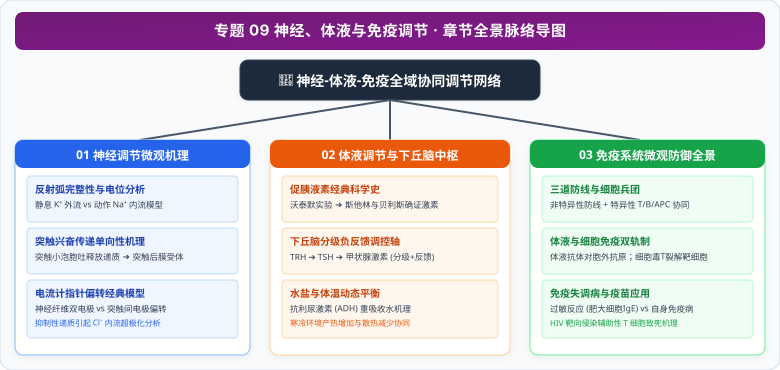

# 专题 09 动物生命活动的神经、体液与免疫调节

> **【专题导读与知识体系】**
>
> - **教材对应**：人教版选择性必修1《稳态与调节》第2章《神经调节》、第3章《体液调节》、第4章《免疫调节》
> - **核心思想**：从神经元微伏级的膜电位离子动力学，到下丘脑皮摩尔级的激素全域调度，再到免疫系统识别“敌与我”的特异性分子战争，揭示多细胞复杂生命维系内环境稳态的高精密网络协同。
> - **高考权重**：高考生物最核心、分值最重的生理大题重镇，高频考查动作电位与局部电流测量、血糖与体温水盐调节、体液-细胞免疫协同流程、过敏与自身免疫辨析及 HIV 消长曲线分析。

<CCChapterOverview />

---

## 章节脉络与核心导航

  

### 本专题包含以下核心篇章：

1. [**01 神经调节微观机理与膜电位分析模型**](./01%20神经调节微观机理与膜电位分析模型.md)
   - 反射弧五大组成与条件反射建立消退机制、静息电位（$K^+$ 外流）与动作电位（$Na^+$ 内流）通道动力学、突触小体单向传递机理、膜外双极电流计偏转解题模型。
2. [**02 体液调节与下丘脑核心枢纽模型**](./02%20体液调节与下丘脑核心枢纽模型.md)
   - 动物主要内分泌腺与激素分类、斯他林促胰液素经典实验、血糖平衡拮抗与协同模型、甲状腺激素分级与负反馈轴、下丘脑在体温和水盐平衡中的核心枢纽地位。
3. [**03 免疫系统的微观防御与体液-细胞免疫全景**](./03%20免疫系统的微观防御与体液-细胞免疫全景.md)
   - 人体三道防线与免疫细胞微观兵团、体液免疫 B 细胞活化“双信号”与细胞因子协同、细胞毒性 T 细胞诱导靶细胞程序性凋亡全流程、二次免疫应答动力学规律。
4. [**04 免疫失调病理模型与前沿临床应用**](./04%20免疫失调病理模型与前沿临床应用.md)
   - 过敏反应抗体吸附肥大细胞脱颗粒机理、四大典型自身免疫病、艾滋病（HIV 逆转录病毒侵染辅助性 T 细胞）消长曲线分析、疫苗接种与器官移植 HLA 免疫抑制排斥策略。
