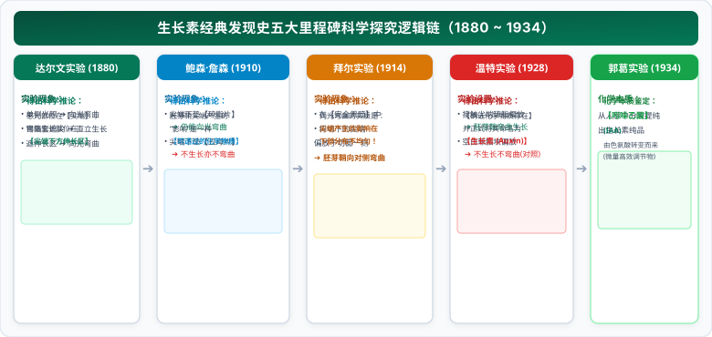
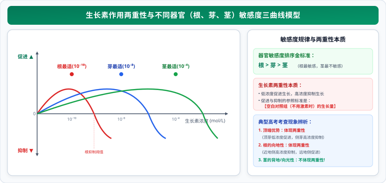

# 01 生长素的发现、极性运输与两重性作用模型

> **【导读与第一性原理】**
>
> - **教材坐标**：选择性必修1 第5章 第1节《植物生长素》
> - **核心生命观念**：结构与功能观、物质与能量观、科学思维（假说-演绎与严密实验对照）
> - **认知引导**：一株柔弱的草本幼苗，在暗室单侧射入的一缕微光下，为何能精准地探出头颅、向光弯曲？它没有眼睛，没有复杂的神经传导，更没有肌肉纤维收缩，究竟是谁在感知光明，又是谁在驱动茎干细胞的不对称伸长？从达尔文父子用锡箔小帽盖住胚芽鞘尖端，到温特用琼脂块捕获这股看不见的化学魔力，人类探究这种被称为“生长素”的微观信使耗费了近半个世纪。本节从极性跨膜运输分子机制与酸生长理论第一性原理出发，系统解构生长素的发现史、微观运输与“低促高抑”两重性模型。

---

## 一、 生长素的发现历程与经典实验设计逻辑

生长素的发现是生物科学史上运用**实验对照、假说-演绎与逻辑推理**的无上典范：

  

---

## 二、 生长素的合成、运输与分布微观机理

### 1. 合成部位与化学本质

- **主要合成部位**：**芽、幼嫩的叶和发育中的种子**。
- **前体原料**：在核糖体及细胞质中，由**色氨酸（Tryptophan）**经过一系列酶促脱羧、氧化反应转变而来。
- **化学本质**：**吲哚乙酸（IAA）**，此外植物体内还存在苯乙酸（PAA）、吲哚丁酸（IBA）等天然内源生长素。

### 2. 运输方式与极性规律

#### (1) 极性运输（Polar Transport）

- **方向定义**：只能从植物形态学的**上端向形态学的下端运输**（即“形态学上端 $\to$ 形态学下端”），而不能反向逆流。
  - _形态学上端_：地上部分的芽尖、茎尖；地下部分的根尖。
  - _考场经典实验_：将形态学上端与下端颠倒放置的胚芽鞘段，上端放含生长素琼脂块，下端受体琼脂块**不能接收到生长素**！
- **微观机制**：属于细胞膜上的 **PIN 载体蛋白介导的主动运输**，需要消耗细胞呼吸产生的 ATP。

#### (2) 横向运输（Lateral Transport）

- **发生部位**：仅发生在植物的**幼嫩感受部位**（如胚芽鞘尖端、根尖分生区）。
- **诱发动力**：
  - **单侧光刺激**：导致尖端的生长素由**向光侧横向运输转移到背光侧**；
  - **重力作用**：地心引力导致横放的根尖和茎尖中的生长素向**近地侧发生横向积累**。

---

## 三、 生长素生理作用的“两重性”与敏感度数学模型

<ClientOnly>
  <AuxinSensitivityProbe />
</ClientOnly>

### 1. 两重性（Dual Action）的核心内涵

- **本质概括**：**低浓度促进生长，高浓度抑制生长**（甚至杀死植物）。
- **具体生理体现**：
  - 既能促进生长，也能抑制生长；
  - 既能促进发芽，也能抑制发芽；
  - 既能防止落花落果，也能疏花疏果。

### 2. 顶端优势（Apical Dominance）微观机理解剖

- **现象**：顶芽优先生长，侧芽生长受到强烈抑制的现象。
- **微观机理解释（高考答题标准）**：
  $$\text{顶芽合成生长素} \xrightarrow{\textbf{极性运输向下输出}} \text{在近顶端的侧芽部位大量积累} \to \textbf{侧芽生长素浓度过高}$$
  $$\because \textbf{侧芽对生长素的敏感度显著高于顶芽} \implies \textbf{过高浓度抑制了侧芽生长}，\text{而顶芽浓度适宜优先生长！}$$
- **生产实践解除**：**人工去除顶芽（打顶、摘心）**，如棉花打顶促进侧枝生长多结棉桃，行道树修剪促进树冠扩展。

---

### 3. 植物不同器官对生长素敏感度的三曲线模型

  

- **三大器官敏感度排序**：**根 > 芽 > 茎**。
- **根的向地性 vs 茎的背地性横向积累对比（横放植株）**：
  - **根部近地侧**：生长素浓度高 $\to$ **由于根极度敏感，该高浓度抑制了近地侧细胞伸长**，而远地侧低浓度促进伸长 $\implies$ **根向地弯曲生长（体现了两重性！）**。
  - **茎部近地侧**：生长素浓度高 $\to$ **由于茎不敏感，该浓度大幅促进近地侧细胞伸长**，比远地侧伸长更快 $\implies$ **茎背地弯曲生长（只体现促进作用，未体现抑制，故不体现两重性！）**。

---

## 四、 核心图解：胚芽鞘实验逻辑与生长素敏感度曲线

<svg xmlns="http://www.w3.org/2000/svg" viewBox="0 0 780 370" width="100%" height="100%">
  <defs>
    <linearGradient id="bgGrad101" x1="0%" y1="0%" x2="100%" y2="100%">
      <stop offset="0%" stop-color="#f8fafc"/>
      <stop offset="100%" stop-color="#f1f5f9"/>
    </linearGradient>
    <linearGradient id="titleGrad101" x1="0%" y1="0%" x2="100%" y2="100%">
      <stop offset="0%" stop-color="#15803d"/>
      <stop offset="100%" stop-color="#166534"/>
    </linearGradient>
    <filter id="shadow101" x="-5%" y="-5%" width="110%" height="115%" filterUnits="userSpaceOnUse">
      <feDropShadow dx="0" dy="2" stdDeviation="3" flood-color="#0f172a" flood-opacity="0.08"/>
    </filter>
  </defs>
  <!-- 背景底板 -->
  <rect width="780" height="370" rx="16" fill="url(#bgGrad101)" stroke="#cbd5e1" stroke-width="1.5"/>
  <!-- 顶部标题横幅 -->
  <rect x="20" y="16" width="740" height="42" rx="10" fill="url(#titleGrad101)" filter="url(#shadow101)"/>
  <text x="390" y="42" text-anchor="middle" font-size="16" font-weight="bold" fill="#ffffff" letter-spacing="1">生长素发现史微观实验逻辑与三大器官两重性敏感度曲线</text>
  <!-- 左侧：胚芽鞘经典实验对照图解 -->
  <g transform="translate(20, 72)">
    <rect width="360" height="280" rx="12" fill="#ffffff" stroke="#cbd5e1" stroke-width="1.2" filter="url(#shadow101)"/>
    <rect x="0" y="0" width="360" height="34" rx="12" fill="#f0fdf4"/>
    <text x="180" y="23" text-anchor="middle" font-size="13" font-weight="bold" fill="#166534">探究典范：胚芽鞘向光弯曲实验逻辑</text>
    <!-- 实验示意图 -->
    <g transform="translate(25, 45)">
      <!-- 实验1: 完整单侧光 -->
      <g transform="translate(0, 0)">
        <path d="M 25,60 Q 25,25 35,15" stroke="#16a34a" stroke-width="8" fill="none" stroke-linecap="round"/>
        <text x="25" y="80" text-anchor="middle" font-size="9.5" font-weight="bold" fill="#0f172a">① 完整照光</text>
        <text x="25" y="95" text-anchor="middle" font-size="8.5" fill="#15803d">向光弯曲</text>
      </g>
      <!-- 实验2: 去尖端 -->
      <g transform="translate(80, 0)">
        <line x1="25" y1="60" x2="25" y2="28" stroke="#94a3b8" stroke-width="8" stroke-linecap="butt"/>
        <text x="25" y="80" text-anchor="middle" font-size="9.5" font-weight="bold" fill="#0f172a">② 切除尖端</text>
        <text x="25" y="95" text-anchor="middle" font-size="8.5" fill="#64748b">不长不弯</text>
      </g>
      <!-- 实验3: 锡箔遮尖 -->
      <g transform="translate(160, 0)">
        <line x1="25" y1="60" x2="25" y2="18" stroke="#16a34a" stroke-width="8" stroke-linecap="round"/>
        <rect x="18" y="14" width="14" height="12" rx="2" fill="#475569"/>
        <text x="25" y="80" text-anchor="middle" font-size="9.5" font-weight="bold" fill="#0f172a">③ 锡箔遮尖</text>
        <text x="25" y="95" text-anchor="middle" font-size="8.5" fill="#0284c7">直立生长</text>
      </g>
      <!-- 实验4: 锡箔遮下 -->
      <g transform="translate(240, 0)">
        <path d="M 25,60 Q 25,25 35,15" stroke="#16a34a" stroke-width="8" fill="none" stroke-linecap="round"/>
        <rect x="18" y="32" width="14" height="14" rx="2" fill="#475569"/>
        <text x="25" y="80" text-anchor="middle" font-size="9.5" font-weight="bold" fill="#0f172a">④ 锡箔遮下</text>
        <text x="25" y="95" text-anchor="middle" font-size="8.5" fill="#15803d">向光弯曲</text>
      </g>
    </g>
    <!-- 结论卡片 -->
    <rect x="15" y="165" width="330" height="98" rx="8" fill="#f8fafc" stroke="#cbd5e1"/>
    <text x="25" y="185" font-size="10.5" font-weight="bold" fill="#0f172a">达尔文实验严密对照结论：</text>
    <text x="25" y="203" font-size="9.5" fill="#334155">① 感受单侧光刺激的部位是【胚芽鞘尖端】；</text>
    <text x="25" y="221" font-size="9.5" fill="#334155">② 发生弯曲生长的部位是【尖端下方伸长区】；</text>
    <text x="25" y="240" font-size="9.5" fill="#047857" font-weight="bold">③ 向光机制：单侧光促使尖端生长素【由向光侧向背光侧横向运输】。</text>
  </g>
  <!-- 右侧：三大器官两重性敏感度曲线 -->
  <g transform="translate(400, 72)">
    <rect width="360" height="280" rx="12" fill="#ffffff" stroke="#cbd5e1" stroke-width="1.2" filter="url(#shadow101)"/>
    <rect x="0" y="0" width="360" height="34" rx="12" fill="#fefce8"/>
    <text x="180" y="23" text-anchor="middle" font-size="13" font-weight="bold" fill="#854d0e">两重性模型：根、芽、茎敏感度曲线</text>
    <!-- 坐标系 -->
    <g transform="translate(40, 42)">
      <line x1="10" y1="110" x2="285" y2="110" stroke="#64748b" stroke-width="1.5"/>
      <line x1="20" y1="10" x2="20" y2="165" stroke="#64748b" stroke-width="1.5"/>
      <text x="275" y="125" font-size="9" fill="#64748b">浓度(mol/L)</text>
      <text x="15" y="8" font-size="8.5" fill="#047857">▲ 促进</text>
      <text x="15" y="172" font-size="8.5" fill="#b91c1c">▼ 抑制</text>
      <!-- 零基准线说明 -->
      <text x="5" y="113" font-size="8" fill="#94a3b8">0</text>
      <!-- 根曲线 (最敏感，最左) 红色 -->
      <path d="M 20,110 Q 55,20 85,110 Q 100,150 115,160" fill="none" stroke="#ef4444" stroke-width="2"/>
      <text x="55" y="32" text-anchor="middle" font-size="9" font-weight="bold" fill="#b91c1c">根 (10⁻¹⁰)</text>
      <!-- 芽曲线 (中等) 蓝色 -->
      <path d="M 20,110 Q 120,20 170,110 Q 185,150 200,160" fill="none" stroke="#2563eb" stroke-width="2"/>
      <text x="120" y="32" text-anchor="middle" font-size="9" font-weight="bold" fill="#1d4ed8">芽 (10⁻⁸)</text>
      <!-- 茎曲线 (最不敏感，最右) 绿色 -->
      <path d="M 20,110 Q 195,20 250,110 Q 265,140 280,155" fill="none" stroke="#10b981" stroke-width="2"/>
      <text x="195" y="32" text-anchor="middle" font-size="9" font-weight="bold" fill="#047857">茎 (10⁻⁴)</text>
    </g>
    <!-- 底部结论总结 -->
    <rect x="20" y="222" width="320" height="46" rx="6" fill="#f8fafc" stroke="#cbd5e1"/>
    <text x="180" y="240" text-anchor="middle" font-size="10" font-weight="bold" fill="#0f172a">规律：敏感度 根 > 芽 > 茎</text>
    <text x="180" y="255" text-anchor="middle" font-size="8.5" fill="#334155">横放根向地性体现了两重性；单侧光茎向光性仅体现促进作用！</text>
  </g>
</svg>

---

## 五、 考场排雷与高频陷阱指南

> [!WARNING]
>
> ### 陷阱 1：胚芽鞘向光性生长究竟有没有体现生长素生理作用的“两重性”？
>
> - **考场标准答案**：**绝没有体现两重性！**
> - **机理剖析**：单侧光照射下，胚芽鞘背光侧生长素浓度高于向光侧，背光侧细胞伸长生长的速度**快于**向光侧，导致向光弯曲；但在该过程中，向光侧和背光侧的生长素浓度**都处于促进生长的浓度范围内**（向光侧促进较慢，背光侧促进更快），**向光侧并没有被抑制生长**，因此不能体现“高浓度抑制”的两重性！
> - **真正体现两重性的典型高考考点**：**顶端优势**（侧芽受抑制）与**横放根的向地性生长**（根近地侧受抑制）。

> [!WARNING]
>
> ### 陷阱 2：单侧光是导致向光侧生长素“分解”还是“横向运输”？
>
> - **考场判定**：在人教版新教材体系与全国高考评分标准中，一律认定为：**尖端的单侧光照射引起生长素在尖端发生由“向光侧向背光侧”的横向转移运输**。
> - **证据支持**：用云母片纵向完全插入胚芽鞘尖端正中时，两侧收集到的生长素总量相等且胚芽鞘直立生长，证明总量未受光照破坏分解。

---

## 六、 高考生物规范答题长句模板

### 1. 阐明植物出现顶端优势的微观生理机理长句

- **试题情境**：在未修剪的茶树或果树上，顶芽优先生长而侧芽生长受到显著抑制，请解释其激素调控机理。
- **满分答题规范**：
  > 顶芽合成的生长素通过**极性运输源源不断向下运送**，并在临近的**侧芽部位大量积累**；由于**侧芽对生长素的敏感度显著高于顶芽**，过高浓度的生长素**对侧芽的生长产生抑制作用**，而顶芽处生长素浓度适宜得以优先生长，因此表现出顶端优势。

### 2. 阐述水平放置植物幼苗出现“根向地生长”机理的长句

- **试题情境**：将正常生长的植物幼苗水平横放于地面，一段时间后其根部呈现明显的向地弯曲生长，请分析原因。
- **满分答题规范**：
  > 在重力作用下，植物根尖产生的生长素发生**横向运输积累到近地侧**，导致根尖近地侧生长素浓度显著高于远地侧；由于**植物根对生长素浓度高度敏感**，近地侧过高浓度的生长素**抑制了细胞的伸长生长**，而远地侧生长素浓度较低**促进了细胞的伸长生长**，近地侧生长慢于远地侧，从而导致根部表现为向地弯曲生长。
