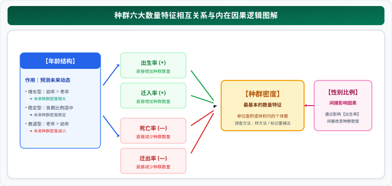
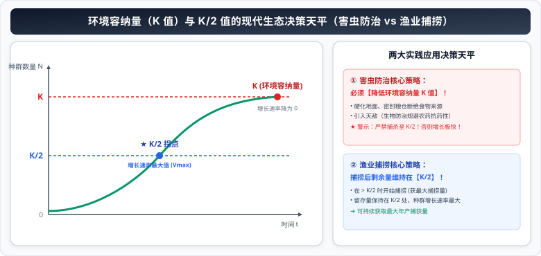

# 01 种群数量特征、增长模型与 K 值实践应用

> **【导读与第一性原理】**
>
> - **教材坐标**：选择性必修2 第1章 第1~3节《种群的数量特征》《种群数量的变化动向》《影响种群数量的因素》
> - **核心生命观念**：系统与数量观、稳态与平衡观、数学建模与数理统计
> - **认知引导**：当生命个体由单兵作战演进为具有基因交流的种群，其数量演化为何不再是个体生命的简单叠加，而是呈现出宏观的群体自组织规律？为什么在有限的物理空间和资源约束下，任何生物的野蛮指数生长最终都会被无形的环境阻力弯折为“S”型曲线？在 $K$ 值与 $K/2$ 的临界点上，人类如何凭借微积分增长速率原理，既实现海洋渔业年年丰产，又能从根本上扼杀农田害虫的猖獗爆发？本节从群体生态动力学第一性原理出发，系统解构种群特征网络与数量增长模型。

---

## 一、 教材基础与种群数量特征内在逻辑

### 1. 种群的概念与数量特征总网

- **种群的严格定义**：在**一定的空间范围内**，**同种生物的所有个体**的集合。种群是生物**繁衍后代的基本单位**，也是生物**进化的基本单位**。
- **六大数量特征逻辑拓扑关系**：

  

1. **种群密度（最基本的数量特征）**：种群在单位面积或单位体积中的个体数。
2. **出生率和死亡率、迁入率和迁出率**：**直接决定**种群密度大小的内部和外部动力因素。
   - 当 出生率 + 迁入率 > 死亡率 + 迁出率 时，种群密度增大；反之减小。
3. **年龄结构（预测种群数量变化趋势的依据）**：
   - **增长型**：幼年个体很多，老年个体很少 $\to$ 预测种群密度将**持续增大**；
   - **稳定型**：各年龄期的个体比例适中 $\to$ 预测种群密度将**保持相对稳定**；
   - **衰退型**：幼年个体很少，老年个体很多 $\to$ 预测种群密度将**持续减小**。
4. **性别比例（间接影响因素）**：通过影响雌雄交配机会与出生率，间接影响种群密度。

---

## 二、 种群密度的调查方法与考场误差分析

### 1. 样方法（Quadrat Method）

- **适用对象**：**植物**及**活动能力弱、活动范围小的动物**（如蚜虫、跳蝻、昆虫卵、蚯蚓、蜗牛）。
- **取样核心原则**：**随机取样**（严禁主观挑选植株密集或稀疏处）。
- **常用取样方法**：
  - **五点取样法**：适用于调查区域形状规则（如正方形、长方形）的地块；
  - **等距取样法**：适用于狭长地块（如路边、河堤、林带）。
- **计数金法则（考场必考细节）**：
  - 样方内部的个体全部计数；
  - 落在样方边界线上的个体，遵循**“计上不计下，计左不计右”**的原则（只计数相邻两边及其顶角上的个体，另一组相邻两边不计，避免重复或遗漏）。

---

### 2. 标记重捕法（Mark-Release-Recapture Method）

- **适用对象**：**活动能力强、活动范围广的动物**（如鸟类、兽类、鱼类）。
- **计算公式推导**：
  设待调查区域的种群总数为 $N$，第一次捕获并标记释放的个体数为 $M$；一段时间后重捕个体数为 $n$，重捕中带标记的个体数为 $m$：
  $$\frac{M}{N} = \frac{m}{n} \implies \textbf{种群总数估算值 } N = \frac{M \times n}{m}$$

#### 考场四大误差定性分析模型（必考得分点）：

根据公式 $N = \frac{M \cdot n}{m}$，凡是导致重捕带标个体数 $m$ 发生改变的因素，都会直接引起估算偏差：

1. **标记物脱落**：导致重捕中带标个体数 $m$ 偏小 $\implies$ **估算值 $N$ 偏大**！
2. **被标记个体更容易被天敌捕食或伤亡**：导致重捕中 $m$ 偏小 $\implies$ **估算值 $N$ 偏大**！
3. **被标记个体受惊变得更加机警，重捕更难**：导致重捕中 $m$ 偏小 $\implies$ **估算值 $N$ 偏大**！
4. **标记物导致个体对陷阱食物产生偏好，更容易被重捕**：导致 $m$ 偏大 $\implies$ **估算值 $N$ 偏小**！

---

## 三、 “J”型与“S”型增长曲线与 $K$ 值生态实践

### 1. 两种增长数学模型对比

| 比较维度         | “J”型增长模型                                                   | “S”型增长模型                                                |
| :--------------- | :-------------------------------------------------------------- | :----------------------------------------------------------- |
| **前提条件**     | 食物充足、空间充裕、气候适宜、**无天敌无竞争**（理想无限环境）  | 资源和空间有限、**存在种内竞争与天敌捕食**（真实自然环境）   |
| **数学方程**     | $N_t = N_0 \cdot \lambda^t$（$\lambda$ 为第二年是第一年的倍数） | 逻辑斯谛方程（Logistic equation）                            |
| **增长率变化**   | **保持恒定不变**（增长率等于 $\lambda - 1$）                    | **逐渐下降**，当数量达到 $K$ 时增长率降为 0                  |
| **增长速率变化** | **持续增大**（指数型暴增）                                      | **先增大后减小**，在 **$K/2$ 时达到最大值**，在 $K$ 时降为 0 |
| **有无 $K$ 值**  | **无 $K$ 值**，持续无限增长                                     | **有环境容纳量 $K$ 值**，数量围绕 $K$ 值上下波动             |

---

### 2. 环境容纳量（$K$ 值）与 $K/2$ 值的现代生态决策

- **环境容纳量（$K$ 值）的定义**：在环境条件不受破坏的情况下，一定空间中所能维持的**种群最大数量**。
- **两大实践应用模型**：

  

1. **渔业捕捞与野生动物资源利用（最大持续产量原则）**：
   - 捕捞时机：必须在种群数量**显著超过 $K/2$ 时才开捕**；
   - 捕捞强度控制：**捕捞后的剩余存活量必须严格维持在 $K/2$ 左右**，因为在 $K/2$ 处种群增长速率最大，再生恢复速度最快，能够提供长期、最大的年捕捞量。
2. **有害生物（农田害虫、鼠害）防治**：
   - 传统喷药只是暂时降低种群数量，若 $K$ 值不变，存活害虫在 $K/2$ 附近会发生报复性暴发！
   - **治本方略**：**从根本上降低其环境容纳量 $K$ 值**！
   - 举措：硬化地面、密封粮仓断绝食物来源、引入猫头鹰等天敌进行生物防治。

---

## 四、 核心图解：“J”型 vs “S”型曲线与增长速率对比模型

<svg xmlns="http://www.w3.org/2000/svg" viewBox="0 0 780 370" width="100%" height="100%">
  <defs>
    <linearGradient id="bgGrad111" x1="0%" y1="0%" x2="100%" y2="100%">
      <stop offset="0%" stop-color="#f8fafc"/>
      <stop offset="100%" stop-color="#f1f5f9"/>
    </linearGradient>
    <linearGradient id="titleGrad111" x1="0%" y1="0%" x2="100%" y2="100%">
      <stop offset="0%" stop-color="#0284c7"/>
      <stop offset="100%" stop-color="#0369a1"/>
    </linearGradient>
    <filter id="shadow111" x="-5%" y="-5%" width="110%" height="115%" filterUnits="userSpaceOnUse">
      <feDropShadow dx="0" dy="2" stdDeviation="3" flood-color="#0f172a" flood-opacity="0.08"/>
    </filter>
  </defs>
  <!-- 背景底板 -->
  <rect width="780" height="370" rx="16" fill="url(#bgGrad111)" stroke="#cbd5e1" stroke-width="1.5"/>
  <!-- 顶部标题横幅 -->
  <rect x="20" y="16" width="740" height="42" rx="10" fill="url(#titleGrad111)" filter="url(#shadow111)"/>
  <text x="390" y="42" text-anchor="middle" font-size="16" font-weight="bold" fill="#ffffff" letter-spacing="1">种群数量增长模型对比：J型/S型曲线与增长速率 K/2 决策网络</text>
  <!-- 左侧：种群数量变化曲线 (J型 vs S型) -->
  <g transform="translate(20, 72)">
    <rect width="360" height="280" rx="12" fill="#ffffff" stroke="#cbd5e1" stroke-width="1.2" filter="url(#shadow111)"/>
    <rect x="0" y="0" width="360" height="34" rx="12" fill="#e0f2fe"/>
    <text x="180" y="23" text-anchor="middle" font-size="13" font-weight="bold" fill="#0369a1">数量变化曲线：理想 J 型 vs 真实 S 型</text>
    <!-- 坐标系 -->
    <g transform="translate(45, 45)">
      <line x1="10" y1="160" x2="280" y2="160" stroke="#64748b" stroke-width="1.5"/>
      <line x1="20" y1="10" x2="20" y2="170" stroke="#64748b" stroke-width="1.5"/>
      <text x="275" y="175" font-size="9" fill="#64748b">时间 t</text>
      <text x="15" y="10" font-size="9" fill="#64748b">个体数 N</text>
      <!-- K值虚线 -->
      <line x1="20" y1="50" x2="280" y2="50" stroke="#cbd5e1" stroke-dasharray="3,3"/>
      <text x="5" y="53" font-size="10" font-weight="bold" fill="#0284c7">K</text>
      <!-- K/2虚线 -->
      <line x1="20" y1="105" x2="280" y2="105" stroke="#cbd5e1" stroke-dasharray="3,3"/>
      <text x="-5" y="108" font-size="9.5" font-weight="bold" fill="#047857">K/2</text>
      <!-- J型曲线 (红色) -->
      <path d="M 20,155 Q 120,150 180,25" fill="none" stroke="#ef4444" stroke-width="2"/>
      <text x="185" y="25" font-size="10" font-weight="bold" fill="#b91c1c">"J"型增长 (无环境阻力)</text>
      <!-- S型曲线 (蓝色) -->
      <path d="M 20,155 Q 90,155 130,105 Q 170,55 270,50" fill="none" stroke="#2563eb" stroke-width="2.5"/>
      <circle cx="130" cy="105" r="4" fill="#047857"/>
      <text x="140" y="108" font-size="9" font-weight="bold" fill="#047857">K/2 (斜率最大)</text>
      <text x="240" y="42" font-size="10" font-weight="bold" fill="#1d4ed8">"S"型增长</text>
      <!-- 环境阻力标注阴影 -->
      <text x="145" y="80" font-size="8.5" fill="#ea580c">阴影区: 环境阻力淘汰数</text>
    </g>
    <!-- 底部结论总结 -->
    <rect x="15" y="228" width="330" height="38" rx="6" fill="#f8fafc" stroke="#cbd5e1"/>
    <text x="180" y="252" text-anchor="middle" font-size="9.5" font-weight="bold" fill="#0f172a">环境阻力本质：空间食物受限 + 种内斗争 + 捕食寄生</text>
  </g>
  <!-- 右侧板块：种群增长速率与决策模型 -->
  <g transform="translate(400, 72)">
    <rect width="360" height="280" rx="12" fill="#ffffff" stroke="#cbd5e1" stroke-width="1.2" filter="url(#shadow111)"/>
    <rect x="0" y="0" width="360" height="34" rx="12" fill="#ecfdf5"/>
    <text x="180" y="23" text-anchor="middle" font-size="13" font-weight="bold" fill="#047857">生态决策：增长速率抛物线与 K/2 实践</text>
    <!-- 增长速率抛物线 -->
    <g transform="translate(40, 42)">
      <line x1="10" y1="110" x2="280" y2="110" stroke="#64748b" stroke-width="1.5"/>
      <line x1="20" y1="10" x2="20" y2="120" stroke="#64748b" stroke-width="1.5"/>
      <text x="270" y="125" font-size="8.5" fill="#64748b">种群数量 N</text>
      <text x="15" y="10" font-size="8.5" fill="#047857">增长速率(dN/dt)</text>
      <!-- 抛物线 -->
      <path d="M 20,110 Q 140,15 260,110" fill="none" stroke="#10b981" stroke-width="2.5"/>
      <circle cx="140" cy="38" r="4" fill="#047857"/>
      <line x1="140" y1="38" x2="140" y2="110" stroke="#047857" stroke-dasharray="2,2"/>
      <text x="140" y="30" text-anchor="middle" font-size="9.5" font-weight="bold" fill="#047857">峰值 (速率最大)</text>
      <text x="140" y="122" text-anchor="middle" font-size="9" font-weight="bold" fill="#047857">K/2</text>
      <text x="260" y="122" text-anchor="middle" font-size="9" font-weight="bold" fill="#0284c7">K</text>
    </g>
    <!-- 实践应用卡片 -->
    <g transform="translate(15, 172)">
      <rect x="0" y="0" width="330" height="42" rx="6" fill="#eff6ff" stroke="#bfdbfe"/>
      <text x="10" y="18" font-size="10" font-weight="bold" fill="#1d4ed8">1. 渔业捕捞资源利用：</text>
      <text x="10" y="32" font-size="8.5" fill="#1e40af">超过 K/2 开捕 ➔ 捕后剩余量【严格维持在 K/2】(再生产能力最高)</text>
      <rect x="0" y="48" width="330" height="42" rx="6" fill="#fef2f2" stroke="#fecaca"/>
      <text x="10" y="66" font-size="10" font-weight="bold" fill="#b91c1c">2. 害虫/有害鼠类防治：</text>
      <text x="10" y="80" font-size="8.5" fill="#991b1b">核心治本对策：【降低 K 值】(硬化地面/密封粮源/引入天敌生物防治)</text>
    </g>
  </g>
</svg>

---

## 五、 考场排雷与高频陷阱指南

> [!WARNING]
>
> ### 陷阱 1：“种群增长率”与“种群增长速率”的严格数理界限
>
> - **种群增长率（Growth Rate）**：指单位数量个体在单位时间内的净增加量，属于**相对变化率（无量纲或百分比表示）**。
>   - 在“J”型增长中，增长率**恒定不变**（等于 $\lambda - 1$）；
>   - 在“S”型增长中，随着种群密度增加，增长率**逐渐下降**，当达到 $K$ 值时增长率降为 $0$。
> - **种群增长速率（Growth Velocity）**：指单位时间内种群个体的绝对增加量（$\Delta N / \Delta t$），属于**绝对速度（单位通常为：个/年）**。
>   - 在“J”型增长中，增长速率**随时间持续增大**；
>   - 在“S”型增长中，增长速率**先增大后减小，在 $K/2$ 时达到最大值**！

> [!WARNING]
>
> ### 陷阱 2：环境容纳量（$K$ 值）是恒定不变的常数吗？
>
> - **考场事实**：**绝对不是常数！**
> - **决定因素**：$K$ 值完全由**环境资源、生存空间、气候条件及天敌数量**所决定。
>   - 改善环境（如建立大熊猫自然保护区、植树造林）：可以**显著提高大熊猫的 $K$ 值**；
>   - 破坏环境（如环境污染、过度放牧破坏草原草场）：会导致牛羊的 **$K$ 值严重下降**。

---

## 六、 高考生物规范答题长句模板

### 1. 解释渔业捕捞后鱼群数量必须维持在 $K/2$ 原理的长句

- **试题情境**：在渔业捕捞生产中，为什么规定必须在鱼群数量大于 $K/2$ 时进行捕捞，且每次捕捞后剩余存活量应维持在 $K/2$ 左右？
- **满分答题规范**：
  > 当种群数量维持在 **$K/2$（环境容纳量的一半）**时，种群的**增长速率（净补充量）达到最大值**；每次捕捞后将剩余量维持在 $K/2$ 左右，可以使鱼群在捕捞后以最快的速率进行自我增殖与恢复，从而能够**长期、持续地获取最大的捕捞产量**。

### 2. 阐释防治农田鼠害应采取“降低 $K$ 值”举措的长句

- **试题情境**：仅靠喷洒化学毒鼠药灭鼠往往会在一段时间后遭遇鼠群数量的报复性反弹，请从种群增长模型角度提出更有效的长期治理策略并阐明机理。
- **满分答题规范**：
  > 仅使用化学毒鼠药虽然暂时降低了老鼠数量，但**并未破坏老鼠的生存环境，环境容纳量（$K$ 值）依然未变**；残存的老鼠在接近 $K/2$ 时繁殖速率最高，极易迅速反弹；因此，更科学的长期治理策略是**从根本上降低老鼠的环境容纳量（$K$ 值）**，例如通过硬化农舍地面、密封粮仓断绝食物来源、保护并引入猫头鹰等天敌进行生物防治，使老鼠种群长期维持在较低数量水平。
