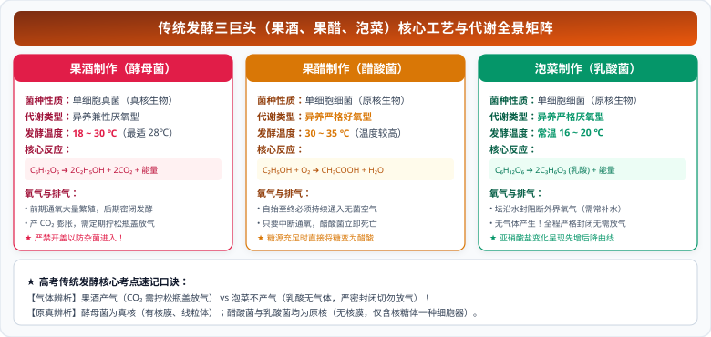

# 01 传统发酵技术（果酒、果醋与泡菜制作原理与实践）

::: tip 核心素养与名师导读
人教版高中生物选择性必修三《生物技术与工程》第一单元以“发酵工程”开篇。传统发酵技术是人类千百年来利用天然微生物进行物质转化的智慧结晶。

在现代新高考中，**果酒、果醋、泡菜制作的微生物学分类地位**、**代谢类型与发酵环境调控（温度、氧气、pH）**，以及**发酵装置的气体控制、污染控制与亚硝酸盐消长曲线的化学-生物学机理**，是全国卷与新高考省份实验大题的“压轴常客”。
:::

---

## 一、 第一性原理：三大传统发酵核心微生物与生化机理

### 1. 三大发酵横向全景对照

| 比较项目         | 果酒制作                                                                                                               | 果醋制作                                                                                                            | 泡菜制作                                                |
| :--------------- | :--------------------------------------------------------------------------------------------------------------------- | :------------------------------------------------------------------------------------------------------------------ | :------------------------------------------------------ |
| **核心微生物**   | **酵母菌**（真核单细胞真菌）                                                                                           | **醋酸菌**（原核单细胞细菌）                                                                                        | **乳酸菌**（原核单细胞细菌，乳酸链球菌/乳酸杆菌）       |
| **代谢类型**     | **异养兼性厌氧型**                                                                                                     | **异养严格好氧型**                                                                                                  | **异养严格厌氧型**                                      |
| **最适温度**     | **$18 \sim 30^\circ\text{C}$**（通常控制在 $28^\circ\text{C}$ 左右）                                                   | **$30 \sim 35^\circ\text{C}$**                                                                                      | **$16 \sim 20^\circ\text{C}$**（室温或更低）            |
| **氧气控制**     | **前期充氧**（有氧呼吸大量繁殖） **后期密封**（无氧呼吸产生酒精）                                                   | **全程持续通入无菌空气**（氧气耗尽会死亡）                                                                          | **全程严格密封绝氧**（接触氧气会抑制乳酸发酵）          |
| **核心生化反应** | ① 有氧：$C_6H_{12}O_6 + 6O_2 + 6H_2O \to 6CO_2 + 12H_2O + 能量$ ② 无氧：$C_6H_{12}O_6 \to 2C_2H_5OH + 2CO_2 + 能量$ | ① 糖源充足：$C_6H_{12}O_6 + 2O_2 \to 2CH_3COOH + 2CO_2 + 2H_2O$ ② 缺少糖源：$C_2H_5OH + O_2 \to CH_3COOH + H_2O$ | $C_6H_{12}O_6 \xrightarrow{酶} 2C_3H_6O_3(乳酸) + 能量$ |
| **主要菌种来源** | 附着在葡萄皮表面的野生型酵母菌（或人工接种）                                                                           | 附着在环境中的野生醋酸菌（或接种醋酸菌液）                                                                          | 附着在蔬菜表面的乳酸菌（或用陈泡菜水接种）              |

  

---

## 二、 核心操作规范与考场实验避坑指南

### 1. 果酒与果醋制作的关键操作细节

1. **清洗葡萄的讲究**：**先冲洗后去梗**。
   - 原因：若先去梗再冲洗，会导致杂菌通过果梗凹陷处的破损进入果实内部，造成发酵液杂菌污染，且会造成葡萄汁中糖分的流失。冲洗次数不能过多，防止洗掉附着在果皮上的野生酵母菌。
2. **装瓶装罐体积控制**：发酵液装量不能超过发酵瓶容积的 **$2/3$**。
   - 原因：① 预留充足空间，供前期酵母菌有氧呼吸大量繁殖；② 防止发酵产生大量 $CO_2$ 以及泡沫溢出容器。
3. **排气口设置**：排气口需连接一根弯曲的长橡胶管并没入水中（水封）。
   - 作用：既能让发酵产生的 $CO_2$ 排出，又能防止空气中的杂菌倒吸进入容器引起污染。
4. **果酒转化为果醋的工艺调整**：
   - 温度由 $18 \sim 30^\circ\text{C}$ 提高至 **$30 \sim 35^\circ\text{C}$**；
   - 装置由密封发酵改为**打开充气口，连续通入无菌空气**；
   - 适量接入醋酸菌菌种。

### 2. 泡菜制作与亚硝酸盐消长动力学

1. **配制盐水**：质量分数为 **$5\% \sim 20\%$** 的食盐水。
   - **必须煮沸后冷却至室温再使用**：煮沸的目的是**杀灭盐水中的杂菌并除去水中的溶解氧**；冷却的目的是**防止高温烫死蔬菜表面的乳酸菌**。
2. **泡菜坛水封沿**：发酵全过程坛沿水槽中必须注满清水，保证坛内缺氧无氧环境。
3. **亚硝酸盐含量变化机制（考场压轴重点）**：
   - **发酵初期**：泡菜坛内氧气未完全耗尽，硝酸盐还原菌（杂菌）大量繁殖，将硝酸盐还原为亚硝酸盐，**亚硝酸盐含量急剧上升**；
   - **发酵中期（达峰）**：随着乳酸菌大量产酸，环境 $pH$ 剧烈下降，乳酸菌占据绝对优势，硝酸盐还原菌被抑制甚至死亡，亚硝酸盐分解速率加快；
   - **发酵后期**：由于乳酸菌的进一步酸化作用以及微生物的降解，亚硝酸盐被分解为无毒物质，**含量急剧下降并稳定在安全国家标准以下**（此时才是最佳食用期）。

---

## 三、 高考核心图解：传统发酵工艺矩阵与亚硝酸盐消长曲线

<svg xmlns="http://www.w3.org/2000/svg" viewBox="0 0 780 370" width="100%" height="100%">
  <!-- 背景底板 -->
  <rect width="780" height="370" rx="16" fill="#F8FAFC" stroke="#CBD5E1" stroke-width="1.5"/>
  <!-- 顶栏标题 -->
  <rect x="20" y="16" width="740" height="42" rx="8" fill="#7C3AED"/>
  <text x="390" y="42" fill="#FFFFFF" font-size="16" font-family="system-ui, -apple-system, sans-serif" font-weight="bold" text-anchor="middle">果酒-果醋-泡菜发酵机制对照与亚硝酸盐消长模型</text>
  <!-- 左卡片：果酒 vs 果醋核心参数决策 (x=20, y=68, w=360, h=286) -->
  <g transform="translate(20, 68)">
    <rect width="360" height="286" rx="12" fill="#FFFFFF" stroke="#7C3AED" stroke-width="1.5"/>
    <rect width="360" height="34" rx="12" fill="#EDE9FE"/>
    <text x="180" y="23" fill="#6D28D9" font-size="14" font-weight="bold" text-anchor="middle">果酒 ➔ 果醋工艺转换与关键对照</text>
    <!-- 果酒部分 -->
    <rect x="15" y="44" width="330" height="66" rx="6" fill="#FFF1F2" stroke="#FDA4AF" stroke-width="1"/>
    <text x="25" y="62" fill="#BE123C" font-size="12" font-weight="bold">【果酒制作】菌种：酵母菌 (真核/兼性厌氧真菌)</text>
    <text x="25" y="80" fill="#334155" font-size="10.5">● 温度：18~30℃ (约28℃) ；装液量 ≤ 2/3 (防溢产气)</text>
    <text x="25" y="96" fill="#334155" font-size="10.5">● 氧气：前期充氧大量繁殖 ➔ 后期水封排气密封产酒</text>
    <!-- 转换指示条 -->
    <rect x="55" y="114" width="250" height="18" rx="9" fill="#F3E8FF" stroke="#C084FC" stroke-width="1"/>
    <text x="180" y="127" fill="#6D28D9" font-size="9.5" font-weight="bold" text-anchor="middle">转化条件：升温至30~35℃ + 持续通氧 + 接入醋酸菌 ➔</text>
    <!-- 果醋部分 -->
    <rect x="15" y="136" width="330" height="64" rx="6" fill="#FFFBEB" stroke="#FDE68A" stroke-width="1"/>
    <text x="25" y="153" fill="#B45309" font-size="12" font-weight="bold">【果醋制作】菌种：醋酸菌 (原核/严格好氧细菌)</text>
    <text x="25" y="170" fill="#334155" font-size="10.5">● 温度：30~35℃ (明显高于果酒) ；发酵周期明显更短</text>
    <text x="25" y="186" fill="#334155" font-size="10.5">● 氧气：全程持续通入无菌空气 (断氧则极易死亡)</text>
    <!-- 考点精粹框 -->
    <rect x="15" y="206" width="330" height="68" rx="6" fill="#F8FAFC" stroke="#94A3B8" stroke-width="1"/>
    <text x="25" y="224" fill="#0F172A" font-size="11" font-weight="bold">考场硬核排雷：</text>
    <text x="25" y="241" fill="#334155" font-size="10">① 葡萄【先冲洗后去梗】，防止杂菌侵入与糖分渗漏；</text>
    <text x="25" y="256" fill="#334155" font-size="10">② 酵母菌与醋酸菌根本差异：【有无以核膜为界限的细胞核】；</text>
    <text x="25" y="270" fill="#BE123C" font-size="9.5" font-weight="bold">③ 酒精检测：酸性重铬酸钾溶液 (橙色 ➔ 灰绿色)。</text>
  </g>
  <!-- 右卡片：泡菜制作与亚硝酸盐消长动力学 (x=400, y=68, w=360, h=286) -->
  <g transform="translate(400, 68)">
    <rect width="360" height="286" rx="12" fill="#FFFFFF" stroke="#7C3AED" stroke-width="1.5"/>
    <rect width="360" height="34" rx="12" fill="#EDE9FE"/>
    <text x="180" y="23" fill="#6D28D9" font-size="14" font-weight="bold" text-anchor="middle">泡菜发酵与亚硝酸盐“倒U型”消长曲线</text>
    <!-- 亚硝酸盐曲线坐标系 -->
    <!-- 坐标轴 -->
    <line x1="45" y1="185" x2="330" y2="185" stroke="#475569" stroke-width="1.5"/>
    <line x1="45" y1="185" x2="45" y2="58" stroke="#475569" stroke-width="1.5"/>
    <text x="45" y="52" fill="#475569" font-size="9" font-weight="bold" text-anchor="middle">亚硝酸盐含量</text>
    <text x="330" y="198" fill="#475569" font-size="10" text-anchor="middle">发酵天数 (天)</text>
    <!-- 安全红线虚线 -->
    <line x1="45" y1="145" x2="330" y2="145" stroke="#DC2626" stroke-width="1" stroke-dasharray="4,3"/>
    <text x="325" y="141" fill="#DC2626" font-size="8.5" text-anchor="end">国家食品安全阈值</text>
    <!-- 倒U型曲线 -->
    <path d="M 45 180 Q 110 68 165 76 T 280 174 L 320 178" fill="none" stroke="#7C3AED" stroke-width="2.5"/>
    <!-- 曲线三个关键点标注 -->
    <circle cx="50" cy="175" r="3" fill="#7C3AED"/>
    <text x="65" y="168" fill="#6D28D9" font-size="9">初期：较低</text>
    <circle cx="165" cy="76" r="3.5" fill="#EF4444"/>
    <text x="165" y="64" fill="#B91C1C" font-size="9.5" font-weight="bold" text-anchor="middle">峰值（杂菌活跃）</text>
    <circle cx="280" cy="174" r="3" fill="#10B981"/>
    <text x="280" y="166" fill="#047857" font-size="9" font-weight="bold" text-anchor="middle">适宜食用期</text>
    <!-- 底部三阶段机理解释框 -->
    <rect x="15" y="206" width="330" height="68" rx="6" fill="#F8FAFC" stroke="#64748B" stroke-width="1"/>
    <text x="25" y="222" fill="#0F172A" font-size="10" font-weight="bold">消长动力学三阶段成因剖析：</text>
    <text x="25" y="238" fill="#334155" font-size="9">① 初增：硝酸盐还原菌繁殖活跃，将硝酸盐还原为亚硝酸盐；</text>
    <text x="25" y="252" fill="#334155" font-size="9">② 达峰：密闭缺氧 + 乳酸积累，pH下降抑制硝酸盐还原菌；</text>
    <text x="25" y="266" fill="#047857" font-size="9" font-weight="bold">③ 下降：亚硝酸盐被还原酶降解，降至安全标准即可食用。</text>
  </g>
</svg>

---

## 四、 亚硝酸盐含量的定量测定方法（比色法）

### 1. 比色法测定原理（高频考点）

在盐酸酸化条件下，亚硝酸盐与**对氨基苯磺酸**发生**重氮化反应**后，再与**N-1-萘基乙二胺盐酸盐**结合形成**玫瑰红色染料**。
将显色后的样品与已知浓度的**标准显色液**进行目测比色或分光光度计比色，即可计算出样品中亚硝酸盐的含量。

### 2. 测定步骤与提取剂

1. **配制标准液**：配制不同浓度的亚硝酸钠溶液，加入显色剂反应，显色后置于比色管中制成标准显色阶梯。
2. **提取样品滤液**：
   - 样品打碎加入**氢氧化铝乳液**（作为澄清剂吸附杂质）和**氯化镉、氯化钡**（作为沉淀剂沉淀蛋白质与有机物）；
   - 过滤得到无色透明滤液。
3. **比色与计算**：将滤液加入显色剂，显色后在同样光程与波长下与标准比色管进行对比。

---

## 五、 考场避坑与满分规范答题模板

::: danger 高考命题雷区警示

1. **泡菜坛水槽干涸的严重后果**：若坛沿水槽干涸，外界空气（氧气）和杂菌将进入坛内，导致**好氧性杂菌大量繁殖，导致泡菜变质发霉腐烂**；同时氧气会抑制乳酸菌的无氧呼吸。
2. **果酒制作不能完全密闭**：酵母菌无氧呼吸产生酒精的同时**必须释放等摩尔的 $CO_2$**。若完全密封不排气，容器内气压持续升高极易导致爆裂！
3. **乳酸菌与酵母菌、醋酸菌的结构本质差异**：
   - 酵母菌是**真核生物**（有核膜包被的细胞核，有线粒体）；
   - 乳酸菌和醋酸菌是**原核生物**（无核膜包被的细胞核，只有核糖体，无复杂细胞器）。
     :::

---

## 六、 高考长句规范答题模板

> **题型 1：分析在果酒发酵后期向果醋发酵转变时需要调整的环境条件**  
> **满分答题模板**：  
> “① 将发酵温度从 $18 \sim 30^\circ\text{C}$ 升高并控制在 **$30 \sim 35^\circ\text{C}$**；  
> ② 打开充气口，**持续通入无菌空气**；  
> ③ 适量接种**醋酸菌**菌种。”

> **题型 2：阐述配制泡菜盐水时“煮沸后冷却至室温”的生理学生物学理由**  
> **满分答题模板**：  
> “① **煮沸**是为了杀灭盐水中的杂菌，并除去水中的溶解氧；  
> ② **冷却至室温**是为了防止高温烫死附着在蔬菜表面的乳酸菌等发酵有益菌种。”

> **题型 3：说明泡菜发酵过程中亚硝酸盐含量先增加后下降至极低水平的原因**  
> **满分答题模板**：  
> “发酵初期，坛内残留氧气使硝酸盐还原菌繁殖活跃，将硝酸盐还原为亚硝酸盐，使其含量上升；随着发酵进行，密闭环境与乳酸菌产酸使坛内无氧且 $pH$ 持续降低，**抑制了硝酸盐还原菌的生命活动，同时在酸性环境和微生物酶的作用下亚硝酸盐被逐渐降解**，因此含量大幅下降并稳定在安全标准以下。”
