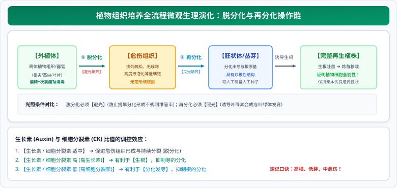

# 01 植物细胞工程（组织培养、脱毒苗与体细胞杂交技术）

::: tip 核心素养与名师导读
植物细胞工程是人教版高中生物选择性必修三《生物技术与工程》第二单元的核心基石。本章将分子遗传学、植物生理学与现代发酵工艺高度交织。

在历年高考大题中，**植物细胞全能性的实质与表达条件**、**生长素与细胞分裂素的比例微调对脱分化/再分化的器官发生决定作用**、**植物体细胞杂交中“去壁-融合-再生细胞壁”的全流程工程控制**，以及**作物脱毒苗切取茎尖的微观细胞学机理**，是极具思维含金量的“必考题型”。
:::

---

## 一、 第一性原理：细胞全能性与植物组织培养

### 1. 植物细胞全能性的本质与表达限制
- **细胞全能性概念**：细胞经分裂和分化后，**仍然具有产生完整有机体或分化成其他各种细胞的潜能和特性**。
- **根本原因**：生物体的每一个体细胞都包含有**该物种全套的遗传信息（基因组）**。
- **全能性表达的条件**：
  1. **离体状态**（打破母体原有组织器官对基因表达的抑制与极性限制）；
  2. **无菌操作与无菌环境**（杜绝杂菌与外植体争夺营养，防止杂菌分泌毒素毒害外植体）；
  3. **适宜的营养成分**（水、无机盐、蔗糖、氨基酸、维生素等）；
  4. **适宜的植物激素配比**（主要是生长素和细胞分裂素）；
  5. **适宜的理化环境**（温度、pH、光照条件）。

### 2. 植物组织培养两大核心阶段：脱分化与再分化

  

#### 脱分化与再分化关键对照表

| 阶段 | 过程定义与细胞状态 | 光照需求及生理原因 | 激素配比决定作用 |
| :--- | :--- | :--- | :--- |
| **脱分化** | 让高度分化的离体细胞失去原有的特化结构，恢复分裂能力，形成**愈伤组织** | **避光培养**。 若给予光照，外植体易过早木质化或分化，阻碍愈伤组织的形成。 | **生长素与细胞分裂素比例适中**，维持旺盛的有丝分裂与未分化增殖状态。 |
| **再分化** | 愈伤组织细胞在适宜诱导条件下重新分化形成**根、芽、胚状体**等结构 | **必须见光培养**。 诱导叶绿素的生物合成，使试管苗转为自养光合作用。 | **动态调节两激素比值**： ① 比值高：促进根分化，抑制芽形成； ② 比值低：促进芽分化，抑制根形成。 |

---

## 二、 植物体细胞杂交技术（打破远缘杂交不亲和障碍）

### 1. 传统杂交 vs 体细胞杂交的本质跨越
传统有性杂交由于**生殖隔离（远缘杂交不亲和）**，无法使亲缘关系较远的物种（如番茄和马铃薯、白菜和甘蓝）实现基因交流。植物体细胞杂交技术打破了这一物种屏障。

### 2. 全流程五大核心工艺环节

1. **去壁制备原生质体**：
   - 酶解法：使用**纤维素酶和果胶酶**在等渗或微高渗缓冲液中去除植物细胞壁（防止原生质体吸水涨破）。
2. **诱导原生质体融合**：
   - **物理法**：离心法、振降法、**电融合法**（高压脉冲诱导膜融合）；
   - **化学法**：**聚乙二醇（PEG）诱导法**、高 $\text{Ca}^{2+}$-高 pH 法。
3. **再生细胞壁（成功的金标准）**：
   - 杂种细胞在培养基中合成分泌纤维素和果胶，再生出新细胞壁。**高尔基体与线粒体活动极度旺盛**。
   - **标志**：只有再生出细胞壁，原生质体融合才真正转化为一个完整的**杂种细胞**。
4. **植物组织培养**：
   - 将筛选出的杂种细胞经脱分化形成杂种愈伤组织，再分化发育为完整的**杂种植株**（如白菜-甘蓝）。
5. **染色体组态与性状表达**：
   - 若亲本 A 为二倍体（$2N=18$），亲本 B 为二倍体（$2M=18$），则诱导融合成功的杂种植株为**异源四倍体（$2N+2M=36$）**，属于**可育的新物种**（体细胞中有同源染色体可正常减数分裂联会）。

---

## 三、 高考核心图解：激素调控天平与体细胞杂交工程模型

<svg xmlns="http://www.w3.org/2000/svg" viewBox="0 0 780 370" width="100%" height="100%">
  <!-- 背景底板 -->
  <rect width="780" height="370" rx="16" fill="#F8FAFC" stroke="#CBD5E1" stroke-width="1.5"/>
  <!-- 顶栏标题 -->
  <rect x="20" y="16" width="740" height="42" rx="8" fill="#15803D"/>
  <text x="390" y="42" fill="#FFFFFF" font-size="16" font-family="system-ui, -apple-system, sans-serif" font-weight="bold" text-anchor="middle">植物组织培养激素调控天平与体细胞杂交工程模型</text>
  <!-- 左卡片：生长素/细胞分裂素比值微调天平 (x=20, y=68, w=360, h=286) -->
  <g transform="translate(20, 68)">
    <rect width="360" height="286" rx="12" fill="#FFFFFF" stroke="#15803D" stroke-width="1.5"/>
    <rect width="360" height="34" rx="12" fill="#DCFCE7"/>
    <text x="180" y="23" fill="#15803D" font-size="14" font-weight="bold" text-anchor="middle">组织培养激素天平：生长素/细胞分裂素比值</text>
    <!-- 比值高：生根 -->
    <rect x="15" y="46" width="330" height="46" rx="6" fill="#ECFDF5" stroke="#10B981" stroke-width="1.2"/>
    <text x="25" y="66" fill="#047857" font-size="12" font-weight="bold">【比值高】：利于生根，抑制芽的形成</text>
    <text x="25" y="82" fill="#059669" font-size="10">生长素占比优势 ➔ 诱导根原基形成与根系发育（壮苗生根）</text>
    <!-- 比值适中：维持愈伤组织 -->
    <rect x="15" y="100" width="330" height="46" rx="6" fill="#FFFBEB" stroke="#F59E0B" stroke-width="1.2"/>
    <text x="25" y="120" fill="#B45309" font-size="12" font-weight="bold">【比值适中】：促进愈伤组织形成与快速分裂</text>
    <text x="25" y="136" fill="#D97706" font-size="10">脱分化阶段 ➔ 维持细胞无定形、高度未分化的增殖状态</text>
    <!-- 比值低：发芽 -->
    <rect x="15" y="154" width="330" height="46" rx="6" fill="#EFF6FF" stroke="#3B82F6" stroke-width="1.2"/>
    <text x="25" y="174" fill="#1D4ED8" font-size="12" font-weight="bold">【比值低】：利于发芽，抑制根的形成</text>
    <text x="25" y="190" fill="#2563EB" font-size="10">细胞分裂素占比优势 ➔ 诱导芽原基形成分化丛芽（再分化）</text>
    <!-- 考点精粹框 -->
    <rect x="15" y="208" width="330" height="66" rx="6" fill="#F8FAFC" stroke="#64748B" stroke-width="1"/>
    <text x="25" y="226" fill="#0F172A" font-size="11" font-weight="bold">光照控制核心避坑：</text>
    <text x="25" y="244" fill="#334155" font-size="10">① 【脱分化阶段】：必须【避光】，防止组织木质化与早衰；</text>
    <text x="25" y="260" fill="#15803D" font-size="10" font-weight="bold">② 【再分化阶段】：必须【见光】，诱导叶绿素合成转为自养！</text>
  </g>
  <!-- 右卡片：植物体细胞杂交全景拓扑 (x=400, y=68, w=360, h=286) -->
  <g transform="translate(400, 68)">
    <rect width="360" height="286" rx="12" fill="#FFFFFF" stroke="#15803D" stroke-width="1.5"/>
    <rect width="360" height="34" rx="12" fill="#DCFCE7"/>
    <text x="180" y="23" fill="#15803D" font-size="14" font-weight="bold" text-anchor="middle">植物体细胞杂交全流程工程流向</text>
    <!-- 植物细胞 A 与 B -->
    <rect x="25" y="46" width="125" height="36" rx="6" fill="#EFF6FF" stroke="#3B82F6" stroke-width="1.2"/>
    <text x="87" y="68" fill="#1D4ED8" font-size="11.5" font-weight="bold" text-anchor="middle">植物细胞甲 (2N)</text>
    <rect x="210" y="46" width="125" height="36" rx="6" fill="#FFF7ED" stroke="#F97316" stroke-width="1.2"/>
    <text x="272" y="68" fill="#C2410C" font-size="11.5" font-weight="bold" text-anchor="middle">植物细胞乙 (2M)</text>
    <!-- 酶解去壁指示 -->
    <path d="M 87 82 L 87 104" stroke="#64748B" stroke-width="1.5"/>
    <path d="M 272 82 L 272 104" stroke="#64748B" stroke-width="1.5"/>
    <text x="180" y="93" fill="#047857" font-size="9.5" font-weight="bold" text-anchor="middle">纤维素酶 + 果胶酶 (去壁)</text>
    <!-- 原生质体 A 与 B -->
    <rect x="25" y="104" width="125" height="28" rx="14" fill="#DBEAFE" stroke="#3B82F6" stroke-width="1.2"/>
    <text x="87" y="122" fill="#1E40AF" font-size="10" font-weight="bold" text-anchor="middle">原生质体甲</text>
    <rect x="210" y="104" width="125" height="28" rx="14" fill="#FFEDD5" stroke="#F97316" stroke-width="1.2"/>
    <text x="272" y="122" fill="#9A3412" font-size="10" font-weight="bold" text-anchor="middle">原生质体乙</text>
    <!-- 融合流程指示条 -->
    <rect x="45" y="139" width="270" height="20" rx="10" fill="#FEF3C7" stroke="#F59E0B" stroke-width="1"/>
    <text x="180" y="153" fill="#B45309" font-size="9.5" font-weight="bold" text-anchor="middle">诱导融合：PEG化学法 / 离心 / 电融合物理法 ➔</text>
    <!-- 杂种原生质体与再生细胞壁 -->
    <rect x="35" y="165" width="290" height="30" rx="6" fill="#ECFDF5" stroke="#10B981" stroke-width="1.2"/>
    <text x="180" y="179" fill="#047857" font-size="10.5" font-weight="bold" text-anchor="middle">再生细胞壁 ➔ 杂种细胞 (2N+2M 四倍体)</text>
    <text x="180" y="191" fill="#059669" font-size="8.5" text-anchor="middle">高尔基体、线粒体旺盛 (原生质体融合成功的标志)</text>
    <!-- 植物组织培养框 -->
    <rect x="15" y="192" width="330" height="82" rx="6" fill="#F8FAFC" stroke="#64748B" stroke-width="1"/>
    <text x="25" y="210" fill="#0F172A" font-size="11" font-weight="bold">植物组织培养与性状遗传：</text>
    <text x="25" y="228" fill="#334155" font-size="10">① 脱分化 ➔ 愈伤组织 ➔ 再分化 ➔ 白菜-甘蓝杂种植株；</text>
    <text x="25" y="244" fill="#334155" font-size="10">② 染色体数目：甲体细胞(2N) + 乙体细胞(2M) = 【2N+2M 四倍体】；</text>
    <text x="25" y="260" fill="#B91C1C" font-size="10" font-weight="bold">③ 最大生物学价值：【打破物种界限，克服远缘杂交不亲和障碍】！</text>
  </g>
</svg>

---

## 四、 植物细胞工程五大现实生产应用全景

### 1. 微型繁殖技术（快速繁殖优良品种）
- **原理**：基于植物组织培养，属于**无性生殖**。
- **优点**：繁殖速度极快，受季节气候限制小，能**100%保持优良母本的优良遗传性状**。

### 2. 作物脱毒技术（培育无病毒苗）
- **核心选材部位**：植物的**顶芽、茎尖分生区**。
- **微观机理（高考常考填空）**：植物顶端分生区附近**导管与筛管等维管组织尚未发育成熟，且分生区细胞分裂极其旺盛，病毒移动速率远慢于细胞分裂速率**，因此茎尖组织几乎不含病毒。
- **特别注意**：脱毒苗只是**本身不带病毒**，但**不具备抗病毒基因，并不能抗病毒**！在田间仍需防治传毒昆虫（如蚜虫）。

### 3. 单倍体育种（花药离体培养）
- **核心操作**：花药离体培养获得**单倍体幼苗** $\to$ **秋水仙素处理幼苗染色体数目加倍** $\to$ 获得纯合二倍体。
- **突出优势**：**极大地缩短了育种年限**，后代全为纯合子，绝不发生性状分离。

### 4. 突变体的利用
- **原理**：植物组织培养过程中，愈伤组织细胞分裂旺盛，处于不断分裂状态的细胞在理化因素诱导下**极易发生基因突变**。
- **应用**：从中筛选抗盐、抗病、耐寒的优质突变细胞株。

### 5. 细胞产物的工厂化生产
- **原理**：利用液体发酵罐大规模培养**愈伤组织或植物悬浮细胞**，提取植物次生代谢产物（如紫草宁、红豆杉醇、人参皂苷等）。
- **优势**：不占用耕地，不受自然灾害与季节影响，纯度高，生产周期极短。

---

## 五、 考场避坑与满分规范答题模板

::: danger 高考高频命题陷阱避坑指南
1. **混淆“脱毒苗”与“抗毒苗”**：
   - 脱毒苗：利用茎尖分生区无毒组织培养出来的**不含病毒的植株**，它**不抗病毒**，再次接触病毒依然会感染发病。
   - 抗毒苗：必须通过**基因工程导入抗病毒基因**或经基因突变筛选获得的**具备抵抗病毒感染能力的植株**。
2. **植物体细胞杂交成功的金标准**：
   - 诱导原生质体融合后，**再生出新的细胞壁**是杂种细胞形成的必要标志；
   - 培育出**能正常生长繁殖的杂种植株**是体细胞杂交技术最终成功的标志。
3. **原生质体不能置于蒸馏水中**：植物细胞失去细胞壁保护后，放入蒸馏水等低渗溶液中会**吸水涨破**。必须置于等渗或微高渗溶液（如适宜浓度的甘露醇、蔗糖溶液）中保护。
:::

---

## 六、 高考长句规范答题模板

> **题型 1：说明选取植物茎尖分生区组织培养来培育“脱毒苗”的细胞学原理**  
> **满分答题模板**：  
> “植物茎尖分生组织附近**维管束尚未发育成熟**，且分生区细胞**分裂极其旺盛，细胞分裂的速度远远大于病毒在此处的扩散和复制速度**，因此茎尖分生区组织几乎不含有病毒。”

> **题型 2：阐释植物组织培养再分化阶段必须给予光照的生理学生物学机理**  
> **满分答题模板**：  
> “再分化形成芽和幼苗的过程中，光照能够**诱导叶绿素的合成和相关光合酶的表达，促进叶绿体的正常发育**，使试管苗由异养型转为自养型光合作用，从而保证幼苗健壮生长。”

> **题型 3：从遗传学角度分析植物体细胞杂交技术相较于传统有性杂交的最大优势**  
> **满分答题模板**：  
> “植物体细胞杂交技术能够**打破物种之间的界限，彻底克服远缘杂交不亲和（生殖隔离）的障碍**，将不同物种的优良遗传性状集于一体，培育出全新的异源杂种多倍体生物。”
