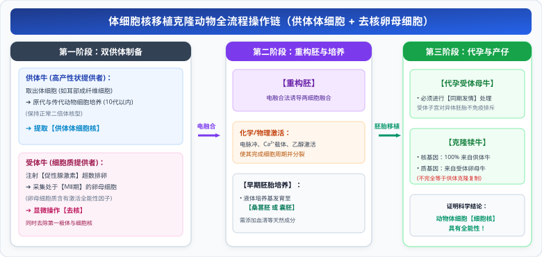

# 02 动物细胞工程（细胞培养、核移植克隆与单克隆抗体制备）

::: tip 核心素养与名师导读
动物细胞工程是现代生物医药、生殖工程与抗肿瘤药物研发的核心引擎。人教版高中生物选择性必修三以**动物细胞培养**为全工程的技术基石，向上衍生出**体细胞核移植技术（克隆动物）**与**单克隆抗体制备技术**。

在历年新高考命题中，**动物细胞培养的气体环境（$5\% CO_2$ 的缓冲作用）**、**核移植选用 MII 期卵母细胞的细胞学机理**，以及**单克隆抗体制备全流程中“两次关键筛选（HAT选择培养基初筛 + 克隆化培养与抗体检测二筛）”与 ADC“生物导弹”靶向机理**，是区分度极高的压轴高分题。
:::

---

## 一、 第一性原理：动物细胞培养（全工程的技术基础）

动物细胞培养是指从动物机体中取出相关的组织，将它分散成单个细胞，然后在适宜的培养条件下，让这些细胞生长和增殖的过程。

### 1. 核心培养流程与细胞学特征

1. **取材**：通常取**动物胚胎或幼龄动物的器官组织**（分化程度低、分裂能力强、增殖旺盛）。
2. **分散细胞**：用**胰蛋白酶或胶原蛋白酶**处理，剪碎后分散成单个细胞。
   - **机理**：动物细胞间质的主要成分是胶原蛋白等蛋白质，蛋白酶可水解细胞间质，使细胞分散，利于细胞吸收营养和排出代谢废物。
   - **避坑**：不能用胃蛋白酶（胃蛋白酶最适 $pH \approx 1.8$，强酸环境会杀死动物细胞）。
3. **两大核心生长特性**：
   - **贴壁生长（贴壁依赖性）**：绝大多数动物体细胞在培养瓶中必须附着在固体表面（如培养瓶内壁）才能生长繁殖；
   - **接触抑制**：当贴壁细胞分裂生长到相互接触时，细胞就会**停止分裂增殖**。此时需用胰蛋白酶处理重新分瓶，进行**传代培养**。

### 2. 动物细胞培养四大生存条件

| 条件维度           | 核心控制参数                                                               | 高考必备生物学机理与考场考点                                                                                         |
| :----------------- | :------------------------------------------------------------------------- | :------------------------------------------------------------------------------------------------------------------- |
| **无菌、无毒环境** | 培养液及培养用具严格无菌；添加适量**抗生素**；定期更换培养液               | 抗生素用于抑制杂菌繁殖；**定期更换培养液是为了清除细胞代谢废物，防止代谢产物积累毒害细胞**。                         |
| **全方位营养**     | 糖类、氨基酸、无机盐、微量元素 + **血清、血浆等天然成分**                  | 现代培养基虽已知大部分营养，但仍需添加动物血清/血浆，提供未知微量营养物质和激素。                                    |
| **温度与 pH**      | 温度：**$36.5 \pm 0.5^\circ\text{C}$**；pH：**$7.2 \sim 7.4$**（微弱碱性） | 维持细胞内酶的最高催化活性。                                                                                         |
| **气体环境**       | **$95\%$ 空气**（$O_2$） + **$5\% CO_2$**（置于 $CO_2$ 培养箱中）          | **$95\%$ 空气中的氧气是细胞有氧代谢所必需的**； **$5\% CO_2$ 的核心作用是维持培养液的 pH 相对稳定（缓冲体系）**。 |

---

## 二、 动物体细胞核移植技术与克隆动物

### 1. 技术原理与核心本质

- **技术原理**：**动物体细胞核具有全能性**（注意：绝对不能表述为“动物细胞具有全能性”！高度分化的动物细胞全能性受到不可逆抑制，但其细胞核仍含有发育为完整个体的全套基因组）。
- **核移植受体细胞**：选用处于**减数第二次分裂中期（MII 期）的卵母细胞**。
  - **选用 MII 期卵母细胞的原因**：
    1. 细胞体积大，易于显微操作去核；
    2. 含有丰富的营养物质，供早期胚胎发育；
    3. **细胞质中含有促进体细胞核全能性表达的物质与调控因子**。

### 2. 全流程操作链条

  

::: warning 遗传性状归属辨析
克隆动物的核基因**100% 来自供体体细胞核**，因此绝大多数性状与核供体一致。但**线粒体 DNA（细胞质基因）来自受体卵母细胞**，且克隆动物在胚胎发育与成长中会受到代孕母体与后天环境的影响，因此**克隆动物与供体母本性状极其相似，但绝非完全 100% 相同**。
:::

---

## 三、 单克隆抗体制备与两次关键筛选拓扑

### 1. 传统血清多克隆抗体 vs 单克隆抗体

- **传统抗体缺点**：抗原通常含有多种抗原决定簇，机体会激活多种 B 淋巴细胞，产生的血清抗体为“多克隆抗体”，产量低、纯度低、特异性差。
- **单克隆抗体神话**：由**单个 B 淋巴细胞增殖形成的细胞克隆分泌产生**的化学性质单一、特异性极高的抗体。
- **构想瓶颈与破局（细胞杂交）**：
  - B 淋巴细胞：能产生单一抗体，但在体外**不能无限增殖**；
  - 骨髓瘤细胞：在体外**能无限增殖**，但**不产生抗体**；
  - 融合形成**杂交瘤细胞**：**既能无限增殖，又能产生专一特异性抗体**！

---

## 四、 高考核心图解：动物细胞工程基石与单抗两次筛选模型

<svg xmlns="http://www.w3.org/2000/svg" viewBox="0 0 780 370" width="100%" height="100%">
  <!-- 背景底板 -->
  <rect width="780" height="370" rx="16" fill="#F8FAFC" stroke="#CBD5E1" stroke-width="1.5"/>
  <!-- 顶栏标题 -->
  <rect x="20" y="16" width="740" height="42" rx="8" fill="#4338CA"/>
  <text x="390" y="42" fill="#FFFFFF" font-size="16" font-family="system-ui, -apple-system, sans-serif" font-weight="bold" text-anchor="middle">单克隆抗体制备两次筛选拓扑与动物细胞培养基石</text>
  <!-- 左卡片：动物细胞培养四大要素 (x=20, y=68, w=360, h=286) -->
  <g transform="translate(20, 68)">
    <rect width="360" height="286" rx="12" fill="#FFFFFF" stroke="#4338CA" stroke-width="1.5"/>
    <rect width="360" height="34" rx="12" fill="#E0E7FF"/>
    <text x="180" y="23" fill="#3730A3" font-size="14" font-weight="bold" text-anchor="middle">动物细胞培养四大生存环境与生长特性</text>
    <!-- 贴壁与接触抑制 -->
    <rect x="15" y="44" width="330" height="60" rx="6" fill="#EEF2FF" stroke="#C7D2FE" stroke-width="1"/>
    <text x="25" y="62" fill="#3730A3" font-size="11.5" font-weight="bold">两大细胞学特性：</text>
    <text x="25" y="80" fill="#334155" font-size="10">● 【贴壁生长】：必须附着在固体基质表面形成单层细胞；</text>
    <text x="25" y="95" fill="#334155" font-size="10">● 【接触抑制】：细胞相互接触后停止分裂（胰蛋白酶分散传代）。</text>
    <!-- 气体控制 -->
    <rect x="15" y="112" width="330" height="74" rx="6" fill="#F0FDF4" stroke="#86EFAC" stroke-width="1.2"/>
    <text x="25" y="130" fill="#166534" font-size="11.5" font-weight="bold">核心环境：气体条件 (CO₂ 培养箱)</text>
    <text x="25" y="148" fill="#15803D" font-size="10.5">● 95% 空气：提供充足 O₂，满足细胞有氧代谢能量需求；</text>
    <text x="25" y="165" fill="#047857" font-size="10.5" font-weight="bold">● 5% CO₂：维持培养液中 pH (7.2~7.4) 相对稳定！(考场秒杀题)</text>
    <text x="25" y="179" fill="#64748B" font-size="9">（与 HCO₃⁻/H₂CO₃ 缓冲对协同维持微弱碱性环境）</text>
    <!-- 避坑提示框 -->
    <rect x="15" y="194" width="330" height="78" rx="6" fill="#FFFBEB" stroke="#FDE68A" stroke-width="1"/>
    <text x="25" y="212" fill="#B45309" font-size="11" font-weight="bold">营养与防毒关键考点：</text>
    <text x="25" y="230" fill="#334155" font-size="10">① 必须添加【动物血清/血浆】，以补充未知微量天然营养成分；</text>
    <text x="25" y="246" fill="#334155" font-size="10">② 【定期更换培养液】：核心目的是【清除代谢废物，防止毒害】；</text>
    <text x="25" y="262" fill="#DC2626" font-size="10" font-weight="bold">③ 分散细胞用【胰蛋白酶/胶原蛋白酶】，绝不能用胃蛋白酶！</text>
  </g>
  <!-- 右卡片：单抗两次筛选全流程 (x=400, y=68, w=360, h=286) -->
  <g transform="translate(400, 68)">
    <rect width="360" height="286" rx="12" fill="#FFFFFF" stroke="#4338CA" stroke-width="1.5"/>
    <rect width="360" height="34" rx="12" fill="#E0E7FF"/>
    <text x="180" y="23" fill="#3730A3" font-size="14" font-weight="bold" text-anchor="middle">单克隆抗体制备：两次关键筛选全景</text>
    <!-- 亲本细胞与融合 -->
    <rect x="15" y="44" width="155" height="36" rx="6" fill="#EFF6FF" stroke="#3B82F6" stroke-width="1"/>
    <text x="92" y="59" fill="#1D4ED8" font-size="10.5" font-weight="bold" text-anchor="middle">已免疫的 B 淋巴细胞</text>
    <text x="92" y="73" fill="#2563EB" font-size="9" text-anchor="middle">能产专一抗体 / 不能无限增殖</text>
    <rect x="190" y="44" width="155" height="36" rx="6" fill="#FFF1F2" stroke="#FDA4AF" stroke-width="1"/>
    <text x="267" y="59" fill="#BE123C" font-size="10.5" font-weight="bold" text-anchor="middle">骨髓瘤细胞</text>
    <text x="267" y="73" fill="#E11D48" font-size="9" text-anchor="middle">不产抗体 / 能无限恶性增殖</text>
    <!-- 融合指示条 -->
    <rect x="45" y="86" width="270" height="18" rx="9" fill="#EDE9FE" stroke="#A78BFA" stroke-width="1"/>
    <text x="180" y="99" fill="#5B21B6" font-size="9.5" font-weight="bold" text-anchor="middle">诱导融合：灭活的病毒 (动物特有) / PEG / 电融合 ➔</text>
    <!-- 第一次筛选：HAT培养基 -->
    <rect x="15" y="108" width="330" height="48" rx="6" fill="#FEF2F2" stroke="#EF4444" stroke-width="1.2"/>
    <text x="25" y="125" fill="#B91C1C" font-size="11.5" font-weight="bold">【第一次筛选】：HAT 选择培养基筛选</text>
    <text x="25" y="141" fill="#7F1D1D" font-size="9.5">淘汰未融合细胞及同种融合细胞 ➔ 仅【杂交瘤细胞】存活！</text>
    <text x="25" y="152" fill="#B91C1C" font-size="8.5">（利用 DNA 合成主要途径与补救途径代谢缺陷进行生化选择）</text>
    <!-- 第二次筛选：克隆化培养与抗体检测 -->
    <rect x="15" y="162" width="330" height="48" rx="6" fill="#ECFDF5" stroke="#10B981" stroke-width="1.2"/>
    <text x="25" y="179" fill="#047857" font-size="11.5" font-weight="bold">【第二次筛选】：克隆化培养与专一抗体阳性检测</text>
    <text x="25" y="195" fill="#064E3B" font-size="9.5">多孔板有限稀释单个细胞培养 ➔ 专一抗原抗体反应筛选</text>
    <text x="25" y="206" fill="#047857" font-size="8.5">（选出【能产生所需特定抗体】的杂交瘤细胞株）</text>
    <!-- 体内/体外生产与ADC -->
    <rect x="15" y="216" width="330" height="58" rx="6" fill="#F8FAFC" stroke="#64748B" stroke-width="1"/>
    <text x="25" y="233" fill="#0F172A" font-size="10.5" font-weight="bold">规模化生产与 ADC “生物导弹”应用：</text>
    <text x="25" y="249" fill="#334155" font-size="9.5">① 小鼠腹腔培养 (体内) 或 发酵罐培养 (体外) 大规模获取单抗；</text>
    <text x="25" y="264" fill="#4338CA" font-size="9.5" font-weight="bold">② ADC 机制：单抗【精准导向定位癌细胞】+ 毒性药物【精准诛杀】！</text>
  </g>
</svg>

---

## 五、 两次关键筛选的生化机制与 ADC“生物导弹”模型

### 1. 两次筛选深度剖析（考场命题核心）

| 筛选阶段       | 筛选手段 / 培养基                                             | 筛选目的与淘汰对象                                                                    | 筛选后获得的细胞类型                                 |
| :------------- | :------------------------------------------------------------ | :------------------------------------------------------------------------------------ | :--------------------------------------------------- |
| **第一次筛选** | **HAT 选择培养基**（次黄嘌呤 H、氨基喋呤 A、胸腺嘧啶核苷 T）  | 淘汰未融合的 B 细胞、未融合的骨髓瘤细胞、B-B 自身融合细胞、骨髓瘤-骨髓瘤自身融合细胞  | 存活下来的全部都是**杂交瘤细胞（B-骨髓瘤融合细胞）** |
| **第二次筛选** | **96 孔板克隆化培养** + **专一抗原-抗体杂交检测（阳性反应）** | 杂交瘤细胞具有多样性（小鼠体内有多种不同的 B 细胞），淘汰不能产生目标抗体的杂交瘤细胞 | **能产生特定目标抗体的高分泌杂交瘤细胞株**           |

### 2. 抗体-药物偶联物（ADC，生物导弹）工作机理

- **结构组成**：
  - **单克隆抗体**（导向元件）：特异性结合癌细胞表面抗原；
  - **连接子（Linker）**：在血液循环中稳定，进入癌细胞后裂解释放药物；
  - **细胞毒性药物（Payload）**：具有极高杀伤力的小分子化疗药物。
- **作用流程**：
  1. ADC 注入血液，单抗特异性结合癌细胞表面的**特异性抗原（受体）**；
  2. 癌细胞发生**胞吞作用**，将 ADC 吞入细胞内部形成内吞泡；
  3. 溶酶体中水解酶裂解连接子，释放高浓度游离细胞毒性药物；
  4. 破坏癌细胞 DNA 或微管蛋白，**诱导癌细胞凋亡**，且不损伤正常健康细胞（副作用极低）。

---

## 六、 考场避坑与满分规范答题模板

::: danger 高考高频失分雷区警示

1. **诱导动物细胞融合特有的方法**：
   - 诱导植物原生质体融合：PEG、电融合、离心振动；
   - 诱导动物细胞融合：PEG、电融合、**灭活的病毒（动物细胞特有！）**。
2. **动物细胞培养分瓶时不能用胃蛋白酶**：
   - 胃蛋白酶最适 $pH$ 约为 1.5~2.2，在动物细胞培养的弱碱性环境（$pH=7.2 \sim 7.4$）中会失活；强酸处理更会导致动物细胞瞬间死亡。只能选用**胰蛋白酶或胶原蛋白酶**。
3. **给小鼠注射特定抗原的不可或缺性**：
   - 必须先给小鼠**多次注射特定抗原**，刺激小鼠机体发生体液免疫，增殖分化出**能产生特定抗体的 B 淋巴细胞（浆细胞）**，否则提取出来的 B 细胞无法定向针对目标抗原。
     :::

---

## 七、 高考长句规范答题模板

> **题型 1：分析动物细胞培养箱中通入 5% CO₂ 的核心生理学作用**  
> **满分答题模板**：  
> “动物细胞培养通常在 $95\%$ 空气与 $5\% CO_2$ 的混合气体环境中进行。通入 $5\% CO_2$ 的核心作用是**维持培养液的 pH 值相对恒定（与培养液中的 $NaHCO_3$ 等缓冲物质构成缓冲体系）**。”

> **题型 2：阐明动物细胞培养中定期更换培养液的生物学必要性**  
> **满分答题模板**：  
> “细胞在旺盛的代谢过程中会不断消耗营养物质并产生大量酸性等代谢废物；定期更换培养液可以**补充细胞生长所需的营养物质，并及时清除细胞代谢产生的有害废物，防止代谢产物积累对细胞造成毒害**。”

> **题型 3：说明单克隆抗体制备过程中进行“第二次筛选”的目的及方法**  
> **满分答题模板**：  
> “① **目的**：从小鼠脾脏中提取的 B 淋巴细胞种类繁多，第一次 HAT 培养基筛选出的杂交瘤细胞并非都能产生所需的目标抗体，因此需要筛选出**能产生特定目标抗体的杂交瘤细胞株**；  
> ② **方法**：利用 96 孔板进行**克隆化培养（有限稀释使单细胞增殖）**，并利用专一抗原进行**特异性抗体检测（抗原-抗体杂交阳性筛选）**，经多次挑选获得分泌目标抗体的细胞克隆。”
