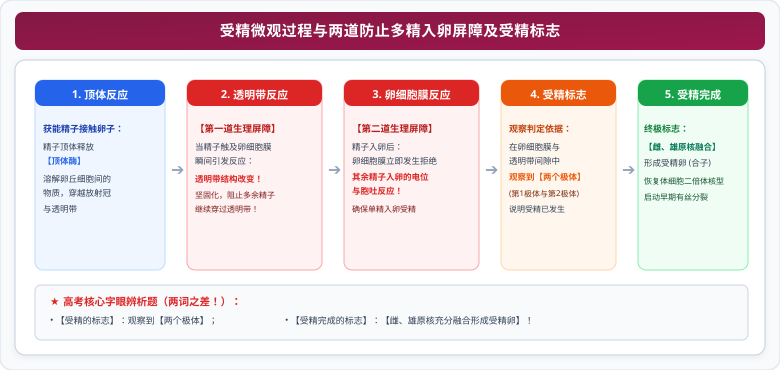

# 03 胚胎工程（受精、早期胚胎发育、胚胎移植与分割技术）

::: tip 核心素养与名师导读
胚胎工程是生命在微观分子与细胞水平向宏观个体发育跨越的高端生物技术，是畜牧繁育与濒危物种抢救的核心手段。人教版高中生物选择性必修三全面阐明了从配子发生、体外受精到早期胚胎发育及工程化移植的全流程。

在高考中，**防止多精入卵的两道屏障机制与受精完成标志**、**卵裂期细胞与有机物变化的数理特征**、**囊胚期内细胞团与滋养层的分化归宿**、**胚胎移植“冲卵”的生物学实质**，以及**囊胚分割必须“均等分割内细胞团”的操作红线**，构成了极高区分度的“高频考纲靶心”。
:::

---

## 一、 第一性原理：受精机理与两道防多精屏障

### 1. 场所与配子准备

- **受精场所**：哺乳动物的**输卵管**。
- **精子获能**：刚排出的精子不能立即受精，必须在雌性动物生殖道内发生相应的生理变化后才具备受精能力（人工可用**肝素或钙离子载体**等获能液）。
- **卵子的成熟**：动物排出的卵子并不成熟，需在输卵管内进一步发育至**减数第二次分裂中期（MII 期）**，才具备与精子受精的能力。

### 2. 受精过程与两道防止多精入卵的生理屏障

  

::: danger 高考核心区分：受精标志 vs 受精完成标志

- **受精的标志**：在卵细胞膜和透明带的间隙中观察到**两个极体**（表明卵子已完成减数第二次分裂）；
- **受精完成的标志**：**雌、雄原核充分形成并融合为一个二倍体受精卵核**。
  :::

---

## 二、 早期胚胎发育的动态演变规律

受精卵在输卵管向子宫移动过程中，进行旺盛的**卵裂期**细胞分裂。

### 1. 早期胚胎各阶段细胞学特征

| 发育阶段   | 细胞形态与结构特征                                                                                                   | 细胞全能性与分化状态                                                                                   | 高考核心考点与生理事件                                                                                               |
| :--------- | :------------------------------------------------------------------------------------------------------------------- | :----------------------------------------------------------------------------------------------------- | :------------------------------------------------------------------------------------------------------------------- |
| **受精卵** | 具有全套二倍体基因组的单细胞                                                                                         | **全能性最高**                                                                                         | 胚胎发育的起点                                                                                                       |
| **卵裂期** | 有丝分裂增殖，细胞数目呈指数增加                                                                                     | 全能性极高                                                                                             | 胚胎总体积**不增加或略减**；每个细胞体积**减小**；每个细胞核 DNA 含量不变，总 DNA **增加**；有机物总量**持续减少**。 |
| **桑椹胚** | 由 **32 个左右**形态结构一致的细胞组成                                                                               | **每个细胞都具有全能性**                                                                               | 胚胎分割的理想选材时期之一                                                                                           |
| **囊胚**   | **出现囊胚腔**，细胞开始**初次分化**： ① **内细胞团**（聚集在胚胎一端）； ② **滋养层**（沿透明带内壁单层排列） | 细胞发生特化： ● 内细胞团将来发育成**胎儿的各种组织器官**； ● 滋养层细胞将来发育成**胎盘和胎膜** | **孵化事件**：囊胚进一步扩大导致透明带破裂，胚胎从中伸展出来。胚胎分割若选囊胚，**必须将内细胞团均等分割**！         |
| **原肠胚** | **出现原肠腔**，分化形成**外胚层、内胚层和中胚层**                                                                   | 分化程度进一步加深                                                                                     | 随着原肠腔扩大，囊胚腔逐渐缩小并退化消失。                                                                           |

---

## 三、 高考核心图解：早期胚胎发育时空图谱与移植分割拓扑

<svg xmlns="http://www.w3.org/2000/svg" viewBox="0 0 780 370" width="100%" height="100%">
  <!-- 背景底板 -->
  <rect width="780" height="370" rx="16" fill="#F8FAFC" stroke="#CBD5E1" stroke-width="1.5"/>
  <!-- 顶栏标题 -->
  <rect x="20" y="16" width="740" height="42" rx="8" fill="#BE123C"/>
  <text x="390" y="42" fill="#FFFFFF" font-size="16" font-family="system-ui, -apple-system, sans-serif" font-weight="bold" text-anchor="middle">早期胚胎发育时空格局与胚胎移植分割工程拓扑</text>
  <!-- 左卡片：早期胚胎发育阶段时空演化 (x=20, y=68, w=360, h=286) -->
  <g transform="translate(20, 68)">
    <rect width="360" height="286" rx="12" fill="#FFFFFF" stroke="#BE123C" stroke-width="1.5"/>
    <rect width="360" height="34" rx="12" fill="#FFE4E6"/>
    <text x="180" y="23" fill="#9F1239" font-size="14" font-weight="bold" text-anchor="middle">受精卵 ➔ 囊胚 ➔ 原肠胚动态发育图谱</text>
    <!-- 阶段演进条 -->
    <rect x="15" y="44" width="330" height="40" rx="6" fill="#FFF1F2" stroke="#FDA4AF" stroke-width="1"/>
    <text x="25" y="60" fill="#9F1239" font-size="11" font-weight="bold">【卵裂期】：</text>
    <text x="25" y="74" fill="#334155" font-size="9.5">有丝分裂 / 细胞数增多但总体积不增 / 有机物持续减少</text>
    <!-- 桑椹胚与囊胚分栏 -->
    <rect x="15" y="90" width="160" height="98" rx="6" fill="#FDF2F8" stroke="#F472B6" stroke-width="1.2"/>
    <text x="95" y="108" fill="#9D174D" font-size="11.5" font-weight="bold" text-anchor="middle">桑椹胚 (32细胞左右)</text>
    <text x="95" y="125" fill="#334155" font-size="9.5" text-anchor="middle">● 每个细胞具全能性</text>
    <text x="95" y="141" fill="#334155" font-size="9.5" text-anchor="middle">● 细胞紧密排列如桑椹</text>
    <text x="95" y="157" fill="#334155" font-size="9.5" text-anchor="middle">● 适合进行胚胎分割</text>
    <text x="95" y="174" fill="#BE123C" font-size="9" font-weight="bold" text-anchor="middle">未分化状态</text>
    <rect x="185" y="90" width="160" height="98" rx="6" fill="#FDF4FF" stroke="#C084FC" stroke-width="1.2"/>
    <text x="265" y="108" fill="#6B21A8" font-size="11.5" font-weight="bold" text-anchor="middle">囊胚 (开始初次分化)</text>
    <text x="265" y="125" fill="#334155" font-size="9.5" text-anchor="middle">● 内细胞团 ➔ 发育为胎儿</text>
    <text x="265" y="141" fill="#334155" font-size="9.5" text-anchor="middle">● 滋养层 ➔ 发育为胎盘胎膜</text>
    <text x="265" y="157" fill="#334155" font-size="9.5" text-anchor="middle">● 出现囊胚腔并发生【孵化】</text>
    <text x="265" y="174" fill="#7E22CE" font-size="9" font-weight="bold" text-anchor="middle">分割必须均等切内细胞团</text>
    <!-- 原肠胚与考场重点 -->
    <rect x="15" y="194" width="330" height="80" rx="6" fill="#F8FAFC" stroke="#64748B" stroke-width="1"/>
    <text x="25" y="212" fill="#0F172A" font-size="11" font-weight="bold">原肠胚结构与胚胎干细胞 (ES/EK) 特性：</text>
    <text x="25" y="228" fill="#334155" font-size="10">① 原肠胚具外、中、内三胚层和【原肠腔】(囊胚腔逐渐退化消失)；</text>
    <text x="25" y="244" fill="#334155" font-size="10">② 胚胎干细胞来源于【早期胚胎 (囊胚内细胞团)】或原始性腺；</text>
    <text x="25" y="260" fill="#9F1239" font-size="10" font-weight="bold">③ 特征：体积小、细胞核大、核仁明显；体外培养增殖而不分化。</text>
  </g>
  <!-- 右卡片：胚胎移植与分割工程拓扑 (x=400, y=68, w=360, h=286) -->
  <g transform="translate(400, 68)">
    <rect width="360" height="286" rx="12" fill="#FFFFFF" stroke="#BE123C" stroke-width="1.5"/>
    <rect width="360" height="34" rx="12" fill="#FFE4E6"/>
    <text x="180" y="23" fill="#9F1239" font-size="14" font-weight="bold" text-anchor="middle">胚胎移植标准化流水线与分割规范</text>
    <!-- 供体与受体操作流水 -->
    <rect x="15" y="44" width="155" height="42" rx="6" fill="#FFF1F2" stroke="#FDA4AF" stroke-width="1"/>
    <text x="92" y="60" fill="#9F1239" font-size="10.5" font-weight="bold" text-anchor="middle">供体母畜 (良种)</text>
    <text x="92" y="75" fill="#E11D48" font-size="9" text-anchor="middle">注射【促性腺激素】超数排卵</text>
    <rect x="190" y="44" width="155" height="42" rx="6" fill="#F0FDF4" stroke="#86EFAC" stroke-width="1"/>
    <text x="267" y="60" fill="#166534" font-size="10.5" font-weight="bold" text-anchor="middle">受体母畜 (普通代孕)</text>
    <text x="267" y="75" fill="#15803D" font-size="9" text-anchor="middle">同期发情处理 (生理状态一致)</text>
    <!-- 冲卵关键指示 -->
    <rect x="25" y="94" width="310" height="38" rx="6" fill="#EFF6FF" stroke="#93C5FD" stroke-width="1.2"/>
    <text x="180" y="110" fill="#1D4ED8" font-size="11" font-weight="bold" text-anchor="middle">配种 / 体外人工授精 ➔【冲卵】</text>
    <text x="180" y="124" fill="#2563EB" font-size="9.5" text-anchor="middle">★ 高考核心避坑：【冲卵】冲出的是【早期胚胎】，绝不是卵子！</text>
    <!-- 胚胎分割规范框 -->
    <rect x="15" y="138" width="330" height="66" rx="6" fill="#FFFBEB" stroke="#FDE68A" stroke-width="1.2"/>
    <text x="25" y="156" fill="#B45309" font-size="11" font-weight="bold">胚胎分割规范与无性克隆：</text>
    <text x="25" y="172" fill="#334155" font-size="9.5">● 选材：发育良好的桑椹胚或囊胚；属于【无性繁殖/克隆】；</text>
    <text x="25" y="187" fill="#DC2626" font-size="9.5" font-weight="bold">● 红线要求：对囊胚分割必须【均等分割内细胞团】，否则发育不良！</text>
    <text x="25" y="198" fill="#64748B" font-size="8.5">（可取滋养层细胞进行 SRY 基因检测，实现性别鉴定）</text>
    <!-- 移植结局框 -->
    <rect x="15" y="210" width="330" height="64" rx="6" fill="#F8FAFC" stroke="#64748B" stroke-width="1"/>
    <text x="25" y="228" fill="#0F172A" font-size="10.5" font-weight="bold">胚胎移植生物学实质与性状归属：</text>
    <text x="25" y="244" fill="#334155" font-size="9.5">① 实质：早期胚胎在【空间位置上的转移】，不改变遗传物质；</text>
    <text x="25" y="259" fill="#047857" font-size="9.5" font-weight="bold">② 后代遗传性状【100% 由供体公母畜决定】，受体母畜只提供孕育生境！</text>
  </g>
</svg>

---

## 四、 胚胎工程两大支柱：胚胎移植与胚胎分割深度解构

### 1. 胚胎移植的生理学基础与技术特权

- **优势**：充分发挥**优良母畜的繁育潜能**（供体只需提供优良遗传基因和受精卵，繁重繁育任务交由受体完成）。
- **四大生理学基础（高考必背大题）**：
  1. **同种动物发情排卵后生殖器官生理环境一致**（这是胚胎移入受体能存活的基础，需进行**同期发情处理**）；
  2. **早期胚胎在游离状态下未与子宫建立组织联系**（这是胚胎收集——**冲卵**的组织学基础）；
  3. **受体对移入的外来胚胎基本不发生免疫排斥反应**（这是胚胎移植成活的关键前提）；
  4. **供体胚胎的遗传特性在孕育过程中不受受体母体影响**（后代性状由供体遗传物质决定）。

### 2. 胚胎分割技术规范

- **时期选择**：处于**桑椹胚**或**囊胚**阶段的优质胚胎。
- **操作器械**：显微操作仪、实体显微镜、分割针或分割刀片。
- **极度严苛的操作红线**：
  - 若在囊胚期分割，**必须将内细胞团均等分割**。
  - **原因**：内细胞团将来发育成胎儿的各种组织器官，若分割不均匀，细胞数目较少的一侧往往发育不良甚至退化死亡。
- **性别鉴定途径**：在分割时，取**滋养层细胞**（不伤及内细胞团）提取 DNA，利用 Y 染色体特异性引物（SRY 基因）进行 PCR 扩增检测，以确定胚胎性别。

---

## 五、 考场避坑指南与高频失分点

::: danger 高考命题核心雷区警示

1. **“冲卵”绝对不是冲出卵子**：冲卵是指在配种后第 7 天左右，用专用的冲卵液从供体母畜子宫或输卵管中**冲出早期胚胎**！
2. **受体母牛对后代遗传性状无影响**：胚胎移植后代的遗传物质**100% 来自供体公牛（精子）和供体母牛（卵子）**，代孕受体母牛只提供营养供给和妊娠场所，其体内的基因绝对不会掺杂进胚胎细胞中。
3. **囊胚腔不是原肠腔**：
   - 囊胚期出现的是**囊胚腔**；
   - 原肠胚期出现的是**原肠腔**，并且分化出三个胚层，随着原肠腔扩大，原有的囊胚腔会逐渐消失。
     :::

---

## 六、 高考长句规范答题模板

> **题型 1：分析为什么在胚胎移植前要对供体和受体进行“同期发情处理”**  
> **满分答题模板**：  
> “通过注射孕激素等激素对供体和受体进行同期发情处理，使受体母畜与供体母畜的**生殖器官处于相同的生理状态**，为供体胚胎移入受体后提供相同的子宫生理环境，保证胚胎能够正常着床发育。”

> **题型 2：阐释胚胎分割时对囊胚阶段胚胎“必须均等分割内细胞团”的原因**  
> **满分答题模板**：  
> “囊胚期的内细胞团细胞将来发育成胎儿的各种组织器官；如果分割不均匀，**细胞数目少的一侧胚胎会由于发育潜能受限而导致发育不良甚至死亡**，因此必须均等分割以保证分割后的胚胎均能正常成活。”

> **题型 3：说明受体母畜为什么不会对外来的供体胚胎产生免疫排斥反应**  
> **满分答题模板**：  
> “在哺乳动物妊娠早期，受体母畜的子宫对移入的外来早期胚胎**基本不发生免疫排斥反应**，这为外来胚胎在受体子宫内的着床和发育提供了安全的免疫耐受环境。”
