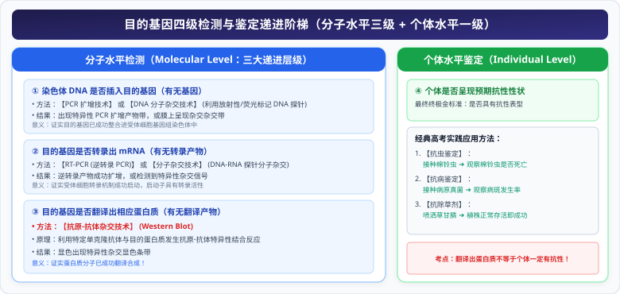
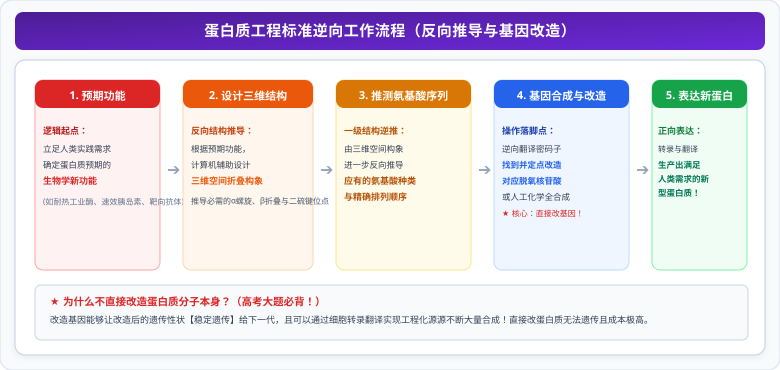

# 02 目的基因转化、分子检测与蛋白质工程全景

::: tip 核心素养与名师导读
基因工程的操作链条在构建好重组载体后，进入向生命体导入与表达的核心攻坚期。人教版高中生物选择性必修三系统规范了**目的基因导入三大受体细胞的标准工艺**、**目的基因从染色体整合到个体表型的四级递进检测金标准**，以及以逆向工程为核心特征的**蛋白质工程**与**生物伦理底线**。

本章是高考非选择题命制高阶推理长句的“高频富矿”。掌握本章，必须能够严密区分“DNA 整合”、“转录出 mRNA”、“翻译出蛋白质”与“个体呈现性状”的四重逻辑断层。
:::

---

## 一、 第一性原理：目的基因导入受体细胞的转化工艺

“转化”是指目的基因进入受体细胞内，并且在受体细胞内维持稳定和表达的过程。受体生物类型不同，转化方法与受体细胞选择具有严格的技术限制：

| 受体细胞类型 | 核心转化方法 | 受体细胞特定选择 | 关键机理与高考必备细节 |
| :--- | :--- | :--- | :--- |
| **植物细胞** | **农杆菌转化法** （最常用） | 植物愈伤组织、体细胞或幼胚 | ① 农杆菌含 **Ti 质粒**，其上的 **T-DNA（可转移 DNA）**能转移并整合到受体细胞**染色体 DNA** 上； ② 天然农杆菌易感染**双子叶植物和裸子植物**；单子叶植物需加酚类化合物诱导。 |
| | **花粉管通道法** （我国学者独创） | 授粉后的受精胚囊 | 在刚授粉后的柱头上滴加含外源 DNA 的溶液，外源基因顺花粉管通道进入受精卵。 |
| **动物细胞** | **显微注射技术** | **受精卵** （唯一首选） | **必须选用受精卵**。 ① 受精卵体积大，显微操作方便； ② **受精卵具有全能性**，通过分裂分化能使动物全身所有体细胞都携带目的基因。 |
| **微生物细胞** | **$\text{Ca}^{2+}$ 感受态细胞法** | 大肠杆菌等细菌 | ① 低温下用 **$CaCl_2$** 处理细菌，使细胞膜通透性增大，细胞处于吸收外源 DNA 的**感受态**； ② 重组质粒与感受态细胞混合冰浴，经 **$42^\circ\text{C}$ 热休克**完成转化。 |

---

## 二、 目的基因的检测与鉴定（四级递进金标准）

目的基因导入受体细胞后，并不意味着一定会成功表达。必须进行从分子到个体的**四层严格验证**：

  

---

## 三、 高考核心图解：农杆菌转化与四级检测蛋白质工程拓扑

<svg xmlns="http://www.w3.org/2000/svg" viewBox="0 0 780 370" width="100%" height="100%">
  <!-- 背景底板 -->
  <rect width="780" height="370" rx="16" fill="#F8FAFC" stroke="#CBD5E1" stroke-width="1.5"/>
  <!-- 顶栏标题 -->
  <rect x="20" y="16" width="740" height="42" rx="8" fill="#0369A1"/>
  <text x="390" y="42" fill="#FFFFFF" font-size="16" font-family="system-ui, -apple-system, sans-serif" font-weight="bold" text-anchor="middle">农杆菌转化全景机制与目的基因四级检测鉴定拓扑</text>
  <!-- 左卡片：农杆菌转化与三大受体转化决策 (x=20, y=68, w=360, h=286) -->
  <g transform="translate(20, 68)">
    <rect width="360" height="286" rx="12" fill="#FFFFFF" stroke="#0369A1" stroke-width="1.5"/>
    <rect width="360" height="34" rx="12" fill="#E0F2FE"/>
    <text x="180" y="23" fill="#0284C7" font-size="14" font-weight="bold" text-anchor="middle">农杆菌 Ti 质粒机制与三大转化法</text>
    <!-- Ti 质粒 T-DNA 机制 -->
    <rect x="15" y="44" width="330" height="66" rx="6" fill="#F0FDF4" stroke="#86EFAC" stroke-width="1.2"/>
    <text x="25" y="62" fill="#166534" font-size="11.5" font-weight="bold">【农杆菌转化法核心机制】：</text>
    <text x="25" y="80" fill="#334155" font-size="10">● 目的基因插入到 Ti 质粒的【T-DNA (可转移DNA)】区段中；</text>
    <text x="25" y="96" fill="#047857" font-size="10" font-weight="bold">● T-DNA 能携带外源基因转移并整合到受体【染色体 DNA】上！</text>
    <!-- 三大受体细胞对应转化法 -->
    <rect x="15" y="118" width="104" height="74" rx="6" fill="#EFF6FF" stroke="#93C5FD" stroke-width="1"/>
    <text x="67" y="136" fill="#1D4ED8" font-size="11" font-weight="bold" text-anchor="middle">植物受体</text>
    <text x="67" y="152" fill="#334155" font-size="9.5" text-anchor="middle">农杆菌转化法</text>
    <text x="67" y="167" fill="#334155" font-size="9.5" text-anchor="middle">花粉管通道法</text>
    <text x="67" y="182" fill="#1E40AF" font-size="9" text-anchor="middle">(双子叶植物易感染)</text>
    <rect x="128" y="118" width="104" height="74" rx="6" fill="#FFF1F2" stroke="#FDA4AF" stroke-width="1"/>
    <text x="180" y="136" fill="#BE123C" font-size="11" font-weight="bold" text-anchor="middle">动物受体</text>
    <text x="180" y="152" fill="#334155" font-size="9.5" text-anchor="middle">显微注射技术</text>
    <text x="180" y="167" fill="#DC2626" font-size="9.5" font-weight="bold" text-anchor="middle">首选【受精卵】</text>
    <text x="180" y="182" fill="#7F1D1D" font-size="9" text-anchor="middle">(全能性最高易表达)</text>
    <rect x="241" y="118" width="104" height="74" rx="6" fill="#FFFBEB" stroke="#FDE68A" stroke-width="1"/>
    <text x="293" y="136" fill="#B45309" font-size="11" font-weight="bold" text-anchor="middle">微生物受体</text>
    <text x="293" y="152" fill="#334155" font-size="9.5" text-anchor="middle">Ca²⁺ 感受态法</text>
    <text x="293" y="167" fill="#D97706" font-size="9.5" text-anchor="middle">CaCl₂ 处理大肠杆菌</text>
    <text x="293" y="182" fill="#78350F" font-size="9" text-anchor="middle">(增大膜通透性)</text>
    <!-- 考点精粹框 -->
    <rect x="15" y="200" width="330" height="74" rx="6" fill="#F8FAFC" stroke="#64748B" stroke-width="1"/>
    <text x="25" y="218" fill="#0F172A" font-size="11" font-weight="bold">考场硬核避坑：</text>
    <text x="25" y="235" fill="#334155" font-size="9.5">① 动物细胞转化【绝对不能选用普通体细胞】，必须选受精卵；</text>
    <text x="25" y="250" fill="#334155" font-size="9.5">② 转化成功标志：目的基因【整合到受体染色体上并能遗传】；</text>
    <text x="25" y="265" fill="#B91C1C" font-size="9.5" font-weight="bold">③ T-DNA 具有可转移性，因此目的基因必须插入在 T-DNA 内部！</text>
  </g>
  <!-- 右卡片：四级检测鉴定与蛋白质工程逆向设计 (x=400, y=68, w=360, h=286) -->
  <g transform="translate(400, 68)">
    <rect width="360" height="286" rx="12" fill="#FFFFFF" stroke="#0369A1" stroke-width="1.5"/>
    <rect width="360" height="34" rx="12" fill="#E0F2FE"/>
    <text x="180" y="23" fill="#0284C7" font-size="14" font-weight="bold" text-anchor="middle">四级递进检测鉴定与蛋白质工程逆向思维</text>
    <!-- 四级检测递进横条 -->
    <rect x="15" y="44" width="330" height="26" rx="4" fill="#EFF6FF" stroke="#93C5FD" stroke-width="1"/>
    <text x="25" y="61" fill="#1D4ED8" font-size="10" font-weight="bold">① 染色体DNA水平：PCR 扩增 / DNA 分子杂交 (证明已插入染色体)</text>
    <rect x="15" y="74" width="330" height="26" rx="4" fill="#ECFDF5" stroke="#86EFAC" stroke-width="1"/>
    <text x="25" y="91" fill="#047857" font-size="10" font-weight="bold">② 转录水平：RT-PCR 扩增 / 分子杂交 (证明目的基因已转录出 mRNA)</text>
    <rect x="15" y="104" width="330" height="26" rx="4" fill="#FEF2F2" stroke="#FDA4AF" stroke-width="1"/>
    <text x="25" y="121" fill="#B91C1C" font-size="10" font-weight="bold">③ 翻译水平：【抗原-抗体杂交】 (证明目的基因已合成出目标蛋白质)</text>
    <rect x="15" y="134" width="330" height="26" rx="4" fill="#FFFBEB" stroke="#FDE68A" stroke-width="1"/>
    <text x="25" y="151" fill="#B45309" font-size="10" font-weight="bold">④ 个体水平：接种害虫/病原体/除草剂 (证明赋予生物体预期优良性状)</text>
    <!-- 蛋白质工程逆向设计流向 -->
    <rect x="15" y="168" width="330" height="106" rx="6" fill="#FAF5FF" stroke="#D8B4FE" stroke-width="1.2"/>
    <text x="25" y="186" fill="#7E22CE" font-size="11" font-weight="bold">蛋白质工程（第二代基因工程）逆向设计铁律：</text>
    <!-- 流程节点 -->
    <rect x="25" y="196" width="68" height="24" rx="4" fill="#EDE9FE"/>
    <text x="59" y="212" fill="#6B21A8" font-size="9" text-anchor="middle">预期功能</text>
    <text x="100" y="212" fill="#7E22CE" font-size="10" font-weight="bold">➔</text>
    <rect x="108" y="196" width="68" height="24" rx="4" fill="#EDE9FE"/>
    <text x="142" y="212" fill="#6B21A8" font-size="9" text-anchor="middle">设计结构</text>
    <text x="183" y="212" fill="#7E22CE" font-size="10" font-weight="bold">➔</text>
    <rect x="191" y="196" width="68" height="24" rx="4" fill="#EDE9FE"/>
    <text x="225" y="212" fill="#6B21A8" font-size="9" text-anchor="middle">推测氨基酸</text>
    <text x="266" y="212" fill="#7E22CE" font-size="10" font-weight="bold">➔</text>
    <rect x="274" y="196" width="64" height="24" rx="4" fill="#FEF2F2" stroke="#EF4444" stroke-width="1"/>
    <text x="306" y="212" fill="#B91C1C" font-size="9" font-weight="bold" text-anchor="middle">改造基因</text>
    <text x="25" y="240" fill="#334155" font-size="9.5">● 核心哲学：【逆中心法则】逆向设计，生产自然界不存在的全新蛋白质；</text>
    <text x="25" y="258" fill="#DC2626" font-size="9.5" font-weight="bold">● 落地归宿：改造的必须是【基因 (脱氧核苷酸序列)】，而非直接改蛋白质！</text>
  </g>
</svg>

---

## 四、 蛋白质工程：第二代基因工程的逆向逻辑

### 1. 蛋白质工程诞生的第一性原理
- **基因工程的局限性**：原则上只能生产自然界中**已存在的天然蛋白质**。但天然蛋白质是长期自然进化的产物，往往不适应人类工业化生产的高温、强酸或体外储存条件（如天然干扰素体外极易变性聚合）。
- **蛋白质工程定义**：以蛋白质分子的结构规律及其与生物功能的关系作为基础，通过**改造或合成基因**，来改造现有蛋白质，或制造一种**新的蛋白质**，以满足人类生产生活的需求。

### 2. 蛋白质工程的标准逆向工作流程

  

::: warning 为什么不能直接修改蛋白质分子本身？
因为对蛋白质直接进行的化学修饰或改造**无法遗传给下一代**，而且蛋白质分子结构极其复杂，直接定向修改氨基酸在操作上极其困难；只有**通过改造编码该蛋白质的基因（DNA 序列）**，才能使宿主细胞持久、稳定、规模化地合成目标蛋白质，并随细胞增殖一代代遗传下去。
:::

---

## 五、 生物技术的安全性与伦理道德红线

高考考纲明确要求掌握生物安全与伦理准则：

### 1. 转基因生物的安全性争议与国家方针
- **争议焦点**：
  - **食品安全**：是否含有新过敏原、毒性蛋白，是否破坏营养平衡；
  - **生物安全**：转基因抗性基因漂移是否会导致抗性杂草（“超级杂草”），导致物种入侵；
  - **环境安全**：抗虫转基因作物是否会杀伤益虫或土壤非靶标微生物，破坏生物多样性。
- **中国政策方针**：**大胆研究、慎重推广、规范管理、确保安全**。实行严格的转基因产品强制标识制度。

### 2. 生殖性克隆 vs 治疗性克隆（中国伦理底线）
- **治疗性克隆（积极支持）**：利用核移植技术获取患者自体胚胎干细胞，体外诱导定向分化为组织器官用于细胞治疗和器官移植（无免疫排斥反应）。
- **生殖性克隆（坚决反对！）**：**不赞成、不允许、不支持、不接受任何生殖性克隆人实验**！
  - 反对理由：技术极不成熟（畸形率、流产率极高）；严重冲击一夫一妻制家庭结构与传统伦理道德。

### 3. 生物武器的严重威胁与国际公约
- **种类**：致病微生物（炭疽杆菌、霍乱弧菌、天花病毒）、毒素（肉毒杆菌毒素）。
- **特点**：致病力极强、潜伏期可长可短、传播途径多、传染性强、污染面积大、难以防治。
- **《禁止生物武器公约》**：任何情况下**不发展、不生产、不储存、不取得并销毁一切生物武器**。

---

## 六、 考场避坑指南与高频失分点

::: danger 高考命题核心雷区警示
1. **农杆菌转化法中 T-DNA 的特异性**：必须将目的基因插在 **T-DNA 内部**。若插在 T-DNA 外侧，由于外侧片段不具备转移能力，目的基因无法进入植物染色体。
2. **转基因抗虫棉的抗虫基因传递**：若抗虫基因只插入到一条染色体上（杂合子 $Aa$），抗虫棉自交后代会发生性状分离，**抗虫与不抗虫比例为 $3:1$**，因此在留种时需格外注意。
3. **不能把“个体未表现出抗性”等同于“目的基因未导入”**：目的基因即使成功整合到染色体上，也可能因为**缺少启动子、甲基化抑制或转录/翻译阻遏**而无法正常表达蛋白质，必须通过四级检测逐一排查。
:::

---

## 七、 高考长句规范答题模板

> **题型 1：分析利用显微注射法培育转基因动物时，受体细胞必须选用“受精卵”的原因**  
> **满分答题模板**：  
> “① 动物受精卵细胞**体积大，便于显微注射操作**；  
> ② 受精卵具有**最高的全能性**，能够正常进行胚胎发育，从而使分化出的**动物全身所有体细胞都含有目的基因**。”

> **题型 2：阐释从分子水平到个体水平，如何层层验证目的基因是否在受体细胞中成功表达**  
> **满分答题模板**：  
> “① 首先通过 **PCR 扩增或 DNA 分子杂交技术**检测受体染色体 DNA 上是否插入了目的基因；  
> ② 其次通过 **RT-PCR 或分子杂交技术**检测目的基因是否成功转录出 mRNA；  
> ③ 再次通过**抗原-抗体杂交技术**检测目的基因是否成功翻译出目标蛋白质；  
> ④ 最后进行**个体水平的表型活性或抗性接种鉴定**（如抗虫或抗病测试）。”

> **题型 3：说明蛋白质工程被称为“第二代基因工程”且必须通过改造基因实现的理由**  
> **满分答题模板**：  
> “① 蛋白质工程的目标是**生产自然界原本不存在的全新蛋白质**；  
> ② 蛋白质的功能由其氨基酸序列和高级结构决定，而氨基酸序列的遗传密码直接存储在基因的脱氧核苷酸序列中；  
> ③ 对蛋白质直接进行化学修饰无法遗传，只有**通过改造或合成基因，才能使改造后的蛋白质性状稳定遗传并实现规模化表达**。”
