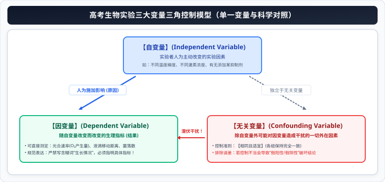

# 02 高考实验设计原则、对照方法与满分答题模板

::: tip 核心素养与名师导读
在高考生物全国卷与新高考各省统考卷中，“实验设计与探究大题”一直被誉为整张试卷的“终极大轴”。考题通常以最新的前沿生物医药科研成果、农作物抗逆生理调控为命题情境，分值高达 10~15 分。

许多考生面对实验题往往陷入“懂其原理却词不达意，或者漏掉对照、忽略等量”的失分困局。本章提炼出高考实验设计的**四大基石原则**、**四大多元对照模型**、**标准四步法解题模板**，以及**探究性 vs 验证性实验的逻辑推演法则**，助力考生在实验大题上实现零扣分满分通关。
:::

---

## 一、 第一性原理：实验变量的精准界定与四大基石原则

科学探究的灵魂在于**变量控制**。任何实验设计的核心逻辑，都是围绕“自变量对因变量的影响，排除无关变量的干扰”展开。

### 1. 三大实验变量的科学定义

  

- **检测指标（观测指标）**：因变量往往是宏观或看不见的生理过程（如“细胞呼吸速率”），必须转化为可量化的具体检测指标（如“单位时间内澄清石灰水变浑浊的程度”、“红墨水滴移动的距离”）。

### 2. 实验设计的四大基石原则

| 核心原则         | 科学内涵与操作规范                                                                         | 高考违背该原则的反面扣分案例                                                       |
| :--------------- | :----------------------------------------------------------------------------------------- | :--------------------------------------------------------------------------------- |
| **单一变量原则** | 实验组与对照组之间，**只能存在一个人为改变的自变量**，其他一切无关变量必须严格保持一致。   | 探究温度对酶活性的影响时，各组的 $pH$ 却不相同；或者温度和底物浓度同时改变。       |
| **对照原则**     | 设置对照组，排除无关变量和自然因素对实验结果的干扰，增强实验结论的科学性与说服力。         | 验证某抗癌药的效果，只给患癌小鼠喂药，不设未喂药或喂生理盐水的小鼠作对照。         |
| **等量原则**     | 各实验组加入的试剂体积、浓度，实验动物的体重、月龄、生理活性，处理时间等必须**完全等量**。 | 实验组注射 $2\text{mL}$ 药液，对照组只注射 $1\text{mL}$ 生理盐水或未注射任何液体。 |
| **平行重复原则** | 选取足够数量的样本进行多次独立重复实验，**计算平均值**，以降低个体差异造成的偶然误差。     | 每组只用 1 只小鼠或 1 株幼苗做实验，因个体死亡或特异体质导致实验结论完全失真。     |

---

## 二、 四大经典对照实验类型全景矩阵

高考题中对照组的设置形式极具灵活性，考生必须精准辨析以下四类对照：

| 对照类型                     | 对照方式与核心特征                                                                                 | 教材与高考典型实验实例                                                                                                           |
| :--------------------------- | :------------------------------------------------------------------------------------------------- | :------------------------------------------------------------------------------------------------------------------------------- |
| **空白对照**                 | 对照组**不给予任何实验变量的处理**（通常加等量的蒸馏水或生理盐水），作为纯净的基线基准。           | 验证甲状腺激素的作用：实验组喂食甲状腺激素制剂，对照组喂食等量不含药物的普通饲料。                                               |
| **自身对照**                 | 对照组和实验组在**同一实验对象**上进行，通过处理前与处理后的状态改变进行前后对比。                 | **观察植物细胞的质壁分离与复原实验**：滴加蔗糖溶液前为正常状态，滴加后为质壁分离状态，滴加清水后为复原状态。                     |
| **条件对照**                 | 给对照组施加**某种已知生理效应的特定条件**，通过与实验组对比，更明确地阐释自变量的作用。           | 证明胰岛素有降血糖作用实验：实验组注射胰岛素出现低血糖休克，随后注射**葡萄糖溶液（条件对照）**使其苏醒。                         |
| **相互对照** （对比实验） | **不单设不作处理的空白对照组**，而是设置两个或多个实验组，通过**各个组别之间的相互对比**得出结论。 | ① **探究酵母菌细胞呼吸的方式**：有氧呼吸组与无氧呼吸组相互对照； ② 探究温度/pH 对酶活性的影响：一系列梯度温度/pH 组互为对照。 |

---

## 三、 高考核心图解：实验变量体系与标准四步法决策流程

<svg xmlns="http://www.w3.org/2000/svg" viewBox="0 0 780 370" width="100%" height="100%">
  <!-- 背景底板 -->
  <rect width="780" height="370" rx="16" fill="#F8FAFC" stroke="#CBD5E1" stroke-width="1.5"/>
  <!-- 顶栏标题 -->
  <rect x="20" y="16" width="740" height="42" rx="8" fill="#1D4ED8"/>
  <text x="390" y="42" fill="#FFFFFF" font-size="16" font-family="system-ui, -apple-system, sans-serif" font-weight="bold" text-anchor="middle">高考生物实验设计四大原则与标准四步法决策模型</text>
  <!-- 左卡片：实验三大变量与四大对照类型 (x=20, y=68, w=360, h=286) -->
  <g transform="translate(20, 68)">
    <rect width="360" height="286" rx="12" fill="#FFFFFF" stroke="#1D4ED8" stroke-width="1.5"/>
    <rect width="360" height="34" rx="12" fill="#DBEAFE"/>
    <text x="180" y="23" fill="#1E40AF" font-size="14" font-weight="bold" text-anchor="middle">实验三大变量与四大经典对照类型</text>
    <!-- 三大变量定义框 -->
    <rect x="15" y="44" width="330" height="74" rx="6" fill="#F0FDF4" stroke="#86EFAC" stroke-width="1.2"/>
    <text x="25" y="62" fill="#166534" font-size="11.5" font-weight="bold">三大变量精准拆解：</text>
    <text x="25" y="80" fill="#334155" font-size="10">● 【自变量】：人为主动施加的改变因素 (温度梯度、药物浓度)；</text>
    <text x="25" y="96" fill="#334155" font-size="10">● 【因变量】：随自变量改变的指标 (产气速率、生长长度、抗性)；</text>
    <text x="25" y="111" fill="#DC2626" font-size="10" font-weight="bold">● 【无关变量】：必须严格保持【相同且适宜】(光照、pH、用量)。</text>
    <!-- 四大对照类型分栏 -->
    <rect x="15" y="126" width="78" height="66" rx="6" fill="#EFF6FF" stroke="#93C5FD" stroke-width="1"/>
    <text x="54" y="145" fill="#1D4ED8" font-size="10.5" font-weight="bold" text-anchor="middle">空白对照</text>
    <text x="54" y="162" fill="#334155" font-size="9" text-anchor="middle">不施加药物</text>
    <text x="54" y="177" fill="#64748B" font-size="8.5" text-anchor="middle">加等量溶剂</text>
    <rect x="99" y="126" width="78" height="66" rx="6" fill="#FAF5FF" stroke="#D8B4FE" stroke-width="1"/>
    <text x="138" y="145" fill="#7E22CE" font-size="10.5" font-weight="bold" text-anchor="middle">自身对照</text>
    <text x="138" y="162" fill="#334155" font-size="9" text-anchor="middle">同一对象</text>
    <text x="138" y="177" fill="#64748B" font-size="8.5" text-anchor="middle">处理前后对比</text>
    <rect x="183" y="126" width="78" height="66" rx="6" fill="#FFFBEB" stroke="#FDE68A" stroke-width="1"/>
    <text x="222" y="145" fill="#B45309" font-size="10.5" font-weight="bold" text-anchor="middle">条件对照</text>
    <text x="222" y="162" fill="#334155" font-size="9" text-anchor="middle">施加已知效应</text>
    <text x="222" y="177" fill="#64748B" font-size="8.5" text-anchor="middle">如注射葡萄糖</text>
    <rect x="267" y="126" width="78" height="66" rx="6" fill="#ECFDF5" stroke="#6EE7B7" stroke-width="1"/>
    <text x="306" y="145" fill="#047857" font-size="10.5" font-weight="bold" text-anchor="middle">相互对照</text>
    <text x="306" y="162" fill="#334155" font-size="9" text-anchor="middle">对比实验</text>
    <text x="306" y="177" fill="#64748B" font-size="8.5" text-anchor="middle">各实验组互比</text>
    <!-- 考场避坑框 -->
    <rect x="15" y="200" width="330" height="74" rx="6" fill="#F8FAFC" stroke="#64748B" stroke-width="1"/>
    <text x="25" y="218" fill="#0F172A" font-size="11" font-weight="bold">考场极易失分的“等量原则”细节：</text>
    <text x="25" y="235" fill="#334155" font-size="9.5">① 实验材料：【生长状况相同、生理状态良好、体重相近】；</text>
    <text x="25" y="250" fill="#334155" font-size="9.5">② 溶剂补偿：对照组必须加入【等量且不含药物的相同溶剂】；</text>
    <text x="25" y="265" fill="#DC2626" font-size="9.5" font-weight="bold">③ 平行重复：严禁只用 1 只动物！样本量足够大并【求平均值】！</text>
  </g>
  <!-- 右卡片：实验设计标准四步法决策流程 (x=400, y=68, w=360, h=286) -->
  <g transform="translate(400, 68)">
    <rect width="360" height="286" rx="12" fill="#FFFFFF" stroke="#1D4ED8" stroke-width="1.5"/>
    <rect width="360" height="34" rx="12" fill="#DBEAFE"/>
    <text x="180" y="23" fill="#1E40AF" font-size="14" font-weight="bold" text-anchor="middle">实验设计标准四步法满分实施流水线</text>
    <!-- 第一步 -->
    <rect x="15" y="44" width="330" height="34" rx="6" fill="#EFF6FF" stroke="#93C5FD" stroke-width="1"/>
    <text x="25" y="60" fill="#1D4ED8" font-size="10.5" font-weight="bold">第 1 步：材料分组与编号</text>
    <text x="25" y="73" fill="#334155" font-size="9">选生长状况一致的材料，【随机均等分组】为 A、B、C... 并编号。</text>
    <!-- 第二步 -->
    <rect x="15" y="84" width="330" height="34" rx="6" fill="#F0FDF4" stroke="#86EFAC" stroke-width="1"/>
    <text x="25" y="100" fill="#166534" font-size="10.5" font-weight="bold">第 2 步：施加自变量 (单一变量处理)</text>
    <text x="25" y="113" fill="#334155" font-size="9">实验组给予【特定浓度/条件处理】；对照组给予【等量空白介质】。</text>
    <!-- 第三步 -->
    <rect x="15" y="124" width="330" height="34" rx="6" fill="#FFFBEB" stroke="#FDE68A" stroke-width="1"/>
    <text x="25" y="140" fill="#B45309" font-size="10.5" font-weight="bold">第 3 步：相同且适宜条件培养</text>
    <text x="25" y="153" fill="#334155" font-size="9">置于【相同且适宜的温度、光照等环境中】，培养相同且适宜的时间。</text>
    <!-- 第四步 -->
    <rect x="15" y="164" width="330" height="34" rx="6" fill="#FEF2F2" stroke="#FDA4AF" stroke-width="1"/>
    <text x="25" y="180" fill="#B91C1C" font-size="10.5" font-weight="bold">第 4 步：检测并记录因变量数据</text>
    <text x="25" y="193" fill="#334155" font-size="9">定时检测记录【具体观测指标】，多次重复测量并【计算平均值】。</text>
    <!-- 探究性 vs 验证性结论模板 -->
    <rect x="15" y="206" width="330" height="68" rx="6" fill="#FAF5FF" stroke="#D8B4FE" stroke-width="1.2"/>
    <text x="25" y="224" fill="#7E22CE" font-size="11" font-weight="bold">结论表述规范：探究性 vs 验证性差异</text>
    <text x="25" y="240" fill="#334155" font-size="9.5">● 【验证性实验】：结论已知单一。预测结果与既定结论【唯一对应】；</text>
    <text x="25" y="255" fill="#DC2626" font-size="9.5" font-weight="bold">● 【探究性实验】：结论未知！必须【分类全面讨论】（若...则...）：</text>
    <text x="25" y="268" fill="#6B21A8" font-size="8.5">（穷尽所有可能：促进 / 抑制 / 无影响，或者高于 / 低于 / 等于对照组）</text>
  </g>
</svg>

---

## 四、 高考实验设计标准“四步法”答题实战

### 标准答题骨架剖析：

1. **第一步：分组与编号**
   - **模板句式**：“选取**生理状态良好、生长发育状况相同、体重相近**的同种健康小鼠若干只，**随机均分为 A、B、C 三组，并做好标记编号**。”
2. **第二步：自变量处理（设置对照）**
   - **模板句式**：“A 组每天定时灌胃适量且等量的**待测药剂 X 溶液**；B 组作为阳性对照每天定时灌胃等量的**已知有效药剂 Y 溶液**；C 组作为空白对照每天定时灌胃**等量的生理盐水（或配制药剂的溶剂）**。”
3. **第三步：控制无关变量培养**
   - **模板句式**：“将 A、B、C 三组置于**相同且适宜的环境条件（如适宜温度、光照周期、充足氧气）**下，给予**等量且相同的全价饲料和饮用水**，连续培养一段时间（如 14 天）。”
4. **第四步：因变量检测与数据分析**
   - **模板句式**：“在实验结束时，**测定并记录各组小鼠的某种具体检测指标（如空腹血糖浓度、血清抗体滴度）**，重复测量并**计算各组的平均值，进行统计学分析与对比**。”

---

## 五、 探究性实验 vs 验证性实验的结论逻辑推演

高考命题对“探究性实验”与“验证性实验”的区分有着极其严苛的阅卷评分标准：

### 1. 验证性实验（结果与结论唯一确定）

- **特点**：所要验证的生物学规律是**前人已经确证的科学事实**。
- **书写规范**：
  - “预期实验结果：实验组...，对照组...；”
  - “实验结论：说明某物质具有促进/抑制...的作用（结论已知且唯一）。”

### 2. 探究性实验（必须分类讨论，穷尽所有可能）

- **特点**：所探究的问题未知，实验结果可能存在多种走向。
- **满分分类讨论书写格式（三段式分类）**：
  - ① **若**实验组的检测指标**明显高于**对照组，**则说明**该因素对某种生理活动起**促进作用**；
  - ② **若**实验组的检测指标**明显低于**对照组，**则说明**该因素对某种生理活动起**抑制作用**；
  - ③ **若**实验组与对照组的检测指标**基本相同（无显著差异）**，**则说明**该因素对某种生理活动**没有影响（无调节作用）**。

---

## 六、 高考实验设计失分雷区与名师避坑指南

::: danger 高考实验大题四大失分雷区警示

1. **因变量直接写宏观概念而非具体可测指标**：
   - ❌ 错误表述：“检测各组光合作用强弱”；
   - ✔️ 满分表述：“测定并记录各组**单位时间内氧气的释放量（或二氧化碳的吸收量）**”。
2. **溶剂对照不规范**：
   - 若待测药物不溶于水，是用二甲基亚砜（DMSO）溶解的，则对照组**绝对不能加蒸馏水或生理盐水**！必须加**等量的 DMSO 溶剂**，以排除有机溶剂本身对生物体的影响。
3. **忽略“随机均分”与“生理状态相同”**：
   - 选材时必须交代“生长发育状况相同、生理状态良好”，分组时必须交代“随机均分”，否则因人为挑选导致组间基线不均，直接扣除实验设计分。
4. **样本量过小**：
   - 实验设计中绝不能出现“取 1 只小鼠”、“取 1 株植株”，必须写“若干只”、“若干株”，并在测量时强调“**求每组的平均值**”。
     :::

---

## 七、 高考长句规范答题模板库

> **题型 1：说明在实验设计中设置“平行重复组”并“计算平均值”的科学目的**  
> **满分答题模板**：  
> “通过设置多组平行重复实验并计算平均值，能够**有效排除实验材料个体差异和偶然因素对实验结果造成的干扰，减小实验误差，提高实验数据的可靠性和实验结论的科学性**。”

> **题型 2：阐释探究某种脂溶性药物疗效时，空白对照组为什么要注射“等量配制该药物的有机溶剂”**  
> **满分答题模板**：  
> “因为该药物溶解在特定的有机溶剂中；对照组注射等量的该有机溶剂，能够**遵循单一变量原则，排除该有机溶剂本身对生物体生理代谢可能产生的影响**，从而确保实验组出现的生理反应完全是由待测药物分子引起的。”

> **题型 3：说明探究光合作用的最适温度实验中，光照强度和 CO₂ 浓度应当如何控制**  
> **满分答题模板**：  
> “光照强度和 $CO_2$ 浓度属于该实验的**无关变量**。根据单一变量原则和等量原则，各组的**光照强度和 $CO_2$ 浓度必须保持相同，并且应控制在植物生长的最适（适宜）水平**，以防止无关变量成为限制光合作用的因素而干扰实验结果。”
