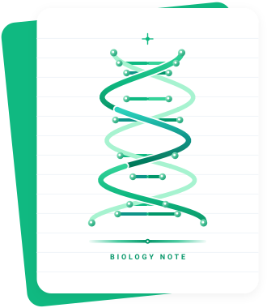

# 高考生物知识库 - Yulaoshizuikeai's Biology Note

<p align="center">
  
</p>

<p align="center">
  <a href="https://vitepress.dev"></a>
  <a href="https://nodejs.org"></a>
  <a href="./LICENSE"></a>
</p>

1. **在线阅读**: [https://biology.indevs.in/](https://biology.indevs.in/)
2. **最新 PDF 下载**:
   - 📕 **[完整版 PDF (单文件全书)](https://github.com/yulaoshizuikeai/Biology-Note/releases/download/latest-pdf/Biology-Note-Complete.pdf)** (由 GitHub Actions 随代码更新自动生成)
   - 📦 **[全套分册归档 (.zip)](https://github.com/yulaoshizuikeai/Biology-Note/releases/download/latest-pdf/Biology-Note-All-PDFs.zip)** (包含全书独立高清矢量 PDF)
3. **知识架构**: 涵盖中国普通高中教科书生物学（人教版必修 2 册 + 选择性必修 3 册共 5 本官方教材），结合高考生物真题与核心题型模型，打造系统化、图解直观的高中生物知识库。

---

## 💡 创作来源与工程架构

- **📚 权威教材体系**：严格基于人教版新课标教材（必修1《分子与细胞》、必修2《遗传与进化》、选择性必修1《稳态与调节》、选择性必修2《生物与环境》、选择性必修3《生物技术与工程》）全量梳理与深度重构。
- **🌟 生命观念与科学思维**：
  - **结构与功能观**：从细胞器微观结构、膜流动镶嵌模型到细胞间信息交流；
  - **物质与能量观**：光反应与暗反应耦合、呼吸电子传递链、生态系统能量流动（10%~20%）；
  - **稳态与平衡观**：神经-体液-免疫调节网络、负反馈调节机制、内环境理化性质动态平衡；
  - **进化与适应观**：突变与基因重组提供原材料、自然选择决定进化方向、隔离导致物种形成。
- **🛠️ Docs as Code 工业化产出**：
  继承现代 VitePress 2.0 静态文档引擎架构、MathJax 3 矢量公式排版规范、组件化考点展示模块（`<CCChapterOverview />`）、Playwright 批量 PDF 渲染流水线与双轨自动发布机制。

---

## 🧭 目录体系

- **00 说明**
  - [Readme](00%20说明/Readme.md)
  - [错误反馈](00%20说明/错误反馈.md)
  - [高考生物全景图与生命观念](00%20说明/高考生物全景图与生命观念.md)
- **01 走进细胞与组成细胞的分子**
- **02 细胞的基本结构与物质跨膜运输**
- **03 细胞代谢与能量供应（酶、ATP与呼吸光合）**
- **04 细胞的生命历程（增殖、分化、衰老与凋亡）**
- **05 孟德尔遗传规律与伴性遗传**
- **06 基因的本质与中心法则（复制、转录与翻译）**
- **07 生物的变异、育种与现代生物进化理论**
- **08 人体内环境与稳态**
- **09 动物生命活动的神经、体液与免疫调节**
- **10 植物生命活动的激素调节**
- **11 种群、群落与生态系统结构功能**
- **12 人与环境及生态工程**
- **13 传统发酵技术与微生物培养应用**
- **14 细胞工程（植物与动物细胞工程）**
- **15 基因工程与生物技术安全性与伦理**
- **16 高中生物经典实验专题与科学探究方法**

---

## ⚡ 考前速查利器

- **[⚡ 高考生物 50 大黄金结论与核心数量关系极速速查表](./golden-conclusions.md)**
- **[🚨 高考生物全专题“防踩坑”排雷与 WARNING 聚合白皮书](./warning-cheatsheet.md)**

---

## 🛠️ 本地运行与构建

```bash
# 安装依赖
npm install

# 启动本地开发服务
npm run docs:dev

# 编译静态网站
npm run docs:build

# 预览静态产物
npm run docs:preview

# 导出单篇 / 全量 PDF
npm run pdf:single
npm run pdf:all

# 打包 PDF 全书与 ZIP 归档
npm run pdf:package
```
